# Elimika Admin Dashboard: Frontend Development Guide

## 1. Overview

This document outlines the features, requirements, and technical specifications for building the frontend of the Elimika Admin Dashboard. It is intended to provide a clear and actionable guide for frontend engineers.

**Target User:** System Administrator (Global Admin)
**Overall Goal:** To provide a centralized command center for monitoring, managing, and configuring the entire Elimika platform.

---

## 2. System Admin Domain Architecture

This architecture provides the foundation for role-based access control within the admin dashboard.

### Admin Hierarchy and Permissions

```mermaid
graph TB
    subgraph "Admin Domain Structure"
        SA[Super Admin<br/>🔧 Platform Owner]
        GA[Global Admin<br/>⚙️ System Operations]
        OA[Organization Admin<br/>🏢 Institution Management]

        SA --> GA
        GA --> OA
    end

    subgraph "Domain Assignment Methods"
        INV[Invitation Process<br/>📧 Email-based Assignment]
        DIRECT[Direct Assignment<br/>🔗 API-based Addition]
        BOOTSTRAP[Bootstrap Process<br/>⚡ Platform Initialization]
    end

    subgraph "Database Mapping"
        UDM[user_domain_mapping<br/>🗃️ Global Admin Assignment]
        UODM[user_organisation_domain_mapping<br/>🎯 Organization Admin Assignment]
    end

    SA -.-> BOOTSTRAP
    GA -.-> INV
    GA -.-> DIRECT
    OA -.-> UODM
    GA -.-> UDM

    style SA fill:#d32f2f
    style GA fill:#ff5722
    style OA fill:#ff9800
    style INV fill:#4caf50
```



### Admin Domain Types

| Domain Type | Scope | Assignment Method | Database Table | Use Case |
|-------------|-------|------------------|----------------|----------|
| **System Admin** | Platform-wide | `user_domain_mapping` | Global domain assignment | Complete platform control |
| **Organization Admin** | Institution-specific | `user_organisation_domain_mapping` | Contextual domain assignment | Organization management only |

---

## Feature 1.0: At-a-Glance Dashboard & Analytics

### 1.1 Objective
To provide a high-level, real-time overview of the platform's status, key metrics, and simple analytics, enabling admins to quickly assess the state and trends of the system.

### 1.2 User Stories
- As an admin, I want to see key platform metrics (KPIs) to track growth.
- As an admin, I want to view simple charts showing user growth and role distribution to understand platform trends.
- As an admin, I want to know the health status of critical system components to react to issues.
- As an admin, I want to see a feed of recent, important events to stay informed.

### 1.3 UI/UX Description
- A modern dashboard layout featuring a top row of "Key Performance Indicator (KPI)" cards.
- A section below the KPIs for simple analytical charts.
- A sidebar or panel for "System Health" and an "Activity Feed".

### 1.4 Simple Analytics Suggestions
- **User Growth Chart:** A line chart displaying new user registrations over the last 30 days.
- **Domain Distribution:** A pie or donut chart showing the current breakdown of users by role (`Student`, `Instructor`, `Admin`).
- **Organization Growth:** A line chart showing new organization sign-ups over the last 6 months.

### 1.5 Required API Endpoints & Data
- **Statistics:** `GET /api/v1/admin/dashboard/statistics` (Returns `SystemHealthDashboard` DTO).
- **Activity Feed:** `GET /api/v1/admin/dashboard/activity-feed` (Returns `List<ActivityEventDTO>`).
- **Analytics (New Endpoints Required):**
    - `GET /api/v1/admin/analytics/user-growth?period=30d` (Returns time-series data).
    - `GET /api/v1/admin/analytics/domain-distribution` (Returns counts for each domain).
    - `GET /api/v1/admin/analytics/organization-growth?period=6m` (Returns time-series data).

### 1.6 Frontend Engineer Task Breakdown

| Component | Description | Key Props / State | Interactions |
| :--- | :--- | :--- | :--- |
| `DashboardPage` | Main container for the dashboard. | `stats`, `activity`, `analyticsData`, `loading`, `error` | Fetches all data on mount. |
| `KPICard` | Displays a single metric (e.g., "Total Users"). | `title: string`, `value: number`, `icon: string` | None. |
| `AnalyticsChart` | A reusable chart component. | `type: 'line' \| 'pie'`, `data: object`, `title: string` | Tooltips on hover. |
| `SystemHealthPanel` | Shows the status of backend services. | `services: Array<{name, status}>` | Color-coded status indicators. |
| `ActivityFeed` | Displays a list of recent platform events. | `events: Array<ActivityEventDTO>` | Links to relevant pages. |

---

## Feature 2.0: Comprehensive Admin User Management

### 2.1 Objective
To provide admins with the tools to search, view, and manage every user account on the platform, with a focus on securely managing system administrator roles.

### 2.2 User Stories
- As an admin, I want to search for users by name or email.
- As an admin, I want to filter the user list by role, organization, or status.
- As an admin, I want to view a user's detailed profile.
- As an admin, I want to suspend, delete, or change the roles of a user.
- As a super admin, I want to securely invite new system administrators.
- As a super admin, I want to revoke system administrator privileges from a user.

### 2.3 Core API Endpoints & Status

#### **Available Endpoints (for general user management)**

| Method | Endpoint | Purpose |
|--------|----------|---------|
| `GET` | `/api/v1/users` | List all platform users |
| `GET` | `/api/v1/users/search` | Search users with filters |
| `GET` | `/api/v1/users/{uuid}` | Get user details |
| `PUT` | `/api/v1/users/{uuid}` | Update user profile |
| `DELETE` | `/api/v1/users/{uuid}` | Delete user account |

#### **Missing Critical Endpoints for Admin Management** ⚠️

The following endpoints are **NOT IMPLEMENTED** and are required for full functionality.

| Priority | Method | Missing Endpoint | Purpose | Impact |
|----------|--------|------------------|---------|---------|
| **HIGH** | `POST` | `/api/v1/admin/users/{uuid}/domains` | Add admin domain to user | **Core functionality blocked** |
| **HIGH** | `DELETE` | `/api/v1/admin/users/{uuid}/domains/{domain}` | Remove admin domain | **Admin removal impossible** |
| **HIGH** | `GET` | `/api/v1/admin/users/admins` | List all system admins | **Admin dashboard empty** |
| **MEDIUM** | `POST` | `/api/v1/admin/users/invite-admin` | Direct admin invitation | **Streamlined admin creation blocked** |

### 2.4 Frontend Implementation Guide

#### **Component Structure**

```jsx
// Main container component hierarchy for this feature
UserManagementPage/
├── AdminUserManagement/
│   ├── AdminUserTable/          // Paginated admin list
│   ├── AdminInviteModal/        // Invite new admin flow
│   ├── AdminDetailsModal/       // View/edit admin details
│   └── AdminBulkActions/        // Batch operations
```

#### **Admin Invitation Workflow**

**Current Implementation Status:** ⚠️ **Partially Available**
**Workaround:** Use the general organization invitation and manually assign the admin domain via database.


#### **Example Component: `AdminInviteModal.jsx`**

```jsx
import React, { useState, useEffect } from 'react';
import { useAuth } from '../hooks/useAuth';
import { adminApi } from '../services/api';

const AdminInviteModal = ({ isOpen, onClose, onSuccess }) => {
  const [formData, setFormData] = useState({
    email: '',
    name: '',
    adminLevel: 'system', // system | organization
    notes: ''
  });
  const [loading, setLoading] = useState(false);
  const [error, setError] = useState(null);

  const handleSubmit = async (e) => {
    e.preventDefault();
    setLoading(true);
    setError(null);

    try {
      // ⚠️ MISSING API ENDPOINT - Using workaround
      // Intended: await adminApi.inviteAdmin(formData);

      // CURRENT WORKAROUND: Use organization invitation
      const response = await adminApi.inviteToOrganization({
        recipientEmail: formData.email,
        recipientName: formData.name,
        domainName: 'admin', // Will need manual domain assignment
        notes: formData.notes
      });

      // ⚠️ MISSING: Automatic admin domain assignment
      // Manual step required after invitation acceptance

      onSuccess(response.data);
      onClose();
    } catch (err) {
      setError('Failed to send admin invitation. Please try again.');
    } finally {
      setLoading(false);
    }
  };

  return (
    <Modal isOpen={isOpen} onClose={onClose} title="Invite New System Admin">
      <form onSubmit={handleSubmit}>
        {/* Form fields for email, name, adminLevel, notes */}
      </form>

      {/* ⚠️ Missing Functionality Warning */}
      <div className="implementation-warning">
        <h4>⚠️ Implementation Status</h4>
        <ul>
          <li>❌ Direct admin invitation endpoint missing</li>
          <li>❌ Automatic admin domain assignment unavailable</li>
          <li>✅ Basic invitation system working</li>
          <li>✅ Email delivery functional</li>
        </ul>
        <p><strong>Current Limitation:</strong> Admin role must be manually assigned after invitation acceptance.</p>
      </div>
    </Modal>
  );
};
```

#### **Example Component: `AdminUserTable.jsx`**

```jsx
const AdminUserTable = () => {
  const [admins, setAdmins] = useState([]);
  const [loading, setLoading] = useState(true);

  useEffect(() => {
    const loadAdmins = async () => {
      try {
        setLoading(true);
        // ⚠️ MISSING: Dedicated admin list endpoint. Using workaround.
        const response = await userApi.searchUsers({ domain: 'admin' });
        setAdmins(response.data.items);
      } catch (error) {
        console.error('Failed to load admin users:', error);
      } finally {
        setLoading(false);
      }
    };
    loadAdmins();
  }, []);

  const handleRemoveAdmin = async (userUuid) => {
    if (!confirm('Remove admin privileges from this user?')) return;
    try {
      // ⚠️ MISSING API ENDPOINT
      // await adminApi.removeAdminDomain(userUuid, 'admin');
      alert('⚠️ Admin removal endpoint not implemented. Contact backend team.');
    } catch (error) {
      alert('Failed to remove admin privileges.');
    }
  };

  return (
    <div className="admin-table-container">
      {/* Table structure to display admins */}
    </div>
  );
};
```

### 2.5 API Service Layer and Security

#### **API Service (`services/adminApi.js`)**

```javascript
// services/adminApi.js
import { apiClient } from './apiClient';

export const adminApi = {
  // Methods for available endpoints...

  // ❌ MISSING ENDPOINTS - Need backend implementation
  inviteAdmin: (adminInviteData) => {
    throw new Error('Admin invitation endpoint not implemented. Expected: POST /api/v1/admin/users/invite-admin');
  },
  addAdminDomain: (userUuid, domainData) => {
    throw new Error('Admin domain assignment endpoint not implemented. Expected: POST /api/v1/admin/users/{uuid}/domains');
  },
  removeAdminDomain: (userUuid, domain) => {
    throw new Error('Admin domain removal endpoint not implemented. Expected: DELETE /api/v1/admin/users/{uuid}/domains/{domain}');
  },
  getAdminUsers: (filters = {}) => {
    // WORKAROUND: Use search with admin domain filter
    return this.searchUsers({ ...filters, domain: 'admin' });
  }
};
```

#### **Security (`hooks/useAdminAccess.js`)**

```jsx
// hooks/useAdminAccess.js
import { useAuth } from './useAuth';
import { useMemo } from 'react';

export const useAdminAccess = () => {
  const { user, isAuthenticated } = useAuth();

  const adminAccess = useMemo(() => {
    if (!isAuthenticated || !user) {
      return { isAdmin: false, isSystemAdmin: false };
    }
    const isSystemAdmin = user.domains.includes('admin');
    return {
      isAdmin: isSystemAdmin || user.domains.includes('organisation_user'),
      isSystemAdmin,
      canManageUsers: isSystemAdmin,
      canViewAuditLogs: isSystemAdmin,
    };
  }, [user, isAuthenticated]);

  return adminAccess;
};
```

### 2.6 Critical Implementation Gaps

This section details the required backend implementation for the missing endpoints.

#### **Admin Domain Management Endpoints** ⚠️ **CRITICAL**

```javascript
// REQUIRED BACKEND IMPLEMENTATION
/**
 * Add admin domain to existing user
 * POST /api/v1/admin/users/{userUuid}/domains
 *
 * Request Body:
 * {
 *   "domainName": "admin",
 *   "assignmentType": "global",
 *   "reason": "Promoted to system administrator"
 * }
 */

/**
 * Remove admin domain from user
 * DELETE /api/v1/admin/users/{userUuid}/domains/{domainName}
 *
 * Query Parameters:
 * - reason: "Role change" | "Security concern"
 */
```

---

## Feature 3.0: Organization & Tenancy Management

### 3.1 Objective
To enable admins to manage the entire lifecycle of organizations on the platform.

### 3.2 User Stories
- As an admin, I want to see a list of all organizations and their status.
- As an admin, I need a queue to review and approve/reject new organization applications.
- As an admin, I want to view an organization's detailed profile.

### 3.3 Required API Endpoints
- `GET /api/v1/organisations`
- `POST /api/v1/organisations`
- `GET /api/v1/admin/organizations/pending`
- `POST /api/v1/admin/organizations/{uuid}/approve`
- `GET /api/v1/organisations/{uuid}/users`
- `GET /api/v1/organisations/{uuid}/training-branches`

### 3.4 Frontend Engineer Task Breakdown

| Component | Description | Key Props / State | Interactions |
| :--- | :--- | :--- | :--- |
| `OrganizationPage` | Main container with tabs for lists. | `activeTab`, `orgs`, `pendingOrgs` | Switches between tabs. |
| `OrganizationList` | Displays active organizations. | `orgs: Array<OrgDTO>` | Clicking an org navigates to its profile. |
| `PendingApprovalsQueue` | Displays orgs awaiting approval. | `pendingOrgs: Array<OrgDTO>` | "Approve" and "Reject" buttons. |
| `OrganizationProfile` | Detailed view of a single organization. | `org: OrgDTO` | Displays users, branches, and courses. |

---

## Feature 4.0: Content & Course Oversight

### 4.1 Objective
To provide admins with a high-level view of all educational content on the platform, with tools for moderation and management.

### 4.2 User Stories
- As an admin, I want to browse and search all courses on the platform, regardless of the organization.
- As an admin, I want to view a course's details and statistics (enrollment, completion rate).
- As an admin, I want to manage the library of public, reusable assessment rubrics.
- As an admin, I want a queue to review content (courses, comments) that has been reported by users for moderation.

### 4.3 UI/UX Description
- A searchable data table for all courses, similar to the user management view.
- A dedicated page for managing the public rubric library, perhaps with the ability to "feature" or "verify" high-quality rubrics.
- A moderation queue that displays reported items with context and provides actions (e.g., "Dismiss Report," "Unpublish Content").

### 4.4 Required API Endpoints & Data
- **Courses:**
    - `GET /api/v1/admin/courses` (New endpoint needed to list all courses across all orgs).
    - `GET /api/v1/courses/{uuid}` (Existing, but may need an admin-specific view).
- **Rubrics:**
    - `GET /api/v1/rubrics/discovery/public` (Existing, as per `RubricManagementGuide.md`).
    - `PUT /api/v1/rubrics/{uuid}` (Existing, admin could use this to change status, e.g., `is_verified`).
- **Moderation:**
    - `GET /api/v1/admin/moderation/queue` (New endpoint needed).
    - `POST /api/v1/admin/moderation/actions` (New endpoint needed to perform actions on reported content).

### 4.5 Frontend Engineer Task Breakdown

| Component | Description | Key Props / State | Interactions |
| :--- | :--- | :--- | :--- |
| `ContentOversightPage` | Main container with tabs for Courses, Rubrics, Moderation. | `activeTab` | Switches between content types. |
| `AllCoursesTable` | A data table to display all courses on the platform. | `courses: Array<CourseDTO>` | Search, filter by org/instructor. |
| `PublicRubricsGrid` | A card-based grid to display public rubrics. | `rubrics: Array<RubricDTO>` | Clicking a rubric shows its matrix. Admin can toggle a `is_verified` flag. |
| `ModerationQueue` | Displays a list of reported content items. | `reportedItems: Array<ReportDTO>` | Admin can view the report details and take action. |

---

## Feature 5.0: System & Platform Settings

### 5.1 Objective
To provide a centralized location for admins to manage platform-wide configurations, security settings, and technical configurations.

### 5.2 User Stories
- As an admin, I want to manage the email templates for system-wide notifications.
- As an admin, I want to view system security and audit logs to track important actions.
- As an admin, I want to enable or disable major platform features using feature toggles.
- As an admin, I want to place the platform in "Maintenance Mode," which shows a banner to all users.

### 5.3 UI/UX Description
- A settings page with a clear navigation structure, likely a vertical list of categories (e.g., General, Notifications, Security, Advanced).
- An editor for email templates with support for variables (e.g., `{{userName}}`).
- A read-only log viewer for audit trails, with search and filtering capabilities.
- A simple list of feature toggles with on/off switches.

### 5.4 Required API Endpoints & Data
- **Notifications:**
    - `GET /api/v1/admin/notifications/templates` (New endpoint needed).
    - `PUT /api/v1/admin/notifications/templates/{templateId}` (New endpoint needed).
- **Security:**
    - `GET /api/v1/admin/audit-log` (New endpoint needed, should support pagination and filtering).
- **Settings:**
    - `GET /api/v1/admin/settings` (New endpoint needed to fetch current settings like maintenance mode).
    - `PUT /api/v1/admin/settings` (New endpoint needed to update settings).
    - `GET /api/v1/admin/features` (New endpoint for feature toggles).
    - `PUT /api/v1/admin/features/{featureName}` (New endpoint to toggle a feature).

### 5.5 Frontend Engineer Task Breakdown

| Component | Description | Key Props / State | Interactions |
| :--- | :--- | :--- | :--- |
| `SettingsPage` | Main container with sidebar navigation. | `settings`, `templates`, `logs` | Fetches and displays various settings data. |
| `EmailTemplateEditor` | An editor for modifying notification templates. | `template: TemplateDTO` | Saves changes to a template. Supports previewing. |
| `AuditLogViewer` | A searchable, filterable view of audit logs. | `logs: Array<LogEntryDTO>` | Search by user, action, or date range. |
| `FeatureToggleList` | A list of features that can be enabled/disabled. | `features: Array<FeatureDTO>` | Toggling the switch triggers an API call. |

---

## Feature 6.0: Advanced Analytics & Reporting

### 6.1 Objective
To allow admins to generate, view, and export detailed reports on various aspects of the platform for business intelligence and operational analysis.

### 6.2 User Stories
- As an admin, I want to generate a downloadable CSV report of all users, including their roles and organization affiliations.
- As an admin, I want to generate a report on course enrollment and completion rates across the entire platform.
- As an admin, I want to create a report on instructor activity, showing the number of courses created and students taught.

### 6.3 UI/UX Description
- A dedicated "Reporting" page.
- The page will feature a list of available reports.
- Each report item will have a description and a "Generate Report" button.
- Generating a report might take time, so the UI should handle asynchronous job status (e.g., "Generating...", "Ready for Download").

### 6.4 Required API Endpoints & Data
- This feature would likely be powered by an asynchronous job system.
- `POST /api/v1/admin/reports/{reportType}`: Kicks off a report generation job (e.g., `reportType` could be `all-users` or `course-completion`). Returns a `jobId`.
- `GET /api/v1/admin/reports/jobs/{jobId}`: Polls for the status of the report generation job.
- `GET /api/v1/admin/reports/download/{jobId}`: When the job is complete, this endpoint downloads the generated file (e.g., a CSV).

### 6.5 Frontend Engineer Task Breakdown

| Component | Description | Key Props / State | Interactions |
| :--- | :--- | :--- | :--- |
| `ReportingPage` | Main container that lists available reports. | `availableReports`, `reportJobs` | Displays the list of reports and the status of recent jobs. |
| `ReportGeneratorCard` | A card for a single type of report. | `report: ReportInfoDTO` | Clicking "Generate" starts the process. |
| `ReportJobsList` | Shows the status of ongoing and completed reports. | `jobs: Array<JobDTO>` | Provides a "Download" link when a job is complete. Handles polling for status updates. |