# Admin Domain Guide

## Overview

The **Admin** domain represents users with system-wide administrative privileges within the Elimika platform. Administrators have the highest level of access and are responsible for platform management, user oversight, system configuration, and maintaining operational integrity.

## Admin Domain Characteristics

### Core Capabilities
- **System Configuration**: Platform settings, feature toggles, global parameters
- **User Management**: Create, modify, deactivate user accounts across all domains
- **Organization Oversight**: Manage organizations, approve registrations, monitor compliance  
- **Content Moderation**: Review, approve, or remove courses and educational content
- **Security Management**: Access controls, audit logs, security policy enforcement
- **Analytics & Reporting**: System-wide metrics, usage analytics, performance monitoring

### Admin Domain Assignment

```mermaid
graph TD
    subgraph "Admin Domain Assignment"
        A[Platform Setup/Super Admin] --> B[Global Admin Domain]
        B --> C[user_domain_mapping ONLY]
        
        D[Organization Request] --> E{Admin Type}
        E -->|System Admin| B
        E -->|Org Admin| F[Organization User Domain]
        F --> G[user_organisation_domain_mapping]
        
        C --> H[Platform-Wide Administrative Access]
        G --> I[Organization-Scoped Administrative Access]
    end
    
    subgraph "Admin Hierarchy"
        J[Super Admin<br/>🔧 Platform Owner]
        K[System Admin<br/>⚙️ Global Operations]
        L[Organization Admin<br/>🏢 Institution Management]
        
        J --> K
        K --> L
    end

    style B fill:#ff5722
    style H fill:#ff5722
    style J fill:#d32f2f
```



## Global Admin Domain (System-Wide)

### Assignment Pattern
**Domain**: `admin` assigned via `user_domain_mapping`
**Scope**: Complete platform administrative control
**Assignment Method**: Direct assignment by existing super admin or during platform initialization

```sql
-- Example: Global admin domain assignment
INSERT INTO user_domain_mapping (user_uuid, domain_uuid)
VALUES ('super-admin-001', 'admin-domain-uuid');
```

### Super Admin vs System Admin

| Level | Capabilities | Assignment | Use Case |
|-------|-------------|------------|----------|
| **Super Admin** | Platform ownership, admin creation, core system changes | Manual/Bootstrap | Platform founders, CTO-level |
| **System Admin** | Daily operations, user management, content oversight | Assigned by Super Admin | Operations team, support leads |

## Admin Capabilities Matrix

### System Management


### Permission Hierarchy


## Admin API Reference

### System Administration Endpoints

| Method | Endpoint | Purpose | Access Level |
|--------|----------|---------|--------------|
| `GET` | `/api/v1/admin/system/health` | System health monitoring | System Admin+ |
| `PUT` | `/api/v1/admin/system/config` | Update global settings | Super Admin |
| `GET` | `/api/v1/admin/users` | List all platform users | System Admin+ |
| `POST` | `/api/v1/admin/users/{uuid}/domains` | Assign user domains | System Admin+ |
| `DELETE` | `/api/v1/admin/users/{uuid}` | Deactivate user account | Super Admin |

### Organization Management Endpoints

| Method | Endpoint | Purpose | Admin Context |
|--------|----------|---------|---------------|
| `GET` | `/api/v1/admin/organizations` | List all organizations | System Admin+ |
| `POST` | `/api/v1/admin/organizations/{uuid}/approve` | Approve org registration | System Admin+ |
| `PUT` | `/api/v1/admin/organizations/{uuid}/suspend` | Suspend organization | System Admin+ |
| `GET` | `/api/v1/admin/organizations/{uuid}/analytics` | Org performance metrics | System Admin+ |

### Content Moderation Endpoints

| Method | Endpoint | Purpose | Moderation Context |
|--------|----------|---------|-------------------|
| `GET` | `/api/v1/admin/content/pending` | Content awaiting review | System Admin+ |
| `POST` | `/api/v1/admin/content/{uuid}/approve` | Approve content | System Admin+ |
| `POST` | `/api/v1/admin/content/{uuid}/reject` | Reject content | System Admin+ |
| `GET` | `/api/v1/admin/content/reports` | User-reported content | System Admin+ |

## Admin Workflow Examples

### New Organization Registration Approval


### User Domain Assignment Workflow

```bash
# Example: Admin assigning domains to users

# 1. System admin reviews user application
curl -X GET /api/v1/admin/users/{userUuid} \
  -H "Authorization: Bearer {admin-token}"

# 2. Assign instructor domain to qualified user
curl -X POST /api/v1/admin/users/{userUuid}/domains \
  -H "Authorization: Bearer {admin-token}" \
  -H "Content-Type: application/json" \
  -d '{
    "domainName": "instructor",
    "assignmentType": "global",
    "reason": "Verified PhD in Computer Science, 10+ years teaching experience",
    "effectiveDate": "2024-12-01"
  }'

# 3. Verify assignment
curl -X GET /api/v1/admin/users/{userUuid}/domains \
  -H "Authorization: Bearer {admin-token}"
```

## Security and Audit Controls

### Admin Action Auditing

```json
{
  "adminAuditLog": {
    "actionId": "audit-2024120123456",
    "adminUserUuid": "admin-789",
    "adminEmail": "admin@elimika.com",
    "action": "ASSIGN_DOMAIN",
    "targetResource": "user:user-456",
    "details": {
      "domainAssigned": "instructor",
      "assignmentType": "global",
      "reason": "Credential verification completed"
    },
    "timestamp": "2024-12-01T15:30:00Z",
    "ipAddress": "192.168.1.100",
    "userAgent": "Mozilla/5.0...",
    "sessionId": "session-abc123"
  }
}
```

### Role-Based Access Controls


## Admin Dashboard and Analytics

### System Health Monitoring

```json
{
  "systemHealthDashboard": {
    "timestamp": "2024-12-01T16:00:00Z",
    "overallHealth": "HEALTHY",
    
    "userMetrics": {
      "totalUsers": 15847,
      "activeUsers24h": 3421,
      "newRegistrations7d": 234,
      "suspendedAccounts": 12
    },
    
    "organizationMetrics": {
      "totalOrganizations": 89,
      "pendingApprovals": 3,
      "activeOrganizations": 84,
      "suspendedOrganizations": 2
    },
    
    "contentMetrics": {
      "totalCourses": 1247,
      "pendingModeration": 8,
      "reportedContent": 2,
      "averageQualityScore": 4.3
    },
    
    "systemPerformance": {
      "serverUptime": "99.97%",
      "averageResponseTime": "142ms",
      "errorRate": "0.02%",
      "storageUsage": "67%"
    }
  }
}
```

### Organization Performance Analytics

```mermaid
dashboard
    title Admin Organization Analytics
    
    chart-bar "Top Organizations by Users"
        "State University" : 2847
        "Tech Institute" : 1923
        "Community College" : 1456
        "Private Academy" : 892
        
    chart-line "Monthly Course Creation Trends"
        "Aug" : 45
        "Sep" : 67
        "Oct" : 89
        "Nov" : 92
        "Dec" : 78
        
    chart-pie "Content Quality Distribution"
        "Excellent (4.5-5.0)" : 42
        "Good (3.5-4.4)" : 38
        "Fair (2.5-3.4)" : 15
        "Poor (1.0-2.4)" : 5
```

## Admin Domain Validation Rules

### Global Admin Assignment

1. **Bootstrap Process**: First admin created during platform initialization
2. **Super Admin Authority**: Only super admins can create new system admins  
3. **Minimum Requirements**: Strong authentication, verified identity
4. **Background Check**: Required for system admin level access
5. **Regular Review**: Annual access review and revalidation

### Permission Validation Logic

```java
// Example admin permission validation
public boolean hasAdminPermission(UUID userUuid, String operation, String resource) {
    // Check for global admin domain
    List<String> userDomains = getUserDomainsFromMappings(userUuid);
    if (userDomains.contains("admin")) {
        return validateGlobalAdminOperation(userUuid, operation, resource);
    }
    
    // Check for organization admin context
    if (resource.startsWith("organization:")) {
        String orgUuid = extractOrgUuidFromResource(resource);
        return hasOrganizationAdminRights(userUuid, orgUuid, operation);
    }
    
    return false; // No admin permissions found
}

private boolean validateGlobalAdminOperation(UUID adminUuid, String operation, String resource) {
    // Log admin action for audit
    auditService.logAdminAction(adminUuid, operation, resource);
    
    // Check for super admin operations
    if (SUPER_ADMIN_OPERATIONS.contains(operation)) {
        return isSuperAdmin(adminUuid);
    }
    
    // Regular system admin operations
    return true;
}
```

## Emergency Admin Procedures

### Account Recovery and Override


This admin domain implementation provides comprehensive platform management capabilities while maintaining strong security controls, audit trails, and appropriate separation of duties between different levels of administrative access.