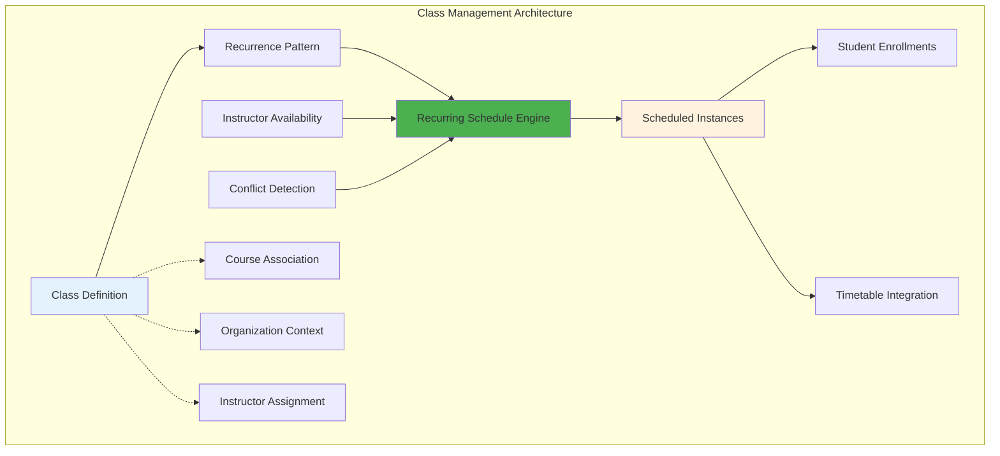
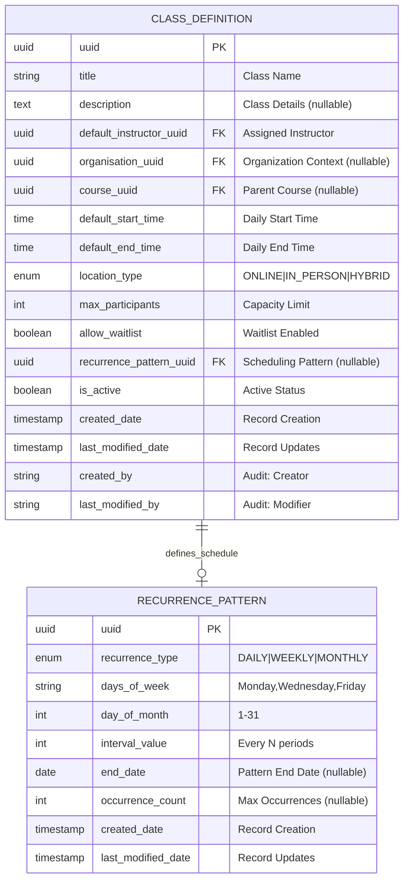
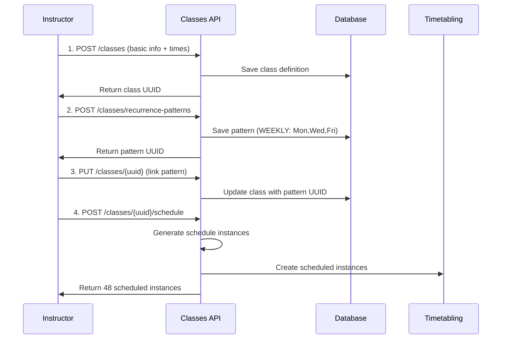
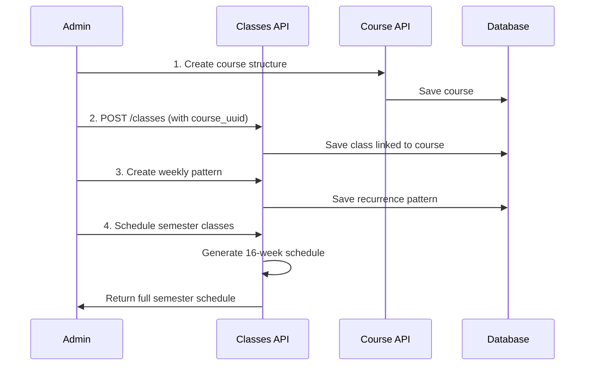
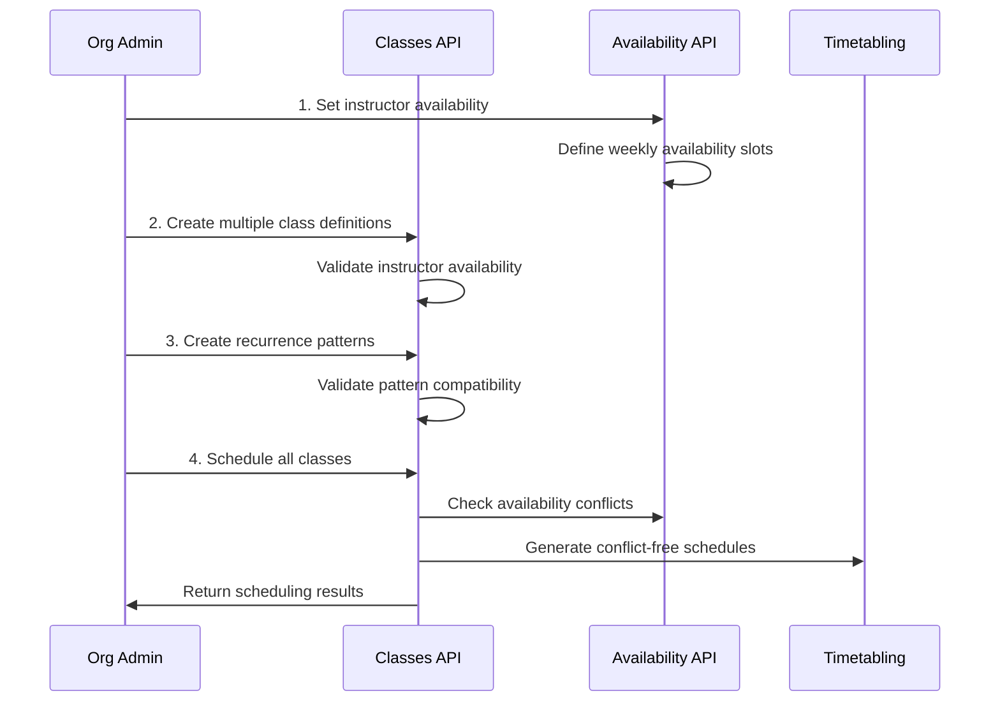
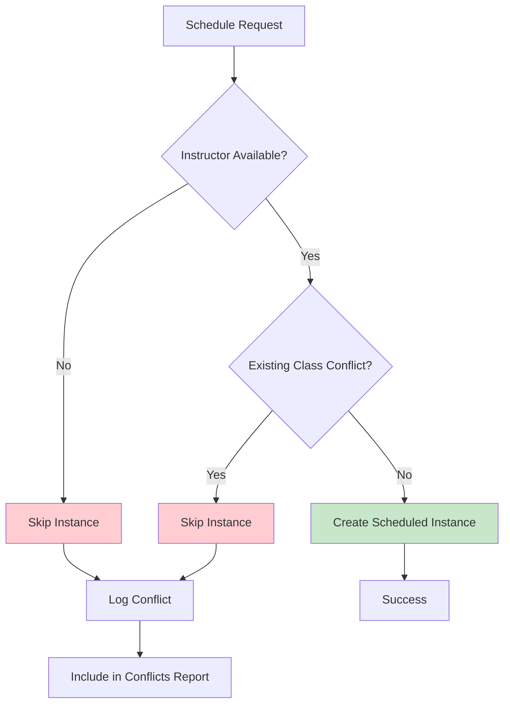

# Class Definitions Management Guide

## Overview

The **Class Definitions** module provides comprehensive management of educational class templates and recurring scheduling functionality. It enables instructors and administrators to define class structures, set up recurring schedules, and automatically generate class instances with Google Calendar-like functionality.

## Core Concepts

### Class Definitions vs Scheduled Instances

The system separates **what** a class is (definition) from **when** it occurs (scheduled instances):



## Class Definition Structure

### Core Entity: ClassDefinition



## API Usage Guide

### 1. Basic Class Definition Management

#### Create a Class Definition

```http
POST /api/v1/classes
Content-Type: application/json

{
  "title": "Introduction to Java Programming",
  "description": "Comprehensive Java programming course covering OOP concepts",
  "default_instructor_uuid": "inst1234-5678-90ab-cdef-123456789abc",
  "organisation_uuid": "org12345-6789-abcd-ef01-234567890abc",
  "course_uuid": "course123-4567-89ab-cdef-123456789abc",
  "default_start_time": "09:00:00",
  "default_end_time": "10:30:00",
  "location_type": "HYBRID",
  "max_participants": 25,
  "allow_waitlist": true,
  "is_active": true
}
```

**Response:**
```json
{
  "success": true,
  "message": "Class definition created successfully",
  "data": {
    "uuid": "cd123456-7890-abcd-ef01-234567890abc",
    "title": "Introduction to Java Programming",
    "default_start_time": "09:00:00",
    "default_end_time": "10:30:00",
    "duration_minutes": 90,
    "duration_formatted": "1h 30m",
    "has_recurrence": false,
    "is_standalone": false,
    "capacity_info": "Max 25 participants (waitlist enabled)"
  }
}
```

#### Retrieve Class Definition

```http
GET /api/v1/classes/{uuid}
```

#### Update Class Definition

```http
PUT /api/v1/classes/{uuid}
Content-Type: application/json

{
  "title": "Advanced Java Programming",
  "default_start_time": "10:00:00",
  "default_end_time": "11:30:00"
}
```

### 2. Recurrence Pattern Management

#### Create Recurrence Pattern

**Weekly Pattern Example:**
```http
POST /api/v1/classes/recurrence-patterns
Content-Type: application/json

{
  "recurrence_type": "WEEKLY",
  "days_of_week": "MONDAY,WEDNESDAY,FRIDAY",
  "interval_value": 1,
  "end_date": "2024-12-31"
}
```

**Monthly Pattern Example:**
```http
POST /api/v1/classes/recurrence-patterns
Content-Type: application/json

{
  "recurrence_type": "MONTHLY",
  "day_of_month": 15,
  "interval_value": 1,
  "occurrence_count": 12
}
```

#### Associate Pattern with Class Definition

```http
PUT /api/v1/classes/{uuid}
Content-Type: application/json

{
  "recurrence_pattern_uuid": "rp123456-7890-abcd-ef01-234567890abc"
}
```

### 3. Recurring Schedule Management (Google Calendar-like)

#### Schedule Recurring Classes

```http
POST /api/v1/classes/{uuid}/schedule?startDate=2024-09-09&endDate=2024-12-31
```

**Response:**
```json
{
  "success": true,
  "message": "Created 48 recurring class instances",
  "data": [
    {
      "uuid": "si123456-7890-abcd-ef01-234567890abc",
      "class_definition_uuid": "cd123456-7890-abcd-ef01-234567890abc",
      "start_time": "2024-09-09T09:00:00",
      "end_time": "2024-09-09T10:30:00",
      "status": "SCHEDULED"
    }
  ]
}
```

#### Preview Schedule Before Creation

```http
GET /api/v1/classes/{uuid}/schedule/preview?startDate=2024-09-09&endDate=2024-12-31
```

#### Update Recurring Schedule

```http
PUT /api/v1/classes/{uuid}/schedule
```

This cancels all future instances and regenerates them based on the current recurrence pattern.

#### Cancel Recurring Schedule

```http
DELETE /api/v1/classes/{uuid}/schedule?reason=Course%20cancelled
```

#### Check for Scheduling Conflicts

```http
GET /api/v1/classes/{uuid}/schedule/conflicts?startDate=2024-09-09&endDate=2024-12-31
```

## Class Definition Initialization Workflows

### Workflow 1: Standalone Class with Fixed Schedule



### Workflow 2: Course-Based Class Series



### Workflow 3: Organization-Wide Class Management



## Advanced Configuration

### Time-Based Validation Rules

```typescript
interface TimeValidationRules {
  startTime: {
    required: true;
    format: "HH:mm:ss";
    businessHours: "06:00:00" to "22:00:00";
  };
  endTime: {
    required: true;
    format: "HH:mm:ss";
    afterStartTime: true;
    maximumDuration: 480; // 8 hours in minutes
    minimumDuration: 15;  // 15 minutes
  };
  recurrencePattern: {
    daysOfWeek: "MONDAY,TUESDAY,WEDNESDAY,THURSDAY,FRIDAY,SATURDAY,SUNDAY";
    dayOfMonth: 1 to 31;
    intervalValue: 1 to 52; // Max yearly interval
  };
}
```

### Conflict Resolution Strategies



## Query Operations

### Find Classes by Different Criteria

```http
# Classes for a specific course
GET /api/v1/classes/course/{courseUuid}?activeOnly=true

# Classes for an instructor
GET /api/v1/classes/instructor/{instructorUuid}?activeOnly=true

# Classes for an organization
GET /api/v1/classes/organisation/{organisationUuid}

# All active classes
GET /api/v1/classes/active
```

### Filtering and Pagination

Query parameters support:
- `activeOnly=true` - Only active class definitions
- Standard pagination if implemented

## Integration Points

### With Availability Module

```http
# Check instructor availability before scheduling
GET /api/v1/availability/instructors/{instructorUuid}/check
  ?start=2024-09-09T09:00:00
  &end=2024-09-09T10:30:00
```

### With Timetabling Module

```http
# Get instructor's existing schedule
GET /api/v1/timetable/instructors/{instructorUuid}/schedule
  ?startDate=2024-09-01&endDate=2024-12-31
```

## Common Use Cases

### 1. University Semester Planning

1. Create course definitions for the semester
2. Define class templates with standard times
3. Set up weekly recurrence patterns
4. Generate full semester schedules
5. Handle holiday breaks and special schedules

### 2. Corporate Training Programs

1. Create modular training class definitions
2. Set flexible recurrence patterns
3. Account for instructor availability constraints
4. Generate training calendars across multiple locations

### 3. Language School Operations

1. Create class levels (Beginner, Intermediate, Advanced)
2. Set daily or multiple-times-per-week schedules
3. Handle rolling enrollment with ongoing classes
4. Manage instructor rotations and substitutions

## Troubleshooting

### Common Issues and Solutions

| Issue | Cause | Solution |
|-------|-------|----------|
| "No recurrence pattern" error | Class definition missing pattern UUID | Create and link recurrence pattern |
| "Instructor not available" conflicts | Instructor availability not set | Configure availability in Availability module |
| "Start time after end time" error | Invalid time configuration | Ensure start_time < end_time |
| "Pattern end date in past" error | End date before current date | Update pattern end date |

### Validation Errors

- **Time Validation**: Start time must be before end time
- **Duration Limits**: Classes must be 15 minutes to 8 hours
- **Pattern Validation**: Weekly patterns need valid days of week
- **Instructor Validation**: Assigned instructor must exist and be active
- **Capacity Validation**: Max participants must be positive number

## Performance Considerations

- **Bulk Scheduling**: Large recurring schedules (>100 instances) may take several seconds
- **Conflict Checking**: Extensive availability checking can impact performance
- **Database Indexing**: Ensure proper indexing on frequently queried fields
- **Caching**: Consider caching frequently accessed class definitions

## Security and Authorization

- **Instructor Access**: Can only manage their own class definitions
- **Organization Admin**: Can manage classes within their organization
- **System Admin**: Full access to all class definitions
- **Student Access**: Read-only access to enrolled classes

This guide provides the foundation for implementing comprehensive class definition management with modern recurring scheduling capabilities similar to popular calendar applications.