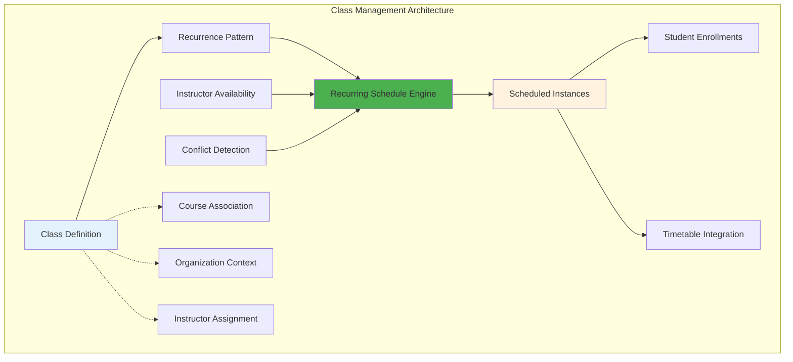

# Class Definition Management: Frontend Integration Guide

## 1. Overview

This guide provides frontend engineers with the necessary information to integrate with the **Class Definition Management** APIs. It covers creating class templates, managing recurrence patterns, and scheduling class instances.

**Key Objective:** Build a UI that allows instructors and administrators to define a class once and schedule it to run multiple times, like in Google Calendar.

---

## 2. Data Flow

The following diagram illustrates the data flow for class definition and scheduling:



---

## 3. Core Concepts for Frontend Developers

### Class Definition vs. Scheduled Instance

-   **`ClassDefinition`**: This is the **template** for a class. It defines *what* the class is about (e.g., "Introduction to Java"), its duration (e.g., 90 minutes), the instructor, and the maximum number of students. It does **not** have a specific date.
-   **`RecurrencePattern`**: This is the **rule** for scheduling. It defines *how often* a class should occur (e.g., every Monday and Wednesday at 10:00 AM).
-   **`ScheduledInstance`**: This is the **actual calendar event**. It's a concrete occurrence of a class on a specific date and time (e.g., "Introduction to Java on 2024-09-09 from 10:00 to 11:30").

**Typical Workflow:**

1.  Create a `ClassDefinition`.
2.  Create a `RecurrencePattern`.
3.  Associate the pattern with the definition.
4.  Trigger the scheduling process to generate the `ScheduledInstance` objects.

---

## 4. Frontend Integration Quick Start

This section provides a task-oriented guide to implementing the frontend UI.

### Task 1: Create the "Define a New Class" Form

This form should capture the details for a `ClassDefinition`.

-   **API Endpoint:** `POST /api/v1/classes`
-   **Method:** `POST`
-   **Controller Method:** `createClassDefinition`

**Example Request Body:**

```json
{
  "title": "Advanced React Patterns",
  "description": "A deep dive into modern React design patterns.",
  "default_instructor_uuid": "a1b2c3d4-e5f6-7890-1234-567890abcdef",
  "course_uuid": "c1d2e3f4-g5h6-7890-1234-567890abcdef",
  "default_start_time": "14:00:00",
  "default_end_time": "15:30:00",
  "location_type": "ONLINE",
  "max_participants": 30,
  "allow_waitlist": true,
  "is_active": true
}
```

**Handling the Response:**

The API will return the newly created `ClassDefinitionDTO`. Your UI should store the `uuid` from the response, as it's needed for all subsequent operations.

**Example Success Response:**

```json
{
  "success": true,
  "message": "Class definition created successfully",
  "data": {
    "uuid": "cd123456-7890-abcd-ef01-234567890abc",
    "title": "Advanced React Patterns",
    "default_start_time": "14:00:00",
    "default_end_time": "15:30:00",
    "duration_minutes": 90,
    "duration_formatted": "1h 30m",
    "has_recurrence": false,
    "is_standalone": false,
    "capacity_info": "Max 30 participants (waitlist enabled)"
  }
}
```

---

### Task 2: Build the "Set Recurrence" UI

This UI allows users to define how often the class should repeat.

-   **API Endpoint:** `POST /api/v1/classes/recurrence-patterns`
-   **Method:** `POST`
-   **Controller Method:** `createClassRecurrencePattern`

**Example: Weekly on Monday, Wednesday, Friday**

```json
{
  "recurrence_type": "WEEKLY",
  "days_of_week": "MONDAY,WEDNESDAY,FRIDAY",
  "interval_value": 1,
  "end_date": "2025-12-31"
}
```

**Example: Monthly on the 15th**

```json
{
  "recurrence_type": "MONTHLY",
  "day_of_month": 15,
  "interval_value": 1,
  "occurrence_count": 12
}
```

**After creating the pattern, associate it with the class definition:**

-   **API Endpoint:** `PUT /api/v1/classes/{uuid}`
-   **Method:** `PUT`
-   **Controller Method:** `updateClassDefinition`

**Request Body:**

```json
{
  "recurrence_pattern_uuid": "rp123456-7890-abcd-ef01-234567890abc"
}
```

---

### Task 3: Implement the "Generate Schedule" Action

This is typically a button that, when clicked, generates the actual class instances on the calendar.

#### Step 3.1: Preview the Schedule (Highly Recommended)

Before creating the instances, show the user a preview of what will be scheduled.

-   **API Endpoint:** `GET /api/v1/classes/{uuid}/schedule/preview`
-   **Method:** `GET`
-   **Controller Method:** `previewRecurringClassSchedule`
-   **Query Parameters:**
    -   `startDate`: The date to start the preview from (e.g., `2024-09-01`).
    -   `endDate`: The date to end the preview (e.g., `2024-12-31`).

**Example Request:**

```http
GET /api/v1/classes/cd123456-7890-abcd-ef01-234567890abc/schedule/preview?startDate=2024-09-01&endDate=2024-09-30
```

**The response will be an array of `ScheduledInstanceDTO` objects that you can display in a list or on a calendar UI.**

#### Step 3.2: Check for Conflicts

It's crucial to check for scheduling conflicts *before* generating the schedule.

-   **API Endpoint:** `GET /api/v1/classes/{uuid}/schedule/conflicts`
-   **Method:** `GET`
-   **Controller Method:** `checkClassSchedulingConflicts`
-   **Query Parameters:** `startDate` and `endDate`.

**Example Request:**

```http
GET /api/v1/classes/cd123456-7890-abcd-ef01-234567890abc/schedule/conflicts?startDate=2024-09-01&endDate=2024-12-31
```

**Handling the Response:**

The API will return a list of instances that conflict with the instructor's availability or other existing classes. Your UI should clearly display these conflicts to the user and ask them how to proceed.

**Example Conflict Response:**

```json
{
  "success": true,
  "message": "Found 2 scheduling conflicts out of 48 potential instances",
  "data": [
    {
      "start_time": "2024-10-14T14:00:00",
      "end_time": "2024-10-14T15:30:00",
      "conflict_reason": "Instructor not available"
    },
    {
      "start_time": "2024-11-05T14:00:00",
      "end_time": "2024-11-05T15:30:00",
      "conflict_reason": "Conflicts with another class: 'Advanced Python'"
    }
  ]
}
```

#### Step 3.3: Create the Schedule

Once the user confirms, you can create the actual schedule.

-   **API Endpoint:** `POST /api/v1/classes/{uuid}/schedule`
-   **Method:** `POST`
-   **Controller Method:** `scheduleRecurringClassFromDefinition`
-   **Query Parameters:** `startDate` and `endDate`.

**Example Request:**

```http
POST /api/v1/classes/cd123456-7890-abcd-ef01-234567890abc/schedule?startDate=2024-09-01&endDate=2024-12-31
```

**The response will contain the list of `ScheduledInstanceDTO`s that were successfully created.**

---

## 5. Managing Existing Classes

### Listing and Filtering

Provide UIs to view class definitions based on different criteria.

-   **For a specific course:** `GET /api/v1/classes/course/{courseUuid}` -> `getClassDefinitionsForCourse`
-   **For a specific instructor:** `GET /api/v1/classes/instructor/{instructorUuid}` -> `getClassDefinitionsForInstructor`
-   **For an organization:** `GET /api/v1/classes/organisation/{organisationUuid}` -> `getClassDefinitionsForOrganisation`

You can use the `activeOnly=true` query parameter to filter for active classes.

### Updating and Deactivating

-   **Update:** `PUT /api/v1/classes/{uuid}` -> `updateClassDefinition`
-   **Deactivate:** `DELETE /api/v1/classes/{uuid}` -> `deactivateClassDefinition`

---

## 6. Advanced UI Considerations

### Handling Scheduling Conflicts

When the `conflicts` endpoint returns conflicts, your UI should:

1.  **Clearly list the conflicting dates and times.**
2.  **Explain the reason for each conflict** (e.g., "Instructor is unavailable," "Another class is already scheduled").
3.  **Provide options to the user:**
    -   "Schedule anyway and ignore conflicts."
    -   "Skip the conflicting instances and schedule the rest."
    -   "Cancel and adjust the schedule."

### Real-time Updates

For a more dynamic experience, consider using WebSockets to:

-   Notify the user when a schedule generation is complete.
-   Update the calendar in real-time if another admin modifies the schedule.

### Optimistic UI Updates

When a user creates or updates a class definition, you can update the UI immediately, before the API call completes. This makes the application feel faster and more responsive.

---

This guide provides the core API interactions needed to build a robust frontend for class definition and scheduling management. By following these guidelines, you can create an intuitive and powerful interface for your users.
