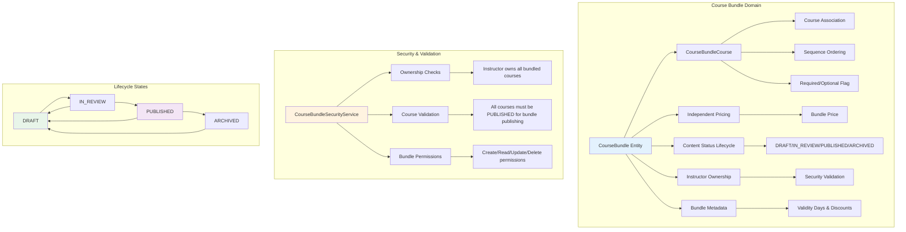

# Course Bundling Guide

## Overview

The **Course Bundling** system enables instructors to package multiple courses together with independent pricing and lifecycle management. This feature allows educators to create comprehensive learning pathways while maintaining complete control over pricing strategies and content organization.

## Course Bundling Characteristics

### Core Capabilities
- **Independent Pricing**: Bundle prices are completely separate from individual course prices
- **Content Organization**: Structured course sequencing with required/optional designations
- **Lifecycle Management**: Full DRAFT → IN_REVIEW → PUBLISHED → ARCHIVED workflow
- **Ownership Validation**: Only course owners can bundle their courses together
- **Flexible Access**: Bundle validity periods and marketing discount information

### Domain Architecture



## Data Models

### CourseBundle Entity

The primary entity representing a course bundle with independent pricing and lifecycle management.

**Key Fields:**
- `uuid`: Unique identifier
- `name`: Bundle display name
- `instructorUuid`: Bundle owner (must own all included courses)
- `description`: Bundle description and value proposition
- `price`: Independent bundle price (not calculated from course prices)
- `status`: Content lifecycle status
- `active`: Bundle availability flag
- `validityDays`: Access duration after purchase
- `discountPercentage`: Marketing discount information
- `thumbnailUrl` / `bannerUrl`: Bundle imagery

**Database Schema:**
```sql
CREATE TABLE course_bundles (
    id BIGSERIAL PRIMARY KEY,
    uuid UUID UNIQUE NOT NULL DEFAULT gen_random_uuid(),
    name VARCHAR(255) NOT NULL,
    instructor_uuid UUID NOT NULL,
    description TEXT,
    price DECIMAL(10, 2),
    status VARCHAR(50) NOT NULL DEFAULT 'draft',
    active BOOLEAN DEFAULT false,
    validity_days INTEGER,
    discount_percentage DECIMAL(5, 2),
    thumbnail_url VARCHAR(500),
    banner_url VARCHAR(500),
    created_date TIMESTAMP WITH TIME ZONE DEFAULT CURRENT_TIMESTAMP,
    created_by VARCHAR(255),
    updated_date TIMESTAMP WITH TIME ZONE DEFAULT CURRENT_TIMESTAMP,
    updated_by VARCHAR(255)
);
```

### CourseBundleCourse Association

Junction table linking bundles to courses with sequencing and requirement information.

**Key Fields:**
- `bundleUuid`: Reference to course bundle
- `courseUuid`: Reference to individual course
- `sequenceOrder`: Suggested learning order
- `isRequired`: Required vs optional course designation

**Database Schema:**
```sql
CREATE TABLE course_bundle_courses (
    id BIGSERIAL PRIMARY KEY,
    uuid UUID UNIQUE NOT NULL DEFAULT gen_random_uuid(),
    bundle_uuid UUID NOT NULL,
    course_uuid UUID NOT NULL,
    sequence_order INTEGER,
    is_required BOOLEAN DEFAULT true,
    created_date TIMESTAMP WITH TIME ZONE DEFAULT CURRENT_TIMESTAMP,
    created_by VARCHAR(255),
    updated_date TIMESTAMP WITH TIME ZONE DEFAULT CURRENT_TIMESTAMP,
    updated_by VARCHAR(255),
    
    CONSTRAINT course_bundle_courses_unique_bundle_course UNIQUE (bundle_uuid, course_uuid)
);
```

## API Endpoints

### Bundle Management

#### Create Course Bundle
```http
POST /api/v1/course-bundles
Content-Type: application/json

{
    "name": "Complete Web Development Bundle",
    "instructor_uuid": "instructor-uuid-here",
    "description": "Comprehensive web development bundle covering frontend and backend",
    "price": 299.99,
    "status": "draft",
    "validity_days": 365,
    "discount_percentage": 25.00
}
```

**Response:**
```json
{
    "success": true,
    "message": "Course bundle created successfully",
    "data": {
        "uuid": "bundle-uuid-here",
        "name": "Complete Web Development Bundle",
        "instructor_uuid": "instructor-uuid-here",
        "description": "Comprehensive web development bundle covering frontend and backend",
        "price": 299.99,
        "status": "draft",
        "active": false,
        "validity_days": 365,
        "discount_percentage": 25.00,
        "created_date": "2025-01-09T12:00:00",
        "is_free": false,
        "is_published": false,
        "is_draft": true,
        "lifecycle_stage": "Draft and Inactive"
    }
}
```

#### Add Course to Bundle
```http
POST /api/v1/course-bundles/{bundleUuid}/courses/{courseUuid}?sequenceOrder=1&isRequired=true
```

**Security Requirement:** Instructor must own both the bundle and the course being added.

#### Get Bundle Courses
```http
GET /api/v1/course-bundles/{bundleUuid}/courses
```

**Response:**
```json
{
    "success": true,
    "message": "Bundle courses retrieved successfully",
    "data": [
        {
            "uuid": "course1-uuid",
            "name": "HTML & CSS Fundamentals",
            "sequence_order": 1,
            "is_required": true
        },
        {
            "uuid": "course2-uuid", 
            "name": "JavaScript Advanced Concepts",
            "sequence_order": 2,
            "is_required": true
        }
    ]
}
```

### Lifecycle Management

#### Publish Bundle
```http
POST /api/v1/course-bundles/{bundleUuid}/publish
```

**Prerequisites:**
- Bundle must be in DRAFT status
- Bundle must contain at least one course
- All bundled courses must be PUBLISHED
- User must own the bundle

#### Check Publishing Readiness
```http
GET /api/v1/course-bundles/{bundleUuid}/ready-for-publishing
```

**Response:**
```json
{
    "success": true,
    "message": "Bundle is ready for publishing",
    "data": true
}
```

#### Get Available Status Transitions
```http
GET /api/v1/course-bundles/{bundleUuid}/status-transitions
```

**Response:**
```json
{
    "success": true,
    "message": "Status transitions retrieved successfully", 
    "data": ["in_review", "published"]
}
```

### Search and Discovery

#### Search Published Bundles
```http
GET /api/v1/course-bundles/published?page=0&size=20
```

#### Search by Instructor
```http
GET /api/v1/course-bundles/instructor/{instructorUuid}?page=0&size=20
```

#### Advanced Search
```http
GET /api/v1/course-bundles/search?name=web&status=published&page=0&size=20
```

## Business Rules

### Bundle Creation Rules
1. **Ownership Validation**: Instructor can only bundle courses they own
2. **Name Uniqueness**: Bundle names must be unique per instructor
3. **Pricing Independence**: Bundle price is set independently of course prices
4. **Status Initialization**: New bundles start in DRAFT status

### Publishing Requirements
1. **Course Requirement**: Bundle must contain at least one course
2. **Course Status**: All bundled courses must be PUBLISHED
3. **Ownership Continuity**: All courses must still be owned by bundle creator
4. **Content Validation**: All course content must be complete and valid

### Lifecycle Transitions

#### DRAFT → IN_REVIEW
- Bundle has complete metadata (name, description, price)
- Contains at least one course
- Instructor initiates review process

#### IN_REVIEW → PUBLISHED  
- All bundled courses are PUBLISHED
- Bundle content passes validation checks
- Administrative approval (if required)

#### PUBLISHED → ARCHIVED
- Bundle no longer available for new purchases
- Existing bundle owners retain access
- Can be reactivated through review process

#### Published Bundle Restrictions
- Cannot remove courses (would break existing purchases)
- Can add courses to existing bundles
- Price decreases require approval
- Price increases allowed without restriction

### Security Model

#### Permission Levels
1. **Bundle Owner**: Full CRUD access to their bundles
2. **Course Owner**: Must own all courses to include in bundle
3. **Public Access**: Can view published, active bundles
4. **Administrative**: Platform-wide bundle management

#### Access Control Implementation
```java
// Security service validates ownership
@PreAuthorize("@courseBundleSecurityService.canModifyBundle(#bundleUuid)")
public CourseBundleDTO updateCourseBundle(UUID bundleUuid, CourseBundleDTO dto);

@PreAuthorize("@courseBundleSecurityService.canAddCourseToBundle(#bundleUuid, #courseUuid)")
public CourseBundleDTO addCourseToBundle(UUID bundleUuid, UUID courseUuid);
```

## Integration Points

### Course Management Integration
- **Course Ownership**: Bundle system queries course ownership before bundling
- **Course Status**: Monitors course publication status for bundle publishing
- **Course Lifecycle**: Responds to course archival/deletion events

### Student Enrollment Integration
- **Bundle Purchases**: Students purchase bundles to access all included courses
- **Progress Tracking**: Bundle completion based on required course completion
- **Certificate Generation**: Bundle certificates awarded when requirements met

### Payment Processing Integration
- **Independent Pricing**: Bundle purchases use bundle price, not sum of course prices
- **Discount Handling**: Marketing discounts applied at bundle level
- **Refund Logic**: Bundle refunds handle partial course access scenarios

## Example Workflows

### Creating a Complete Learning Path

1. **Instructor Creates Courses**
   ```http
   POST /api/v1/courses (Create "HTML Basics")
   POST /api/v1/courses (Create "CSS Advanced") 
   POST /api/v1/courses (Create "JavaScript Fundamentals")
   ```

2. **Publish Individual Courses**
   ```http
   POST /api/v1/courses/{courseUuid}/publish
   ```

3. **Create Course Bundle**
   ```http
   POST /api/v1/course-bundles
   {
       "name": "Frontend Development Mastery",
       "description": "Complete frontend development learning path",
       "price": 199.99,
       "validity_days": 365
   }
   ```

4. **Add Courses to Bundle**
   ```http
   POST /api/v1/course-bundles/{bundleUuid}/courses/{htmlCourseUuid}?sequenceOrder=1
   POST /api/v1/course-bundles/{bundleUuid}/courses/{cssCourseUuid}?sequenceOrder=2  
   POST /api/v1/course-bundles/{bundleUuid}/courses/{jsCourseUuid}?sequenceOrder=3
   ```

5. **Publish Bundle**
   ```http
   POST /api/v1/course-bundles/{bundleUuid}/publish
   ```

### Student Bundle Purchase Flow

1. **Browse Published Bundles**
   ```http
   GET /api/v1/course-bundles/published
   ```

2. **View Bundle Details**
   ```http
   GET /api/v1/course-bundles/{bundleUuid}
   GET /api/v1/course-bundles/{bundleUuid}/courses
   ```

3. **Purchase Bundle** (Payment system integration)
   
4. **Access All Bundle Courses** (Enrollment system grants access)

## Error Handling

### Common Error Scenarios

#### Insufficient Permissions
```json
{
    "success": false,
    "message": "Access denied to modify course bundle",
    "error_code": "BUNDLE_ACCESS_DENIED"
}
```

#### Bundle Not Ready for Publishing
```json
{
    "success": false,
    "message": "Bundle is not ready for publishing - not all courses are published",
    "error_code": "BUNDLE_PUBLISHING_REQUIREMENTS_NOT_MET"
}
```

#### Course Already in Bundle
```json
{
    "success": false,
    "message": "Course is already associated with this bundle", 
    "error_code": "DUPLICATE_COURSE_ASSOCIATION"
}
```

#### Invalid Course Ownership
```json
{
    "success": false,
    "message": "Cannot bundle course - instructor does not own the course",
    "error_code": "COURSE_OWNERSHIP_VALIDATION_FAILED"
}
```

## Performance Considerations

### Database Optimizations
- **Indexes**: Bundle instructor, status, and course associations
- **Query Optimization**: Efficient course ownership validation queries
- **Caching**: Bundle metadata and course associations
- **Pagination**: All list endpoints support pagination

### Security Performance
- **Batch Validation**: Validate multiple course ownership in single query
- **Permission Caching**: Cache instructor ownership for active sessions
- **Audit Logging**: Track bundle operations for security monitoring

## Monitoring and Analytics

### Key Metrics
- **Bundle Creation Rate**: Track instructor adoption
- **Publishing Success Rate**: Monitor content quality
- **Purchase Conversion**: Bundle vs individual course sales
- **Completion Rates**: Bundle vs individual course completion

### Alerting
- **Failed Publishing**: Alert when bundles fail validation
- **Ownership Violations**: Security alert for unauthorized access attempts  
- **Performance Degradation**: Monitor query performance for large bundles

This comprehensive course bundling system provides instructors with powerful tools for creating learning pathways while maintaining strict security and content lifecycle management.