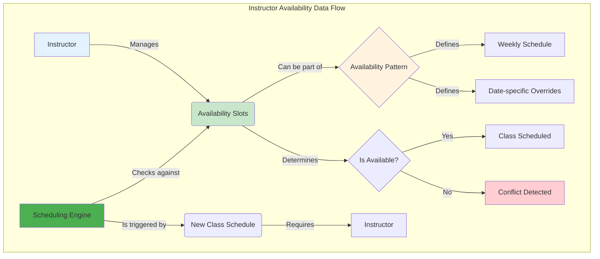

# Instructor Availability: Frontend Integration Guide

## 1. Overview

This guide provides frontend engineers with a comprehensive walkthrough for integrating with the **Instructor Availability Management** APIs. It focuses on building a calendar-based UI for managing instructor schedules.

**API Endpoint Root:** `/api/v1/availability`
**OpenAPI Tag:** `Instructor Availability Management`

---

## 2. Data Flow

The following diagram illustrates the data flow for instructor availability:



---

## 3. Core Task: Building the Availability Calendar

The primary UI is a weekly calendar where instructors can manage their availability.

### Fetching Availability Data

To populate the calendar, fetch all availability slots for an instructor.

-   **API Endpoint:** `GET /api/v1/availability/instructors/{instructorUuid}`
-   **Method:** `GET`
-   **Controller Method:** `getInstructorAvailability`

**Example Request:**

```http
GET /api/v1/availability/instructors/a1b2c3d4-e5f6-7890-1234-567890abcdef
```

**Example Response:**

The response will be a list of `AvailabilitySlotDTO` objects. Your UI should render these slots on the calendar, using `is_available` to style them differently (e.g., green for available, gray for blocked).

```json
{
  "success": true,
  "message": "Instructor availability retrieved successfully",
  "data": [
    {
      "uuid": "slot1-uuid-...",
      "instructor_uuid": "a1b2c3d4-e5f6-7890-1234-567890abcdef",
      "availability_type": "WEEKLY",
      "day_of_week": 1, // Monday
      "start_time": "09:00:00",
      "end_time": "12:00:00",
      "is_available": true,
      "duration_formatted": "3h 0m"
    },
    {
      "uuid": "slot2-uuid-...",
      "instructor_uuid": "a1b2c3d4-e5f6-7890-1234-567890abcdef",
      "availability_type": "SPECIFIC_DATE",
      "specific_date": "2024-10-20",
      "start_time": "14:00:00",
      "end_time": "15:00:00",
      "is_available": false, // Blocked time
      "duration_formatted": "1h 0m"
    }
  ]
}
```

---

## 4. Managing Availability Patterns

Instructors can define their availability in several ways.

### Setting Weekly Availability

This is the most common scenario. The user selects time slots that repeat every week.

-   **API Endpoint:** `POST /api/v1/availability/instructors/{instructorUuid}/weekly`
-   **Method:** `POST`
-   **Controller Method:** `setInstructorWeeklyAvailability`

**Example Request Body:**

This request sets the instructor to be available every Monday from 9 AM to 5 PM and every Wednesday from 10 AM to 1 PM.

```json
[
  {
    "day_of_week": 1, // Monday
    "start_time": "09:00:00",
    "end_time": "17:00:00",
    "is_available": true
  },
  {
    "day_of_week": 3, // Wednesday
    "start_time": "10:00:00",
    "end_time": "13:00:00",
    "is_available": true
  }
]
```

### Blocking Specific Times

Users may need to block time for appointments or other commitments.

-   **API Endpoint:** `POST /api/v1/availability/instructors/{instructorUuid}/block`
-   **Method:** `POST`
-   **Controller Method:** `blockInstructorTime`
-   **Query Parameters:**
    -   `start`: The start time in `YYYY-MM-DDTHH:mm:ss` format.
    -   `end`: The end time in `YYYY-MM-DDTHH:mm:ss` format.

**Example Request:**

```http
POST /api/v1/availability/instructors/{instructorUuid}/block?start=2024-09-12T11:00:00&end=2024-09-12T12:30:00
```

This will create a new `AvailabilitySlot` with `is_available` set to `false`.

---

## 5. Checking Availability

This is a crucial integration point for other modules, like **Class Definition Management**. Before scheduling a class, you must check if the instructor is available.

-   **API Endpoint:** `GET /api/v1/availability/instructors/{instructorUuid}/check`
-   **Method:** `GET`
-   **Controller Method:** `checkInstructorAvailability`
-   **Query Parameters:**
    -   `start`: The start time in `YYYY-MM-DDTHH:mm:ss` format.
    -   `end`: The end time in `YYYY-MM-DDTHH:mm:ss` format.

**Example Request:**

```http
GET /api/v1/availability/instructors/a1b2c3d4-e5f6-7890-1234-567890abcdef/check?start=2024-09-10T10:00:00&end=2024-09-10T11:30:00
```

**Example Response (Instructor is Available):**

```json
{
  "success": true,
  "message": "Instructor is available",
  "data": true
}
```

**Example Response (Instructor is Not Available):**

```json
{
  "success": true,
  "message": "Instructor is not available",
  "data": false
}
```

### UI Implementation

-   When an administrator is assigning an instructor to a class, use this endpoint to validate the selection in real-time.
-   Disable the "Save" or "Assign" button if the instructor is not available.
-   Provide a clear error message explaining the conflict.

---

## 6. Data Structures for Frontend

### `AvailabilitySlotDTO`

This is the primary data structure you'll work with.

```typescript
interface AvailabilitySlotDTO {
  uuid?: string;
  instructor_uuid: string;
  availability_type: 'DAILY' | 'WEEKLY' | 'MONTHLY' | 'CUSTOM' | 'SPECIFIC_DATE';
  day_of_week?: number; // 1=Monday, 7=Sunday
  specific_date?: string; // YYYY-MM-DD
  start_time: string; // HH:mm:ss
  end_time: string; // HH:mm:ss
  is_available: boolean;
  // Computed properties from the backend
  duration_formatted?: string; // e.g., "1h 30m"
  description?: string; // e.g., "Weekly on Mondays"
}
```

### `WeeklyAvailabilitySlotDTO`

Used when creating weekly patterns.

```typescript
interface WeeklyAvailabilitySlotDTO {
  day_of_week: number;
  start_time: string;
  end_time: string;
  is_available?: boolean; // Defaults to true
}
```

---

This updated guide provides a more focused, task-oriented approach for frontend developers integrating with the Instructor Availability APIs.
