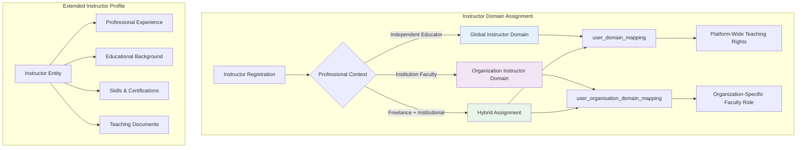
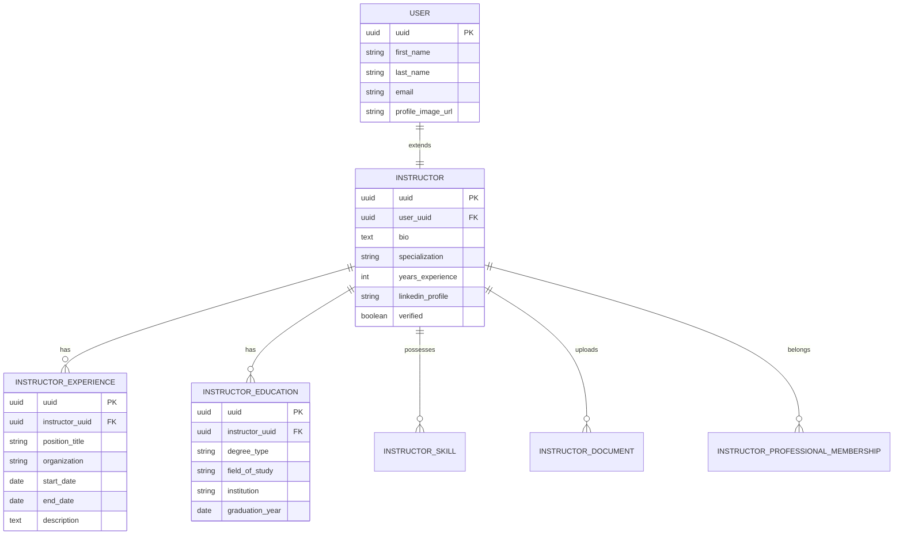
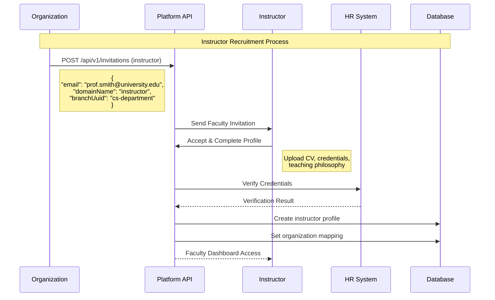
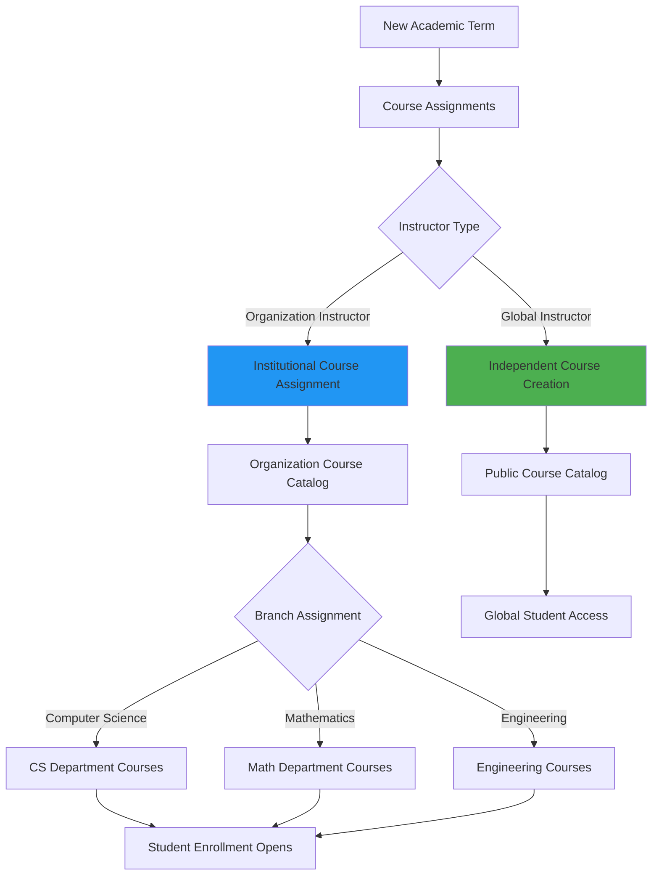
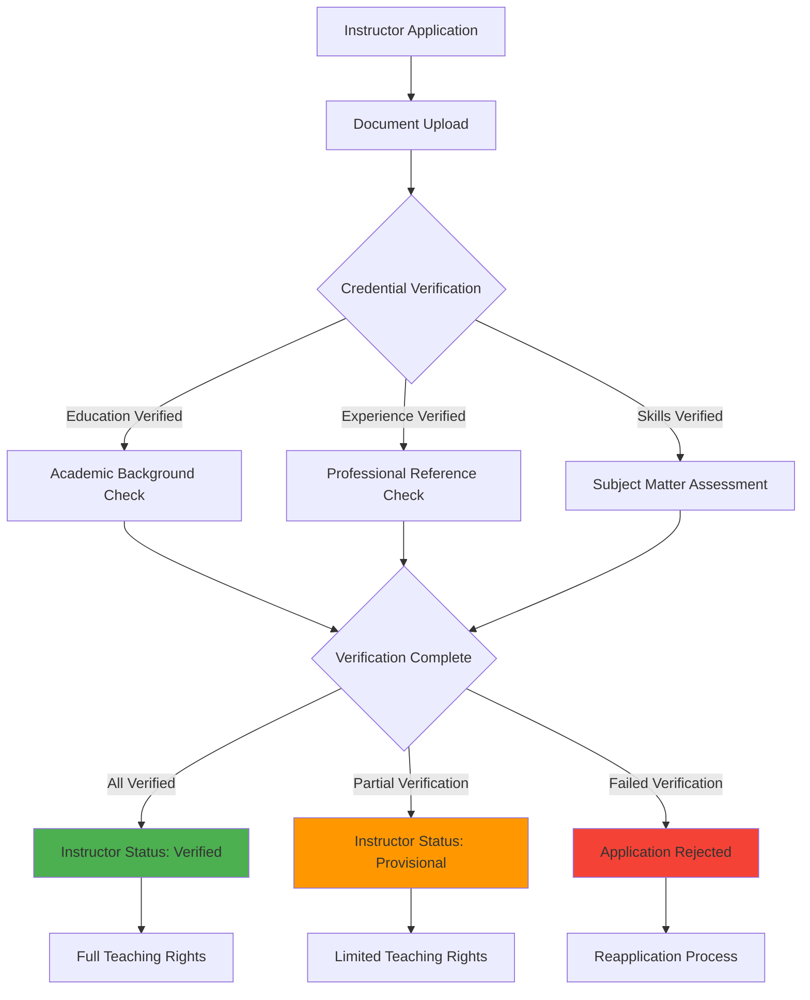

# Instructor Domain Guide

## Overview

The **Instructor** domain represents educators who create, deliver, and manage educational content within the Elimika platform. Instructors can operate as independent content creators (global domain) or as faculty members affiliated with specific educational organizations.

## Instructor Domain Characteristics

### Core Capabilities
- **Content Creation**: Design courses, lessons, assessments, and rubrics
- **Student Management**: Monitor progress, provide feedback, grade assignments
- **Assessment Design**: Create quizzes, assignments, and evaluation criteria
- **Performance Analytics**: Track student engagement and learning outcomes
- **Certification Authority**: Award certificates upon course completion

### Domain Assignment Patterns



## Global vs Organization Instructor Domains

### Global Instructor Domain

**Assignment**: Direct mapping in `user_domain_mapping` table
**Scope**: Platform-wide content creation and teaching authority
**Use Cases**:
- Independent course creators
- Freelance educators
- Subject matter experts
- Community contributors

```sql
-- Example: Global instructor domain assignment
INSERT INTO user_domain_mapping (user_uuid, domain_uuid)
VALUES ('instructor-456', 'instructor-domain-uuid');
```

**Capabilities**:
- Create public courses accessible to all students
- Publish to platform course catalog
- Earn revenue from course enrollments
- Build instructor reputation and ratings

### Organization Instructor Domain

**Assignment**: Contextual mapping in `user_organisation_domain_mapping` table
**Scope**: Institution-specific teaching and administrative responsibilities
**Additional Context**:
- Department/faculty assignment
- Academic rank and tenure status
- Semester/term associations
- Institution-specific policies and curricula

```sql
-- Example: Organization instructor domain assignment
INSERT INTO user_organisation_domain_mapping (
    user_uuid, organisation_uuid, domain_uuid, branch_uuid,
    start_date, active, deleted
) VALUES (
    'instructor-456', 'university-xyz', 'instructor-domain-uuid', 'engineering-faculty',
    '2024-08-01', true, false
);
```

## Extended Instructor Profile System

### Instructor Entity Relationships



### Professional Qualifications Management

```json
{
  "instructorProfile": {
    "userUuid": "instructor-456",
    "specialization": "Machine Learning & Data Science",
    "yearsExperience": 8,
    "verified": true,
    "bio": "PhD in Computer Science with expertise in ML algorithms...",
    
    "education": [
      {
        "degreeType": "PhD",
        "fieldOfStudy": "Computer Science", 
        "institution": "MIT",
        "graduationYear": "2018"
      }
    ],
    
    "experience": [
      {
        "positionTitle": "Senior Data Scientist",
        "organization": "Google",
        "startDate": "2020-01-01",
        "endDate": null,
        "description": "Leading ML research initiatives..."
      }
    ],
    
    "skills": ["Python", "TensorFlow", "Deep Learning", "Statistics"],
    
    "professionalMemberships": [
      {
        "organizationName": "ACM",
        "membershipType": "Professional Member",
        "startDate": "2019-01-01"
      }
    ]
  }
}
```

## Instructor Lifecycle Management

### Recruitment and Onboarding



### Teaching Assignment Workflow



## API Reference for Instructor Management

### Instructor Profile Management

| Method | Endpoint | Purpose | Instructor-Specific Fields |
|--------|----------|---------|---------------------------|
| `GET` | `/api/v1/instructors/{uuid}` | Get complete instructor profile | `bio`, `specialization`, `yearsExperience` |
| `PUT` | `/api/v1/instructors/{uuid}` | Update instructor info | Teaching philosophy, expertise areas |
| `POST` | `/api/v1/instructors/{uuid}/experience` | Add work experience | Position history, achievements |
| `POST` | `/api/v1/instructors/{uuid}/education` | Add education record | Degrees, certifications |

### Course and Content Management

| Method | Endpoint | Purpose | Use Case |
|--------|----------|---------|----------|
| `POST` | `/api/v1/instructors/{uuid}/courses` | Create new course | Content development |
| `GET` | `/api/v1/instructors/{uuid}/courses` | List instructor courses | Teaching portfolio |
| `PUT` | `/api/v1/courses/{courseUuid}/content` | Update course content | Curriculum maintenance |
| `POST` | `/api/v1/courses/{courseUuid}/assessments` | Create assessments | Student evaluation |

### Student Management and Analytics

| Method | Endpoint | Purpose | Instructor Context |
|--------|----------|---------|-------------------|
| `GET` | `/api/v1/instructors/{uuid}/students` | List all students across courses | Class roster management |
| `GET` | `/api/v1/courses/{courseUuid}/enrollments` | Get course enrollments | Specific course management |
| `GET` | `/api/v1/instructors/{uuid}/analytics` | Teaching performance metrics | Professional development |
| `POST` | `/api/v1/courses/{courseUuid}/grades` | Submit student grades | Assessment recording |

## Organization-Specific Instructor Features

### Academic Department Integration

```json
{
  "organizationInstructor": {
    "instructorUuid": "prof-smith-789",
    "organizationAffiliation": {
      "organisationUuid": "state-university",
      "organisationName": "State University",
      "domainInOrganisation": "instructor",
      "branchUuid": "cs-department",
      "branchName": "Computer Science Department",
      "academicRank": "Associate Professor",
      "tenure": true,
      "startDate": "2020-08-01",
      "active": true
    },
    
    "institutionalResponsibilities": {
      "courseLoad": 6,
      "maxStudentsPerCourse": 150,
      "researchExpectations": true,
      "committeeAssignments": ["Graduate Admissions", "Curriculum Committee"],
      "officeHours": "Tuesdays 2-4 PM, Thursdays 10-12 PM"
    }
  }
}
```

### Multi-Branch Teaching Assignments

Instructors can teach across multiple departments within an organization:

```sql
-- Example: Instructor teaching in multiple departments
INSERT INTO user_organisation_domain_mapping 
(user_uuid, organisation_uuid, domain_uuid, branch_uuid, start_date, active, deleted)
VALUES 
('prof-interdisciplinary', 'university-abc', 'instructor-domain', 'cs-dept', '2024-01-01', true, false),
('prof-interdisciplinary', 'university-abc', 'instructor-domain', 'math-dept', '2024-01-01', true, false);
```

## Performance Analytics and Reporting

### Teaching Effectiveness Metrics

```mermaid
dashboard
    title Instructor Performance Dashboard
    
    chart-pie "Student Satisfaction"
        "Excellent (85%)" : 85
        "Good (12%)" : 12
        "Fair (3%)" : 3
        
    chart-bar "Course Completion Rates"
        "Fall 2024" : 94
        "Spring 2024" : 91
        "Fall 2023" : 88
        
    chart-line "Student Engagement Trends"
        "Week 1" : 95
        "Week 5" : 87
        "Week 10" : 92
        "Week 15" : 89
```

### Assessment Quality Metrics

```json
{
  "instructorAssessmentAnalytics": {
    "instructorUuid": "prof-smith-789",
    "period": "Fall 2024",
    "coursesTeaching": 3,
    "totalStudents": 287,
    
    "assessmentMetrics": {
      "averageGradeDistribution": {
        "A": 23,
        "B": 45, 
        "C": 27,
        "D": 4,
        "F": 1
      },
      "assignmentCompletionRate": 94.2,
      "averageSubmissionTime": "2.3 days before deadline",
      "rubricUsageConsistency": 98.5
    },
    
    "studentFeedback": {
      "overallSatisfaction": 4.6,
      "contentClarity": 4.8,
      "responseTime": 4.4,
      "helpfulness": 4.7
    }
  }
}
```

## Instructor Validation and Quality Assurance

### Professional Verification Process



### Continuous Professional Development

Organizations can track and require ongoing instructor development:

```bash
# Example: Instructor certification tracking

# 1. Get instructor's current certifications
curl -X GET /api/v1/instructors/{instructorUuid}/certifications

# 2. Record new certification
curl -X POST /api/v1/instructors/{instructorUuid}/certifications \
  -H "Content-Type: application/json" \
  -d '{
    "certificationType": "Educational Technology",
    "issuingOrganization": "International Society for Technology in Education",
    "dateEarned": "2024-11-15",
    "expirationDate": "2027-11-15",
    "verificationUrl": "https://iste.org/verify/12345"
  }'

# 3. Check compliance with organization requirements
curl -X GET /api/v1/organizations/{orgUuid}/instructors/{instructorUuid}/compliance
```

This instructor domain implementation provides comprehensive support for both independent educators and institutional faculty, enabling effective content creation, student management, and professional development while maintaining appropriate quality standards and accountability measures.