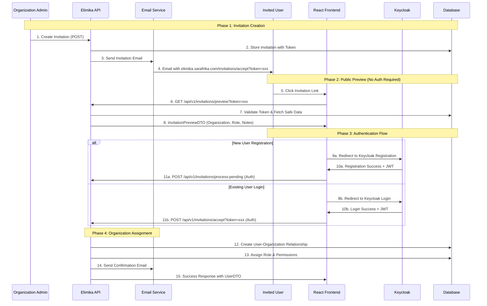

# Elimika Invitation System Guide

## Overview

This comprehensive guide covers the complete Elimika invitation system, including API usage for creating invitations and React frontend integration for handling invitation acceptance/decline flows. The system provides secure, token-based invitations with Keycloak authentication integration.

## System Architecture

The invitation system implements a multi-phase authentication flow that accommodates both new and existing users while maintaining security through token-based validation and Keycloak integration.



# API Reference - Creating Invitations

## Organization Invitations

Invite users to join an organization with a specific role.

**Endpoint:** `POST /api/v1/organisations/{organisationUuid}/invitations`

### Parameters

| Parameter | Type | Location | Description | 
|---|---|---|---|
| `organisationUuid` | `UUID` | Path | The unique identifier of the organization. |

### Request Body (InvitationRequestDTO)

```json
{
  "recipient_email": "john.doe@example.com",
  "recipient_name": "John Doe",
  "domain_name": "instructor",
  "inviter_uuid": "550e8400-e29b-41d4-a716-446655440004",
  "notes": "Welcome to our training program! We're excited to have you join our team."
}
```

| Field | Type | Required | Description |
|---|---|---|---|
| `recipient_email` | `String` | **Required** | Valid email address (max 100 chars). Used for invitation delivery. |
| `recipient_name` | `String` | **Required** | Full name of invitee (max 150 chars). Used in email templates. |
| `domain_name` | `String` | **Required** | Role to assign: `student`, `instructor`, `admin`, `organisation_user` |
| `inviter_uuid` | `UUID` | **Required** | UUID of user sending invitation. Must have appropriate permissions. |
| `notes` | `String` | Optional | Personal message (max 500 chars). Displayed in invitation email. |

### User Roles (domain_name)

| Role | Description | Permissions |
|------|-------------|-------------|
| `student` | Learners enrolled in courses | Access learning materials, submit assignments, track progress |
| `instructor` | Teachers and facilitators | Create/manage courses, grade assignments, interact with students |
| `admin` | System administrators | Full organizational control, manage users, courses, settings |
| `organisation_user` | General organization members | Basic access to organizational resources |

### Example Request

An administrator would make a `POST` request to the relevant endpoint with a JSON body containing the recipient's details, the domain to assign, and the inviter's UUID.

## Training Branch Invitations

Invite users directly to a specific training branch within an organization.

**Endpoint:** `POST /api/v1/organisations/{organisationUuid}/training-branches/{branchUuid}/invitations`

### Parameters

| Parameter | Type | Location | Description |
|---|---|---|---|
| `organisationUuid` | `UUID` | Path | UUID of organization that owns the training branch |
| `branchUuid` | `UUID` | Path | UUID of the specific training branch |

### Request Body

Same format as organization invitations (InvitationRequestDTO).

### Example Request

Similar to the organization invitation, a `POST` request is made to the branch-specific endpoint with the same JSON payload.

# Frontend Integration - React Implementation

## URL Structure

The React frontend handles invitation URLs with token-based authentication:

```
https://elimika.sarafrika.com/invitations/accept?token={64-character-token}
https://elimika.sarafrika.com/invitations/decline?token={64-character-token}
```

## API Endpoints for Frontend

### 1. Public Preview (No Authentication)

**Endpoint:** `GET /api/v1/invitations/preview?token={token}`

**Purpose:** Display invitation details before user authentication

**Response:** InvitationPreviewDTO

```json
{
  "success": true,
  "data": {
    "recipient_name": "John Doe",
    "organisation_name": "Acme Training Institute",
    "branch_name": "Downtown Branch",
    "role_name": "Instructor",
    "role_description": "A teacher or facilitator with course creation and management capabilities",
    "inviter_name": "Jane Smith",
    "expires_at": "2025-09-05T14:30:00",
    "notes": "Welcome to our training program!",
    "is_expired": false,
    "requires_registration": true
  }
}
```

### 2. Accept Invitation (Authenticated)

**Endpoint:** `POST /api/v1/invitations/accept?token={token}`

**Headers:** `Authorization: Bearer {jwt-token}`

**Response:** Updated UserDTO with organization relationships

### 3. Decline Invitation (Authenticated)

**Endpoint:** `POST /api/v1/invitations/decline?token={token}`

**Headers:** `Authorization: Bearer {jwt-token}`

**Response:** Success confirmation

### 4. Process Pending Invitations (Authenticated)

**Endpoint:** `POST /api/v1/invitations/process-pending`

**Purpose:** Auto-accept all pending invitations for newly authenticated user

**Headers:** `Authorization: Bearer {jwt-token}`

**Response:** Array of accepted invitations

## Frontend Component Logic

A frontend component, such as an `InvitationPage`, is responsible for handling the user-facing invitation flow. Its logic can be broken down as follows:

1.  **Token Parsing**: On page load, the component extracts the invitation token from the URL parameters.
2.  **Preview Fetching**: It makes an unauthenticated call to the `GET /api/v1/invitations/preview` endpoint using the token.
    -   If the invitation is invalid or expired, it displays an error message.
    -   Otherwise, it stores the preview data (organization name, role, notes, etc.) in its state and renders a preview of the invitation to the user.
3.  **Authentication Check**:
    -   If the user is not authenticated, the component displays buttons to either "Create New Account" or "Sign In". These actions should trigger the Keycloak authentication flow.
    -   If the user is already authenticated, the component displays "Accept" and "Decline" buttons.
4.  **Acceptance/Decline**:
    -   Clicking "Accept" makes an authenticated `POST` request to `/api/v1/invitations/accept`. On success, it should redirect the user to their dashboard with a welcome message.
    -   Clicking "Decline" makes an authenticated `POST` request to `/api/v1/invitations/decline`.
5.  **Auto-Processing for New Logins**: To provide a seamless experience, after a user logs in or registers, the component should check if there are any pending invitations and, if so, automatically process them by calling the `POST /api/v1/invitations/process-pending` endpoint.

## Authentication Integration

The system integrates with Keycloak for authentication:

1. **JWT Token Extraction:** Backend extracts user email from Keycloak JWT claims
2. **Email Validation:** Ensures JWT email matches invitation recipient  
3. **Automatic User Creation:** New users added to database after Keycloak registration
4. **Session Management:** React app manages Keycloak tokens and session state

## Invitation Status Lifecycle

Invitations progress through the following states:

| Status | Description | Actions Available |
|--------|-------------|-------------------|
| `PENDING` | Invitation sent, awaiting response | Accept, Decline, Expire |
| `ACCEPTED` | User accepted invitation | View only |
| `DECLINED` | User declined invitation | None |
| `EXPIRED` | Invitation passed expiration date | None |
| `CANCELLED` | Admin cancelled invitation | None |

## Error Handling

| Error Type | HTTP Status | Frontend Handling |
|------------|-------------|-------------------|
| Invalid Token | 404 | "Invitation not found" message |
| Expired Invitation | 400 | Expiration notice with contact info |
| Email Mismatch | 400 | "Please use correct email address" |
| Already Accepted | 400 | Redirect to dashboard with status |
| Authentication Required | 401 | Trigger authentication flow |
| Network Error | 500 | Show retry option |

## Security Considerations

### Token Security
- **Unique Tokens:** 64-character cryptographically secure tokens
- **Single Use:** Tokens invalid after acceptance/decline  
- **Expiration:** Configurable expiration (default 7 days)
- **HTTPS Only:** All invitation links use HTTPS

### Authentication Security
- **JWT Validation:** All endpoints validate Keycloak JWT tokens
- **Email Verification:** JWT email must match invitation recipient
- **CSRF Protection:** State-changing operations use POST
- **Rate Limiting:** API endpoints implement rate limiting

## Maintenance Endpoints

System maintenance endpoints for automated cleanup:

### Mark Expired Invitations
`POST /api/v1/invitations/maintenance/mark-expired`

### Send Expiry Reminders  
`POST /api/v1/invitations/maintenance/send-reminders?hoursBeforeExpiry=24`

### Cleanup Old Invitations
`DELETE /api/v1/invitations/maintenance/cleanup?daysOld=90`

These endpoints are typically called by scheduled jobs for system maintenance.

```