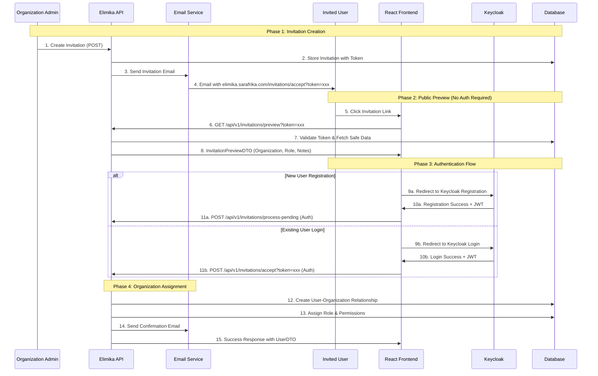

# Elimika Invitation System Guide

## Overview

This comprehensive guide covers the complete Elimika invitation system, including API usage for creating invitations and React frontend integration for handling invitation acceptance/decline flows. The system provides secure, token-based invitations with Keycloak authentication integration.

## System Architecture

The invitation system implements a multi-phase authentication flow that accommodates both new and existing users while maintaining security through token-based validation and Keycloak integration.



# API Reference - Creating Invitations

## Organization Invitations

Invite users to join an organization with a specific role.

**Endpoint:** `POST /api/v1/organisations/{organisationUuid}/invitations`

### Parameters

| Parameter | Type | Location | Description | 
|---|---|---|---|
| `organisationUuid` | `UUID` | Path | The unique identifier of the organization. |

### Request Body (InvitationRequestDTO)

```json
{
  "recipient_email": "john.doe@example.com",
  "recipient_name": "John Doe",
  "domain_name": "instructor",
  "inviter_uuid": "550e8400-e29b-41d4-a716-446655440004",
  "notes": "Welcome to our training program! We're excited to have you join our team."
}
```

| Field | Type | Required | Description |
|---|---|---|---|
| `recipient_email` | `String` | **Required** | Valid email address (max 100 chars). Used for invitation delivery. |
| `recipient_name` | `String` | **Required** | Full name of invitee (max 150 chars). Used in email templates. |
| `domain_name` | `String` | **Required** | Role to assign: `student`, `instructor`, `admin`, `organisation_user` |
| `inviter_uuid` | `UUID` | **Required** | UUID of user sending invitation. Must have appropriate permissions. |
| `notes` | `String` | Optional | Personal message (max 500 chars). Displayed in invitation email. |

### User Roles (domain_name)

| Role | Description | Permissions |
|------|-------------|-------------|
| `student` | Learners enrolled in courses | Access learning materials, submit assignments, track progress |
| `instructor` | Teachers and facilitators | Create/manage courses, grade assignments, interact with students |
| `admin` | System administrators | Full organizational control, manage users, courses, settings |
| `organisation_user` | General organization members | Basic access to organizational resources |

### Example Request

```bash
curl -X POST \
  'https://api.sarafrika.com/api/v1/organisations/f47ac10b-58cc-4372-a567-0e02b2c3d479/invitations' \
  -H 'Content-Type: application/json' \
  -H 'Authorization: Bearer {your-jwt-token}' \
  -d '{
    "recipient_email": "jane.doe@example.com",
    "recipient_name": "Jane Doe",
    "domain_name": "instructor",
    "inviter_uuid": "a1b2c3d4-e5f6-7890-1234-567890abcdef",
    "notes": "Looking forward to having you on the instructor team!"
  }'
```

## Training Branch Invitations

Invite users directly to a specific training branch within an organization.

**Endpoint:** `POST /api/v1/organisations/{organisationUuid}/training-branches/{branchUuid}/invitations`

### Parameters

| Parameter | Type | Location | Description |
|---|---|---|---|
| `organisationUuid` | `UUID` | Path | UUID of organization that owns the training branch |
| `branchUuid` | `UUID` | Path | UUID of the specific training branch |

### Request Body

Same format as organization invitations (InvitationRequestDTO).

### Example Request

```bash
curl -X POST \
  'https://api.sarafrika.com/api/v1/organisations/f47ac10b-58cc-4372-a567-0e02b2c3d479/training-branches/123e4567-e89b-12d3-a456-426614174000/invitations' \
  -H 'Content-Type: application/json' \
  -H 'Authorization: Bearer {your-jwt-token}' \
  -d '{
    "recipient_email": "sam.smith@example.com",
    "recipient_name": "Sam Smith",
    "domain_name": "student",
    "inviter_uuid": "a1b2c3d4-e5f6-7890-1234-567890abcdef",
    "notes": "Welcome to the downtown campus!"
  }'
```

# Frontend Integration - React Implementation

## URL Structure

The React frontend handles invitation URLs with token-based authentication:

```
https://elimika.sarafrika.com/invitations/accept?token={64-character-token}
https://elimika.sarafrika.com/invitations/decline?token={64-character-token}
```

## API Endpoints for Frontend

### 1. Public Preview (No Authentication)

**Endpoint:** `GET /api/v1/invitations/preview?token={token}`

**Purpose:** Display invitation details before user authentication

**Response:** InvitationPreviewDTO

```json
{
  "success": true,
  "data": {
    "recipient_name": "John Doe",
    "organisation_name": "Acme Training Institute",
    "branch_name": "Downtown Branch",
    "role_name": "Instructor",
    "role_description": "A teacher or facilitator with course creation and management capabilities",
    "inviter_name": "Jane Smith",
    "expires_at": "2025-09-05T14:30:00",
    "notes": "Welcome to our training program!",
    "is_expired": false,
    "requires_registration": true
  }
}
```

### 2. Accept Invitation (Authenticated)

**Endpoint:** `POST /api/v1/invitations/accept?token={token}`

**Headers:** `Authorization: Bearer {jwt-token}`

**Response:** Updated UserDTO with organization relationships

### 3. Decline Invitation (Authenticated)

**Endpoint:** `POST /api/v1/invitations/decline?token={token}`

**Headers:** `Authorization: Bearer {jwt-token}`

**Response:** Success confirmation

### 4. Process Pending Invitations (Authenticated)

**Endpoint:** `POST /api/v1/invitations/process-pending`

**Purpose:** Auto-accept all pending invitations for newly authenticated user

**Headers:** `Authorization: Bearer {jwt-token}`

**Response:** Array of accepted invitations

## React Component Example

```jsx
import React, { useState, useEffect } from 'react';
import { useParams, useNavigate } from 'react-router-dom';
import { useAuth } from '../hooks/useAuth';
import { invitationApi } from '../services/api';

const InvitationPage = () => {
  const { token } = useParams();
  const navigate = useNavigate();
  const { user, isAuthenticated, login, register } = useAuth();
  
  const [invitation, setInvitation] = useState(null);
  const [loading, setLoading] = useState(true);
  const [error, setError] = useState(null);

  useEffect(() => {
    loadInvitationPreview();
  }, [token]);

  useEffect(() => {
    if (isAuthenticated && invitation) {
      processPendingInvitations();
    }
  }, [isAuthenticated]);

  const loadInvitationPreview = async () => {
    try {
      const response = await invitationApi.previewInvitation(token);
      if (response.data.is_expired) {
        setError('This invitation has expired.');
        return;
      }
      setInvitation(response.data);
    } catch (err) {
      setError('Invalid or expired invitation link.');
    } finally {
      setLoading(false);
    }
  };

  const processPendingInvitations = async () => {
    try {
      const response = await invitationApi.processPendingInvitations();
      if (response.data.length > 0) {
        navigate('/dashboard', { 
          state: { 
            message: `Welcome! You've been added to ${invitation.organisation_name}.`
          }
        });
      }
    } catch (err) {
      console.error('Failed to process pending invitations:', err);
    }
  };

  const handleAccept = async () => {
    try {
      await invitationApi.acceptInvitation(token);
      navigate('/dashboard', {
        state: { message: `Welcome to ${invitation.organisation_name}!` }
      });
    } catch (err) {
      setError('Failed to accept invitation.');
    }
  };

  if (loading) return <div>Loading...</div>;
  if (error) return <div className="error">{error}</div>;

  return (
    <div className="invitation-page">
      <div className="invitation-preview">
        <h1>You're Invited!</h1>
        <p><strong>{invitation.inviter_name}</strong> has invited you to join:</p>
        <h2>{invitation.organisation_name}</h2>
        {invitation.branch_name && <p>{invitation.branch_name}</p>}
        <div className="role-info">
          <h3>Role: {invitation.role_name}</h3>
          <p>{invitation.role_description}</p>
        </div>
        {invitation.notes && (
          <div className="invitation-notes">
            <h4>Message:</h4>
            <p>{invitation.notes}</p>
          </div>
        )}
      </div>
      
      {!isAuthenticated ? (
        <div className="auth-options">
          <h3>To accept this invitation:</h3>
          {invitation.requires_registration && (
            <button onClick={() => register()} className="btn-primary">
              Create New Account
            </button>
          )}
          <button onClick={() => login()} className="btn-secondary">
            Sign In to Existing Account
          </button>
        </div>
      ) : (
        <div className="invitation-actions">
          <button onClick={handleAccept} className="btn-success">
            Accept Invitation
          </button>
          <button onClick={() => invitationApi.declineInvitation(token)} className="btn-outline-danger">
            Decline
          </button>
        </div>
      )}
    </div>
  );
};

export default InvitationPage;
```

## Authentication Integration

The system integrates with Keycloak for authentication:

1. **JWT Token Extraction:** Backend extracts user email from Keycloak JWT claims
2. **Email Validation:** Ensures JWT email matches invitation recipient  
3. **Automatic User Creation:** New users added to database after Keycloak registration
4. **Session Management:** React app manages Keycloak tokens and session state

## Invitation Status Lifecycle

Invitations progress through the following states:

| Status | Description | Actions Available |
|--------|-------------|-------------------|
| `PENDING` | Invitation sent, awaiting response | Accept, Decline, Expire |
| `ACCEPTED` | User accepted invitation | View only |
| `DECLINED` | User declined invitation | None |
| `EXPIRED` | Invitation passed expiration date | None |
| `CANCELLED` | Admin cancelled invitation | None |

## Error Handling

| Error Type | HTTP Status | Frontend Handling |
|------------|-------------|-------------------|
| Invalid Token | 404 | "Invitation not found" message |
| Expired Invitation | 400 | Expiration notice with contact info |
| Email Mismatch | 400 | "Please use correct email address" |
| Already Accepted | 400 | Redirect to dashboard with status |
| Authentication Required | 401 | Trigger authentication flow |
| Network Error | 500 | Show retry option |

## Security Considerations

### Token Security
- **Unique Tokens:** 64-character cryptographically secure tokens
- **Single Use:** Tokens invalid after acceptance/decline  
- **Expiration:** Configurable expiration (default 7 days)
- **HTTPS Only:** All invitation links use HTTPS

### Authentication Security
- **JWT Validation:** All endpoints validate Keycloak JWT tokens
- **Email Verification:** JWT email must match invitation recipient
- **CSRF Protection:** State-changing operations use POST
- **Rate Limiting:** API endpoints implement rate limiting

## Maintenance Endpoints

System maintenance endpoints for automated cleanup:

### Mark Expired Invitations
`POST /api/v1/invitations/maintenance/mark-expired`

### Send Expiry Reminders  
`POST /api/v1/invitations/maintenance/send-reminders?hoursBeforeExpiry=24`

### Cleanup Old Invitations
`DELETE /api/v1/invitations/maintenance/cleanup?daysOld=90`

These endpoints are typically called by scheduled jobs for system maintenance.

```