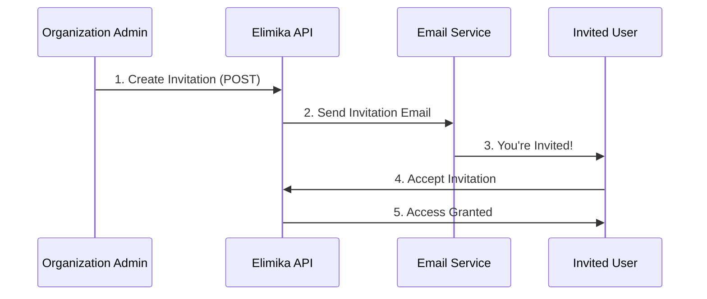

# User Invitation Guide

## Overview

This guide explains how to use the Elimika API to invite users to join an organization or a specific training branch. The invitation process is designed to be secure, flexible, and easy to use.

## Invitation Process

The invitation process follows these steps:

1.  An administrator or a user with the appropriate permissions sends an invitation to a new or existing user's email address.
2.  The user receives an email with a unique link to accept or decline the invitation.
3.  If the user accepts, they are added to the organization and/or branch with the specified role.
4.  The invitation has an expiration date, after which it can no longer be used.



## Creating an Organization Invitation

To invite a user to an organization, you send a `POST` request to the following endpoint:

`POST /api/v1/organisations/{organisationUuid}/invitations`

### Parameters

| Parameter | Type | Location | Description | 
|---|---|---|---|
| `organisationUuid` | `UUID` | Path | The unique identifier of the organization. |
| `branchUuid` | `UUID` | Query (optional) | The unique identifier of a specific training branch. If provided, the user will be invited to the branch as well. |

### Request Body

The request body must be a JSON object with the following fields:

```json
{
  "recipientEmail": "new.user@example.com",
  "recipientName": "John Doe",
  "domainName": "student",
  "inviterUuid": "a1b2c3d4-e5f6-7890-1234-567890abcdef",
  "notes": "Welcome to the team! We're excited to have you."
}
```

| Field | Type | Required | Description |
|---|---|---|---|
| `recipientEmail` | `String` | Yes | The email address of the user to invite. |
| `recipientName` | `String` | Yes | The full name of the user to invite. |
| `domainName` | `String` | Yes | The role to assign to the user. See User Roles section below. |
| `inviterUuid` | `UUID` | Yes | The UUID of the user sending the invitation. |
| `notes` | `String` | No | An optional message to include in the invitation email. |

### User Roles (domainName)

The `domainName` field specifies the role that the invited user will have in the organization. The following roles are available:

*   **`student`**: This role is for learners who will be enrolling in courses. Students can view course materials, submit assignments, and track their progress.
*   **`instructor`**: This role is for teachers or facilitators. Instructors can create and manage courses, grade assignments, and interact with students.
*   **`admin`**: This role grants full administrative privileges over the organization. Administrators can manage users, courses, and organization settings.
*   **`organisation_user`**: This is a general-purpose role for users who are part of the organization but may not be directly involved in teaching or learning. They have basic access to the organization's resources.

### Example Request

```bash
curl -X POST \
  'http://localhost:8080/api/v1/organisations/f47ac10b-58cc-4372-a567-0e02b2c3d479/invitations' \
  -H 'Content-Type: application/json' \
  -d '{
    "recipientEmail": "jane.doe@example.com",
    "recipientName": "Jane Doe",
    "domainName": "instructor",
    "inviterUuid": "a1b2c3d4-e5f6-7890-1234-567890abcdef",
    "notes": "Looking forward to having you on the instructor team!"
  }'
```

## Creating a Training Branch Invitation

To invite a user directly to a training branch, you send a `POST` request to the following endpoint:

`POST /api/v1/organisations/{organisationUuid}/training-branches/{branchUuid}/invitations`

### Parameters

| Parameter | Type | Location | Description |
|---|---|---|---|
| `organisationUuid` | `UUID` | Path | The unique identifier of the organization that the branch belongs to. |
| `branchUuid` | `UUID` | Path | The unique identifier of the training branch. |

### Request Body

The request body is the same as for the organization invitation:

```json
{
  "recipientEmail": "another.user@example.com",
  "recipientName": "Sam Smith",
  "domainName": "student",
  "inviterUuid": "a1b2c3d4-e5f6-7890-1234-567890abcdef",
  "notes": "Welcome to the downtown campus!"
}
```

### Example Request

```bash
curl -X POST \
  'http://localhost:8080/api/v1/organisations/f47ac10b-58cc-4372-a567-0e02b2c3d479/training-branches/123e4567-e89b-12d3-a456-426614174000/invitations' \
  -H 'Content-Type: application/json' \
  -d '{
    "recipientEmail": "another.user@example.com",
    "recipientName": "Sam Smith",
    "domainName": "student",
    "inviterUuid": "a1b2c3d4-e5f6-7890-1234-567890abcdef",
    "notes": "Welcome to the downtown campus!"
  }'
```

## Invitation Lifecycle

Once an invitation is created, it has a lifecycle that is managed by the system. The status of an invitation can be one of the following:

*   `PENDING`: The invitation has been sent but has not yet been accepted or declined.
*   `ACCEPTED`: The user has accepted the invitation.
*   `DECLINED`: The user has declined the invitation.
*   `EXPIRED`: The invitation has passed its expiration date.
*   `CANCELLED`: The invitation has been cancelled by an administrator.

```