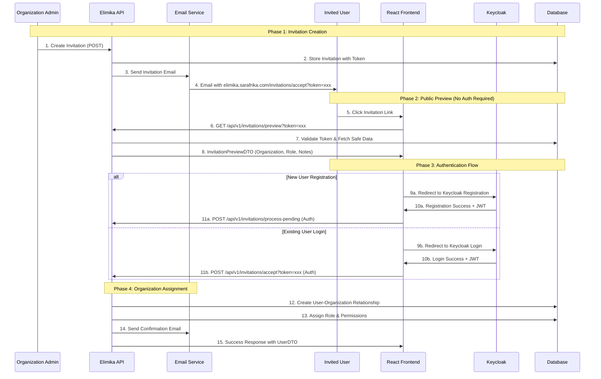
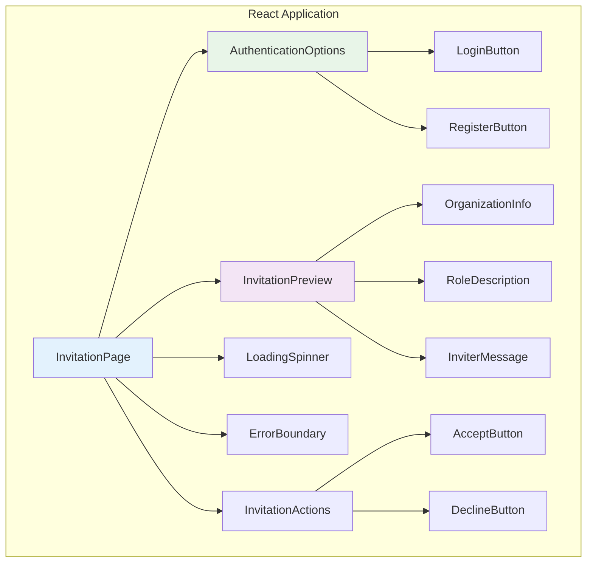
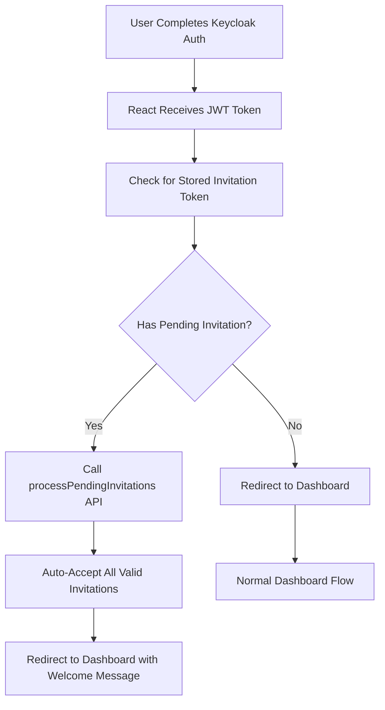

# Invitation Handling & React Frontend Integration Guide

## Overview

This guide provides comprehensive documentation for handling user invitations in the Elimika platform, including seamless integration with React frontend applications and Keycloak authentication. The invitation system supports both new user registration and existing user authentication flows while maintaining security and user experience standards.

## Invitation Flow Architecture

The invitation system implements a sophisticated multi-phase authentication flow that accommodates both new and existing users while maintaining security through token-based validation and Keycloak integration.



## Frontend URL Structure

The React frontend should handle these invitation URLs:

### **Invitation URLs**
```
https://elimika.sarafrika.com/invitations/accept?token={64-character-token}
https://elimika.sarafrika.com/invitations/decline?token={64-character-token}
```

### **URL Parameters**
| Parameter | Type | Required | Description |
|-----------|------|----------|-------------|
| `token` | String | Yes | 64-character unique invitation token from email |

## API Endpoints Reference

### **1. Public Preview Endpoint (No Authentication)**

```http
GET /api/v1/invitations/preview?token={token}
```

**Purpose**: Displays invitation details before user authentication
**Authentication**: None required (token-based validation)
**Response**: `InvitationPreviewDTO`

#### Request Example
```javascript
const response = await fetch(
  `/api/v1/invitations/preview?token=${invitationToken}`,
  {
    method: 'GET',
    headers: {
      'Content-Type': 'application/json'
    }
  }
);
```

#### Response Structure
```json
{
  "success": true,
  "data": {
    "recipient_name": "John Doe",
    "organisation_name": "Acme Training Institute",
    "branch_name": "Downtown Branch",
    "role_name": "Instructor",
    "role_description": "A teacher or facilitator with course creation and management capabilities",
    "inviter_name": "Jane Smith",
    "expires_at": "2025-09-05T14:30:00",
    "notes": "Welcome to our training program! We're excited to have you join our team.",
    "is_expired": false,
    "requires_registration": true
  },
  "message": "Invitation preview retrieved successfully"
}
```

#### InvitationPreviewDTO Fields

| Field | Type | Description |
|-------|------|-------------|
| `recipient_name` | String | Full name of person being invited |
| `organisation_name` | String | Name of organization extending invitation |
| `branch_name` | String | Name of specific training branch (nullable) |
| `role_name` | String | Display name of role being offered |
| `role_description` | String | Detailed description of role responsibilities |
| `inviter_name` | String | Name of person who sent invitation |
| `expires_at` | DateTime | When invitation expires (ISO 8601) |
| `notes` | String | Personal message from inviter (nullable) |
| `is_expired` | Boolean | Whether invitation has expired |
| `requires_registration` | Boolean | Whether user needs to register first |

### **2. Accept Invitation Endpoint (Authentication Required)**

```http
POST /api/v1/invitations/accept?token={token}
```

**Purpose**: Accepts invitation for authenticated user
**Authentication**: Keycloak JWT token required
**Response**: `UserDTO` with updated organization relationships

#### Request Example
```javascript
const response = await fetch(
  `/api/v1/invitations/accept?token=${invitationToken}`,
  {
    method: 'POST',
    headers: {
      'Authorization': `Bearer ${jwtToken}`,
      'Content-Type': 'application/json'
    }
  }
);
```

### **3. Decline Invitation Endpoint (Authentication Required)**

```http
POST /api/v1/invitations/decline?token={token}
```

**Purpose**: Declines invitation for authenticated user
**Authentication**: Keycloak JWT token required
**Response**: Success confirmation

#### Request Example
```javascript
const response = await fetch(
  `/api/v1/invitations/decline?token=${invitationToken}`,
  {
    method: 'POST',
    headers: {
      'Authorization': `Bearer ${jwtToken}`,
      'Content-Type': 'application/json'
    }
  }
);
```

### **4. Process Pending Invitations Endpoint (Authentication Required)**

```http
POST /api/v1/invitations/process-pending
```

**Purpose**: Auto-accepts all pending invitations for authenticated user
**Authentication**: Keycloak JWT token required
**Response**: Array of accepted invitations

#### Request Example
```javascript
const response = await fetch('/api/v1/invitations/process-pending', {
  method: 'POST',
  headers: {
    'Authorization': `Bearer ${jwtToken}`,
    'Content-Type': 'application/json'
  }
});
```

## React Frontend Implementation

### **Component Architecture**



### **1. Main Invitation Page Component**

```jsx
import React, { useState, useEffect } from 'react';
import { useParams, useNavigate } from 'react-router-dom';
import { useAuth } from '../hooks/useAuth';
import { invitationApi } from '../services/api';

const InvitationPage = () => {
  const { token } = useParams();
  const navigate = useNavigate();
  const { user, isAuthenticated, login, register } = useAuth();
  
  const [invitation, setInvitation] = useState(null);
  const [loading, setLoading] = useState(true);
  const [error, setError] = useState(null);
  const [processing, setProcessing] = useState(false);

  useEffect(() => {
    loadInvitationPreview();
  }, [token]);

  useEffect(() => {
    if (isAuthenticated && invitation) {
      // User just authenticated, process any pending invitations
      processPendingInvitations();
    }
  }, [isAuthenticated]);

  const loadInvitationPreview = async () => {
    try {
      setLoading(true);
      const response = await invitationApi.previewInvitation(token);
      
      if (response.data.is_expired) {
        setError('This invitation has expired.');
        return;
      }
      
      setInvitation(response.data);
    } catch (err) {
      setError('Invalid or expired invitation link.');
    } finally {
      setLoading(false);
    }
  };

  const handleLogin = () => {
    // Store invitation token for post-auth processing
    sessionStorage.setItem('pendingInvitationToken', token);
    login({ redirectTo: window.location.pathname });
  };

  const handleRegister = () => {
    // Store invitation token for post-auth processing  
    sessionStorage.setItem('pendingInvitationToken', token);
    register({ redirectTo: window.location.pathname });
  };

  const processPendingInvitations = async () => {
    try {
      setProcessing(true);
      const response = await invitationApi.processPendingInvitations();
      
      if (response.data.length > 0) {
        // Successfully processed invitations
        navigate('/dashboard', { 
          state: { 
            message: `Welcome! You've been added to ${invitation.organisation_name} as ${invitation.role_name}.`
          }
        });
      }
    } catch (err) {
      console.error('Failed to process pending invitations:', err);
      // Continue to manual accept flow
    } finally {
      setProcessing(false);
    }
  };

  const handleAccept = async () => {
    try {
      setProcessing(true);
      await invitationApi.acceptInvitation(token);
      
      navigate('/dashboard', {
        state: { 
          message: `Welcome to ${invitation.organisation_name}! You've been added as ${invitation.role_name}.`
        }
      });
    } catch (err) {
      setError('Failed to accept invitation. Please try again.');
    } finally {
      setProcessing(false);
    }
  };

  const handleDecline = async () => {
    try {
      setProcessing(true);
      await invitationApi.declineInvitation(token);
      
      navigate('/', {
        state: { 
          message: 'Invitation declined successfully.'
        }
      });
    } catch (err) {
      setError('Failed to decline invitation. Please try again.');
    } finally {
      setProcessing(false);
    }
  };

  if (loading) return <LoadingSpinner />;
  if (error) return <ErrorMessage message={error} />;
  if (!invitation) return <ErrorMessage message="Invitation not found" />;

  return (
    <div className="invitation-page">
      <InvitationPreview invitation={invitation} />
      
      {!isAuthenticated ? (
        <AuthenticationOptions 
          onLogin={handleLogin}
          onRegister={handleRegister}
          requiresRegistration={invitation.requires_registration}
        />
      ) : (
        <InvitationActions
          onAccept={handleAccept}
          onDecline={handleDecline}
          processing={processing}
        />
      )}
    </div>
  );
};
```

### **2. Invitation Preview Component**

```jsx
const InvitationPreview = ({ invitation }) => (
  <div className="invitation-preview">
    <div className="invitation-header">
      <h1>You're Invited!</h1>
      <p className="inviter-info">
        <strong>{invitation.inviter_name}</strong> has invited you to join:
      </p>
    </div>

    <div className="organization-info">
      <h2>{invitation.organisation_name}</h2>
      {invitation.branch_name && (
        <p className="branch-name">{invitation.branch_name}</p>
      )}
    </div>

    <div className="role-info">
      <h3>Role: {invitation.role_name}</h3>
      <p className="role-description">{invitation.role_description}</p>
    </div>

    {invitation.notes && (
      <div className="invitation-notes">
        <h4>Personal Message:</h4>
        <p>{invitation.notes}</p>
      </div>
    )}

    <div className="expiration-info">
      <p>This invitation expires on {formatDate(invitation.expires_at)}</p>
    </div>
  </div>
);
```

### **3. Authentication Options Component**

```jsx
const AuthenticationOptions = ({ onLogin, onRegister, requiresRegistration }) => (
  <div className="auth-options">
    <h3>To accept this invitation, please:</h3>
    
    <div className="auth-buttons">
      {requiresRegistration && (
        <button 
          onClick={onRegister}
          className="btn btn-primary"
        >
          Create New Account
        </button>
      )}
      
      <button 
        onClick={onLogin}
        className="btn btn-secondary"
      >
        Sign In to Existing Account
      </button>
    </div>

    <div className="auth-help">
      <p>
        {requiresRegistration 
          ? "New to Elimika? Create an account to get started."
          : "Already have an account? Sign in to accept this invitation."
        }
      </p>
    </div>
  </div>
);
```

### **4. Invitation Actions Component**

```jsx
const InvitationActions = ({ onAccept, onDecline, processing }) => (
  <div className="invitation-actions">
    <h3>What would you like to do?</h3>
    
    <div className="action-buttons">
      <button 
        onClick={onAccept}
        disabled={processing}
        className="btn btn-success"
      >
        {processing ? 'Processing...' : 'Accept Invitation'}
      </button>
      
      <button 
        onClick={onDecline}
        disabled={processing}
        className="btn btn-outline-danger"
      >
        Decline
      </button>
    </div>

    <div className="action-help">
      <p>
        Accepting this invitation will add you to the organization with the specified role.
        You can always change your role or leave the organization later.
      </p>
    </div>
  </div>
);
```

### **5. API Service Layer**

```javascript
// services/invitationApi.js
class InvitationApi {
  async previewInvitation(token) {
    const response = await fetch(
      `/api/v1/invitations/preview?token=${token}`,
      {
        method: 'GET',
        headers: {
          'Content-Type': 'application/json'
        }
      }
    );
    
    if (!response.ok) {
      throw new Error('Failed to load invitation');
    }
    
    return response.json();
  }

  async acceptInvitation(token) {
    const response = await fetch(
      `/api/v1/invitations/accept?token=${token}`,
      {
        method: 'POST',
        headers: {
          'Authorization': `Bearer ${getAuthToken()}`,
          'Content-Type': 'application/json'
        }
      }
    );
    
    if (!response.ok) {
      throw new Error('Failed to accept invitation');
    }
    
    return response.json();
  }

  async declineInvitation(token) {
    const response = await fetch(
      `/api/v1/invitations/decline?token=${token}`,
      {
        method: 'POST',
        headers: {
          'Authorization': `Bearer ${getAuthToken()}`,
          'Content-Type': 'application/json'
        }
      }
    );
    
    if (!response.ok) {
      throw new Error('Failed to decline invitation');
    }
    
    return response.json();
  }

  async processPendingInvitations() {
    const response = await fetch('/api/v1/invitations/process-pending', {
      method: 'POST',
      headers: {
        'Authorization': `Bearer ${getAuthToken()}`,
        'Content-Type': 'application/json'
      }
    });
    
    if (!response.ok) {
      throw new Error('Failed to process pending invitations');
    }
    
    return response.json();
  }
}

export const invitationApi = new InvitationApi();
```

## Authentication Integration

### **Keycloak Integration Points**

1. **JWT Token Extraction**: The backend extracts user email from Keycloak JWT claims
2. **Email Validation**: System ensures JWT email matches invitation recipient
3. **Automatic User Creation**: New users are automatically added to database after Keycloak registration
4. **Session Management**: React app manages Keycloak tokens and session state

### **Post-Authentication Flow**



## Error Handling & Edge Cases

### **Common Error Scenarios**

| Error Type | HTTP Status | Frontend Handling |
|------------|-------------|-------------------|
| Invalid Token | 404 | Show "Invitation not found" message |
| Expired Invitation | 400 | Show expiration notice with contact info |
| Email Mismatch | 400 | Show "Please use correct email address" |
| Already Accepted | 400 | Redirect to dashboard with status |
| User Not Found | 404 | Trigger re-authentication flow |
| Network Error | 500 | Show retry option with offline support |

### **Error Handling Implementation**

```jsx
const ErrorBoundary = ({ error, onRetry }) => {
  const getErrorMessage = (error) => {
    switch (error.status) {
      case 404:
        return "This invitation link is invalid or has been removed.";
      case 400:
        if (error.message.includes('expired')) {
          return "This invitation has expired. Please contact the organization for a new invitation.";
        }
        if (error.message.includes('email')) {
          return "Please sign in with the email address that received this invitation.";
        }
        return "This invitation has already been processed or is no longer valid.";
      case 401:
        return "Please sign in to accept this invitation.";
      default:
        return "Something went wrong. Please try again or contact support.";
    }
  };

  return (
    <div className="error-boundary">
      <div className="error-content">
        <h2>Oops!</h2>
        <p>{getErrorMessage(error)}</p>
        
        {onRetry && (
          <button onClick={onRetry} className="btn btn-primary">
            Try Again
          </button>
        )}
        
        <div className="help-links">
          <a href="/support">Contact Support</a>
          <a href="/">Return to Home</a>
        </div>
      </div>
    </div>
  );
};
```

## Security Considerations

### **Token Security**
- **Unique Tokens**: 64-character cryptographically secure tokens
- **Single Use**: Tokens become invalid after acceptance/decline  
- **Expiration**: Configurable expiration (default 7 days)
- **HTTPS Only**: All invitation links use HTTPS

### **Authentication Security**
- **JWT Validation**: All authenticated endpoints validate Keycloak JWT tokens
- **Email Verification**: System ensures JWT email matches invitation recipient
- **CSRF Protection**: State-changing operations use POST with proper headers
- **Rate Limiting**: API endpoints implement rate limiting for abuse prevention

### **Data Privacy**
- **Minimal Exposure**: Public preview endpoint only shows safe, necessary data
- **Audit Logging**: All invitation actions are logged for security auditing
- **PII Protection**: Sensitive user data is never exposed in public endpoints

## Testing Strategy

### **Unit Tests**
```javascript
// __tests__/InvitationPage.test.jsx
describe('InvitationPage', () => {
  it('should load invitation preview on mount', async () => {
    const mockInvitation = { /* mock data */ };
    jest.spyOn(invitationApi, 'previewInvitation')
        .mockResolvedValue({ data: mockInvitation });

    render(<InvitationPage />);
    
    await waitFor(() => {
      expect(screen.getByText(mockInvitation.organisation_name)).toBeInTheDocument();
    });
  });

  it('should handle expired invitations', async () => {
    jest.spyOn(invitationApi, 'previewInvitation')
        .mockResolvedValue({ data: { is_expired: true } });

    render(<InvitationPage />);
    
    await waitFor(() => {
      expect(screen.getByText(/expired/i)).toBeInTheDocument();
    });
  });
});
```

### **Integration Tests**
```javascript
// __tests__/integration/invitation-flow.test.js
describe('Invitation Flow Integration', () => {
  it('should complete full acceptance flow for new user', async () => {
    // 1. Load preview
    const preview = await invitationApi.previewInvitation(testToken);
    expect(preview.data.requires_registration).toBe(true);

    // 2. Mock Keycloak registration
    mockKeycloakAuth({ email: 'test@example.com', isNew: true });

    // 3. Process pending invitations
    const result = await invitationApi.processPendingInvitations();
    expect(result.data).toHaveLength(1);
  });
});
```

## Performance Optimization

### **Frontend Optimizations**
- **Code Splitting**: Load invitation components only when needed
- **Caching**: Cache invitation preview data for session duration
- **Preloading**: Preload organization assets while user authenticates
- **Lazy Loading**: Load non-critical components asynchronously

### **Backend Optimizations**  
- **Database Indexing**: Optimize queries with proper token indexing
- **Connection Pooling**: Efficient database connection management
- **Async Processing**: Email sending happens asynchronously
- **Caching**: Cache organization/branch data for invitation previews

## Deployment Considerations

### **Environment Configuration**
```yaml
# application.yml
app:
  frontend:
    url: https://elimika.sarafrika.com
  invitation:
    expiry-hours: 168 # 7 days
    token-length: 64
```

### **Frontend Environment Variables**
```env
REACT_APP_API_BASE_URL=https://api.sarafrika.com
REACT_APP_KEYCLOAK_URL=https://auth.sarafrika.com
REACT_APP_KEYCLOAK_REALM=elimika
REACT_APP_KEYCLOAK_CLIENT=elimika-frontend
```

## Monitoring & Analytics

### **Key Metrics to Track**
- Invitation acceptance rate by role type
- Time from invitation to acceptance
- Authentication method preferences (login vs register)
- Error rates by invitation type
- User journey completion rates

### **Logging Implementation**
```javascript
// Frontend logging
const logInvitationEvent = (eventType, data) => {
  analytics.track('Invitation Event', {
    event_type: eventType,
    invitation_token: hashToken(data.token),
    organization: data.organization_name,
    role: data.role_name,
    timestamp: new Date().toISOString()
  });
};
```

This comprehensive guide provides everything needed to implement robust invitation handling with React frontend integration while maintaining security, performance, and user experience standards.