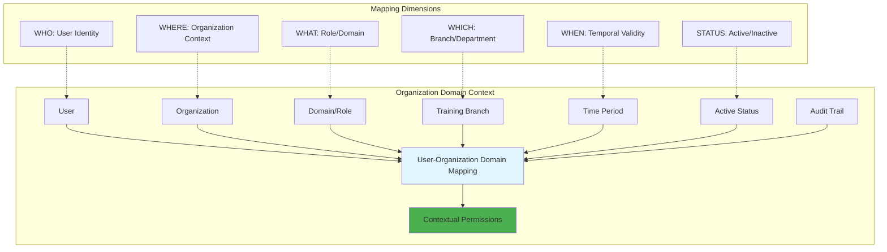
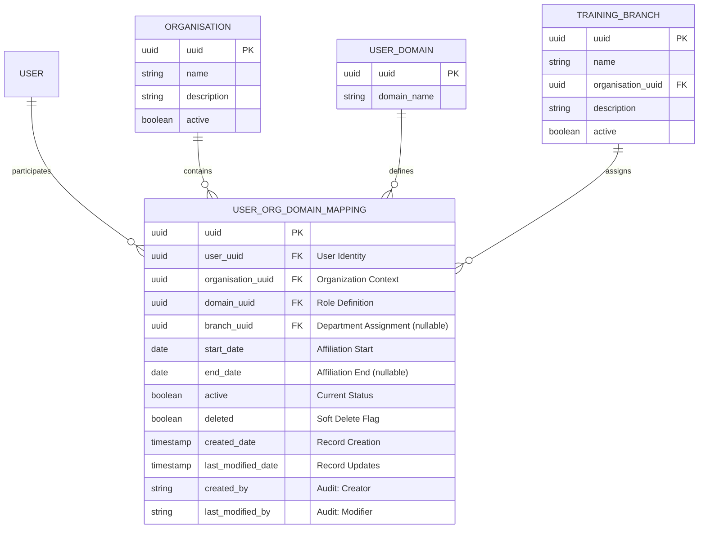
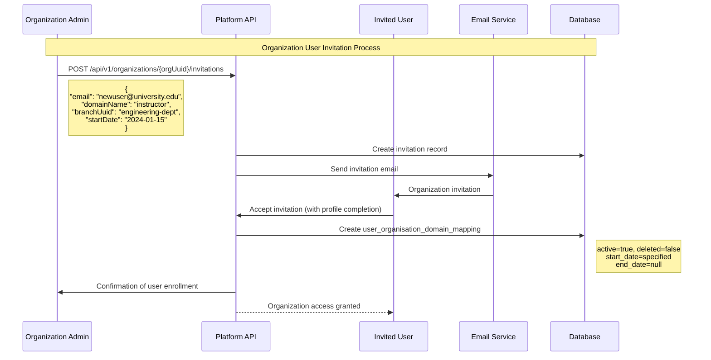
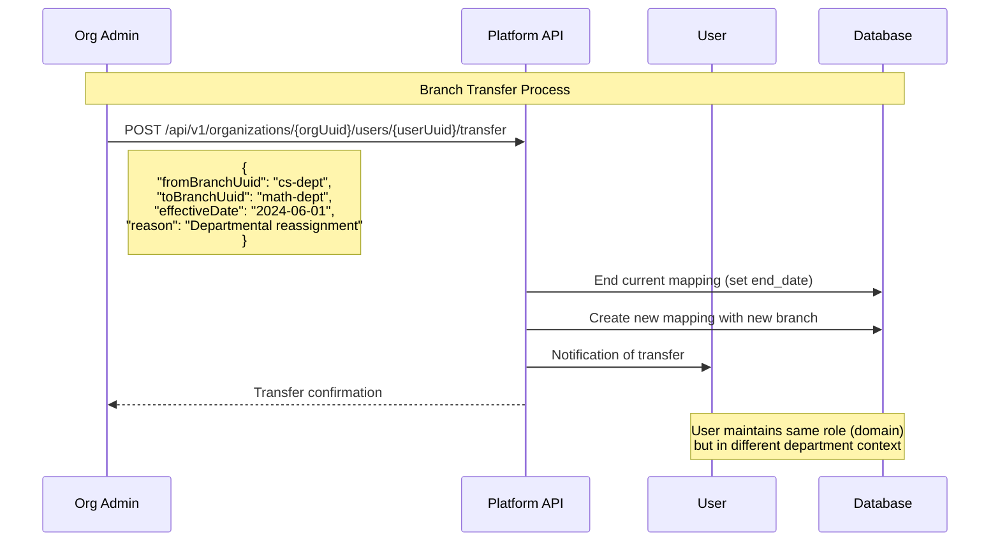
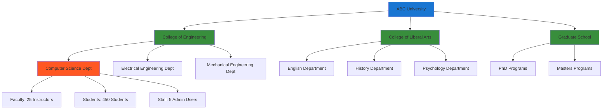
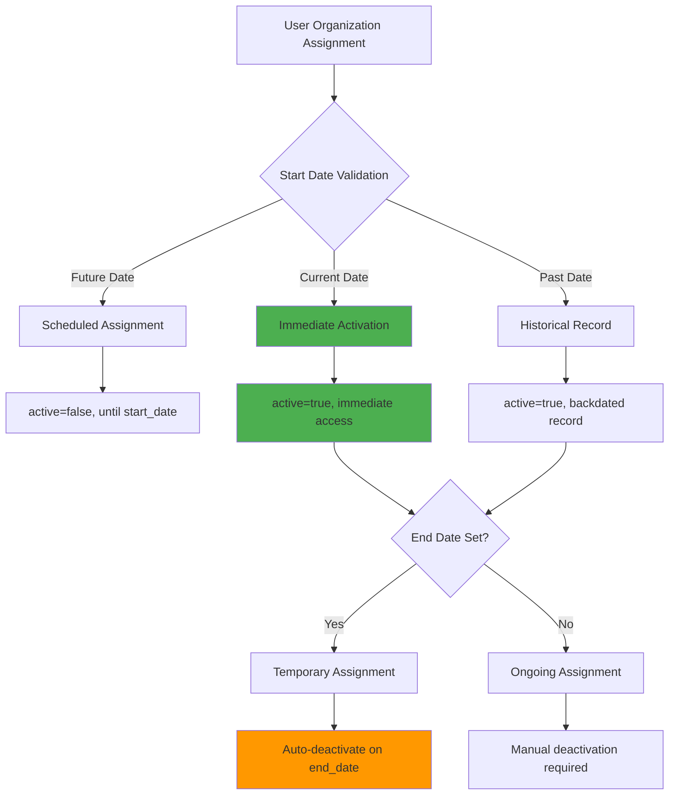
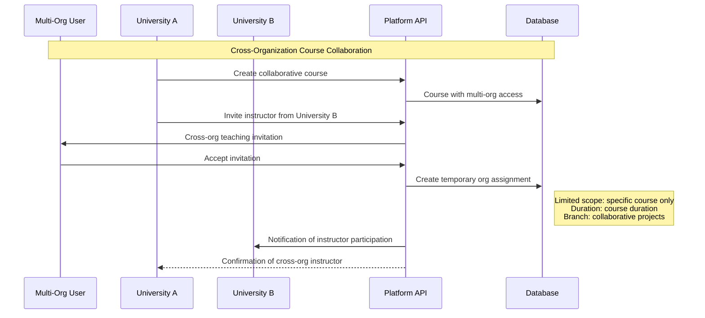

# Organization-Specific User Domains Guide

## Overview

Organization-specific domains enable contextual role-based access control within educational institutions. Unlike global domains that apply platform-wide, organization domains provide granular control over user permissions, responsibilities, and access rights within specific institutional contexts.

## Organization Domain Architecture

### Multi-Dimensional Mapping System

Organization domains use a sophisticated mapping system that considers multiple contextual factors:



## Organization Domain Entity Structure

### Core Entity: UserOrganisationDomainMapping



### Organization Affiliation DTO

The system provides rich contextual information through the `UserOrganisationAffiliationDTO`:

```json
{
  "organizationAffiliation": {
    "organisationUuid": "university-abc-123",
    "organisationName": "ABC State University",
    "domainInOrganisation": "instructor",
    "branchUuid": "cs-department-456", 
    "branchName": "Computer Science Department",
    "startDate": "2024-01-15",
    "endDate": null,
    "active": true,
    "affiliatedDate": "2024-01-15T09:00:00Z"
  }
}
```

## Organization Domain Lifecycle Management

### User Invitation and Enrollment



### Branch Transfer Within Organization



## Branch-Level Organization Management

### Hierarchical Structure

Organizations can have multiple training branches (departments/divisions) with specific management:



### Branch-Specific User Management

```bash
# Example: Managing users within specific branches

# 1. Get all users in Computer Science department
curl -X GET "/api/v1/organizations/university-abc/branches/cs-dept/users" \
  -H "Authorization: Bearer {admin-token}"

# 2. Get instructors only in CS department  
curl -X GET "/api/v1/organizations/university-abc/branches/cs-dept/users?domain=instructor" \
  -H "Authorization: Bearer {admin-token}"

# 3. Assign user to specific branch with role
curl -X POST "/api/v1/organizations/university-abc/users/prof-smith/assign" \
  -H "Authorization: Bearer {admin-token}" \
  -H "Content-Type: application/json" \
  -d '{
    "domainName": "instructor",
    "branchUuid": "cs-dept-456",
    "startDate": "2024-01-15",
    "academicRank": "Associate Professor",
    "courseLoad": 6
  }'
```

## Organization Domain Repository Capabilities

### Advanced Query Methods

The `UserOrganisationDomainMappingRepository` provides comprehensive querying:

```java
// Active relationship queries with organization context
List<UserOrganisationDomainMapping> findActiveByUser(UUID userUuid);
List<UserOrganisationDomainMapping> findActiveByOrganisation(UUID orgUuid);
Optional<UserOrganisationDomainMapping> findActiveByUserAndOrganisation(UUID userUuid, UUID orgUuid);

// Role-based filtering within organizations
List<UserOrganisationDomainMapping> findActiveByOrganisationAndDomain(UUID orgUuid, UUID domainUuid);

// Branch-specific queries
List<UserOrganisationDomainMapping> findActiveByBranch(UUID branchUuid);
long countDistinctActiveUsersByBranch(UUID branchUuid);

// Temporal and lifecycle queries
List<UserOrganisationDomainMapping> findMappingsEndingBetween(LocalDate start, LocalDate end);
List<UserOrganisationDomainMapping> findCurrentActiveMapping(UUID userUuid, UUID orgUuid);

// Bulk operations for organization management
List<UserOrganisationDomainMapping> findActiveByUserUuidsAndOrganisation(
    List<UUID> userUuids, UUID orgUuid);
```

### Analytics and Reporting Queries

```java
// Organization analytics
long countDistinctActiveUsersByOrganisation(UUID orgUuid);
long countDistinctActiveUsersByOrganisationAndDomain(UUID orgUuid, UUID domainUuid);

// Cross-organization user analysis
List<UUID> findDistinctOrganisationUuidsByUser(UUID userUuid);
List<UUID> findDistinctUserUuidsByOrganisation(UUID orgUuid);
```

## Organization API Reference

### Organization User Management

| Method | Endpoint | Purpose | Organization Context |
|--------|----------|---------|----------------------|
| `GET` | `/api/v1/organizations/{uuid}/users` | List organization users | All affiliated users |
| `GET` | `/api/v1/organizations/{uuid}/users?domain={role}` | Filter by role | Role-specific listing |
| `POST` | `/api/v1/organizations/{uuid}/users/{userUuid}` | Add user to organization | Direct assignment |
| `DELETE` | `/api/v1/organizations/{uuid}/users/{userUuid}` | Remove from organization | Soft delete mapping |

### Branch Management

| Method | Endpoint | Purpose | Branch Context |
|--------|----------|---------|----------------|
| `GET` | `/api/v1/organizations/{uuid}/branches` | List organization branches | Department structure |
| `POST` | `/api/v1/organizations/{uuid}/branches` | Create new branch | Department creation |
| `GET` | `/api/v1/branches/{branchUuid}/users` | List branch users | Department roster |
| `PUT` | `/api/v1/branches/{branchUuid}/users/{userUuid}` | Transfer user to branch | Departmental transfer |

### Analytics and Reporting

| Method | Endpoint | Purpose | Analytical Context |
|--------|----------|---------|-------------------|
| `GET` | `/api/v1/organizations/{uuid}/analytics/users` | User distribution analytics | Role breakdowns, trends |
| `GET` | `/api/v1/organizations/{uuid}/analytics/branches` | Branch performance metrics | Department comparisons |
| `GET` | `/api/v1/organizations/{uuid}/reports/affiliations` | Detailed affiliation report | Audit and compliance |

## Organization Domain Business Rules

### Temporal Management Rules



### Assignment Validation Logic

```java
// Example organization domain assignment validation
public void validateOrganizationDomainAssignment(
    UUID userUuid, UUID orgUuid, String domainName, UUID branchUuid) {
    
    // 1. Validate organization is active
    Organisation org = findOrganisationOrThrow(orgUuid);
    if (!org.isActive()) {
        throw new IllegalStateException("Cannot assign users to inactive organization");
    }
    
    // 2. Validate branch belongs to organization (if specified)
    if (branchUuid != null) {
        TrainingBranch branch = findBranchOrThrow(branchUuid);
        if (!branch.getOrganisationUuid().equals(orgUuid)) {
            throw new IllegalArgumentException("Branch does not belong to specified organization");
        }
    }
    
    // 3. Check for existing active assignment
    Optional<UserOrganisationDomainMapping> existing = 
        repository.findActiveByUserAndOrganisation(userUuid, orgUuid);
    if (existing.isPresent()) {
        // Handle existing assignment (transfer, update, or reject)
        handleExistingAssignment(existing.get(), domainName, branchUuid);
    }
    
    // 4. Validate domain assignment rules
    validateDomainAssignmentRules(userUuid, domainName, orgUuid);
}
```

## Multi-Organization Scenarios

### Users with Multiple Organization Affiliations

```json
{
  "userProfile": {
    "userUuid": "multi-org-user-123",
    "firstName": "Dr. Sarah",
    "lastName": "Johnson",
    "email": "sarah.johnson@email.com",
    
    "organisationAffiliations": [
      {
        "organisationUuid": "state-university",
        "organisationName": "State University",
        "domainInOrganisation": "instructor",
        "branchName": "Computer Science Department",
        "startDate": "2020-08-01",
        "active": true,
        "primaryAffiliation": true
      },
      {
        "organisationUuid": "tech-consulting-firm", 
        "organisationName": "Tech Consulting Solutions",
        "domainInOrganisation": "instructor",
        "branchName": "Training Division",
        "startDate": "2023-01-15",
        "active": true,
        "primaryAffiliation": false
      },
      {
        "organisationUuid": "community-college",
        "organisationName": "Metro Community College", 
        "domainInOrganisation": "instructor",
        "branchName": "Continuing Education",
        "startDate": "2022-06-01",
        "endDate": "2023-12-31",
        "active": false,
        "primaryAffiliation": false
      }
    ]
  }
}
```

### Cross-Organization Collaboration



## Organization Domain Analytics

### Membership Analytics Dashboard

```json
{
  "organizationAnalytics": {
    "organizationUuid": "state-university-123",
    "organizationName": "State University",
    "reportingPeriod": "Fall 2024",
    
    "membershipMetrics": {
      "totalActiveUsers": 12847,
      "usersByDomain": {
        "student": 11234,
        "instructor": 892,
        "organisation_user": 721
      },
      "usersByBranch": {
        "Computer Science": 2341,
        "Engineering": 3567,  
        "Liberal Arts": 2890,
        "Graduate School": 1456
      }
    },
    
    "temporalMetrics": {
      "newAffiliationsThisMonth": 234,
      "expiredAffiliationsThisMonth": 67,
      "transfersBetweenBranches": 12,
      "averageAffiliationDuration": "3.2 years"
    },
    
    "branchPerformance": [
      {
        "branchName": "Computer Science",
        "activeUsers": 2341,
        "courseCompletionRate": 94.2,
        "studentSatisfaction": 4.6,
        "facultyUtilization": 87.3
      }
    ]
  }
}
```

This organization-specific domain system provides sophisticated multi-tenant capabilities with granular control over user roles, responsibilities, and access within institutional contexts while maintaining clear audit trails and temporal management of affiliations.