# Rubric Management API Usage Chart

## System Architecture Overview

```mermaid
graph TB
    subgraph "Core Entities"
        AR[Assessment Rubric<br/>📋 Main Container]
        RC[Rubric Criteria<br/>📊 Matrix Rows]
        RS[Rubric Scoring<br/>🎯 Cell Descriptions]
        GL[Grading Levels<br/>📈 Matrix Columns]
    end
    
    subgraph "Association Layer"
        CRA[Course Rubric Association<br/>🔗 Many-to-Many Link]
        C[Courses<br/>📚 Multiple Courses]
    end
    
    AR --> RC
    RC --> RS
    RS --> GL
    AR --> CRA
    CRA --> C
    
    style AR fill:#e1f5fe
    style RC fill:#f3e5f5
    style RS fill:#e8f5e8
    style CRA fill:#fff3e0
```



## API Workflow - Step by Step

### Phase 1: Create Rubric Foundation


### Phase 2: Build Matrix Content


### Phase 3: Course Association


## Endpoint Reference Chart

### 🏗️ Rubric Creation Endpoints

| Method | Endpoint | Purpose | Key Fields |
|--------|----------|---------|------------|
| `POST` | `/api/v1/rubrics` | Create rubric | `title`, `is_public`, `rubric_type` |
| `POST` | `/api/v1/rubrics/{uuid}/criteria` | Add criteria | `component_name`, `display_order` |
| `POST` | `/api/v1/rubrics/{uuid}/initialize-matrix` | Setup matrix | `template`, `createdBy` |
| `POST` | `/api/v1/rubrics/{rubricUuid}/criteria/{criteriaUuid}/scoring` | Add cell content | `description`, `grading_level_uuid` |

### 🔍 Discovery & Retrieval Endpoints

| Method | Endpoint | Purpose | Use Case |
|--------|----------|---------|----------|
| `GET` | `/api/v1/rubrics/discovery/public` | Browse public rubrics | Find reusable rubrics |
| `GET` | `/api/v1/rubrics/discovery/search?q=music&type=Performance` | Search rubrics | Targeted discovery |
| `GET` | `/api/v1/rubrics/discovery/popular` | Popular rubrics | Most-used rubrics |
| `GET` | `/api/v1/rubrics/{uuid}/matrix-view` | Complete matrix | Full rubric structure |

### 🔗 Course Association Endpoints

| Method | Endpoint | Purpose | Key Parameters |
|--------|----------|---------|----------------|
| `POST` | `/api/v1/courses/{courseUuid}/rubrics/associate` | Link to course | `usage_context`, `is_primary_rubric` |
| `GET` | `/api/v1/courses/{courseUuid}/rubrics` | Course rubrics | View associations |
| `DELETE` | `/api/v1/courses/{courseUuid}/rubrics/{rubricUuid}` | Unlink rubric | Remove association |

### ✅ Validation & Management Endpoints

| Method | Endpoint | Purpose | Returns |
|--------|----------|---------|---------|
| `GET` | `/api/v1/rubrics/{uuid}/validate-matrix` | Check completeness | `MatrixValidationResult` |
| `PUT` | `/api/v1/rubrics/{uuid}` | Update rubric | Modified `AssessmentRubricDTO` |
| `GET` | `/api/v1/rubrics/statistics` | Usage stats | Counts and metrics |

## Data Flow & Relationships

```mermaid
graph LR
    subgraph "Input Flow"
        I[Instructor Creates<br/>Assessment Rubric]
        C1[Add Criteria<br/>(Rows)]
        S1[Add Scoring<br/>(Cells)]
    end
    
    subgraph "Matrix Structure"
        M[Rubric Matrix<br/>Criteria × Levels]
        V[Validation<br/>Check]
        P[Publication<br/>Ready]
    end
    
    subgraph "Reuse & Association"
        D[Discovery<br/>Search/Browse]
        A[Associate<br/>with Courses]
        U[Usage Across<br/>Multiple Courses]
    end
    
    I --> C1 --> S1 --> M --> V --> P
    P --> D --> A --> U
    
    style I fill:#e3f2fd
    style M fill:#f1f8e9
    style U fill:#fff3e0
```

## Common Usage Patterns

### Pattern 1: Create New General Rubric
```bash
# 1. Create rubric (is_public=true, no course_uuid)
POST /api/v1/rubrics

# 2. Add 3-4 criteria
POST /api/v1/rubrics/{uuid}/criteria (repeat)

# 3. Initialize matrix with standard template
POST /api/v1/rubrics/{uuid}/initialize-matrix?template=standard

# 4. Fill in scoring descriptions
POST /api/v1/rubrics/{rubricUuid}/criteria/{criteriaUuid}/scoring (for each cell)

# 5. Validate and publish
GET /api/v1/rubrics/{uuid}/validate-matrix
PUT /api/v1/rubrics/{uuid} (set status="published")
```

### Pattern 2: Reuse Existing Rubric
```bash
# 1. Search for suitable rubric
GET /api/v1/rubrics/discovery/search?q=performance&type=Music

# 2. View complete matrix
GET /api/v1/rubrics/{foundUuid}/matrix-view

# 3. Associate with your course
POST /api/v1/courses/{courseUuid}/rubrics/associate
```

### Pattern 3: Multi-Context Usage
```bash
# Associate same rubric for different assessment contexts
POST /api/v1/courses/{courseUuid}/rubrics/associate (usage_context="midterm")
POST /api/v1/courses/{courseUuid}/rubrics/associate (usage_context="final")
POST /api/v1/courses/{courseUuid}/rubrics/associate (usage_context="assignment")
```

## Rubric Template System

### Standard Template Details (5 Scoring Levels)

The **standard template** creates a comprehensive 5-level scoring system with clear performance expectations:

| Level Order | Name | Points | Status | Color | Description |
|-------------|------|--------|---------|-------|-------------|
| 1 | **Excellent** | 4.00 | ✅ Passing | 🟢 #4CAF50 | Exceeds expectations in all areas |
| 2 | **Good** | 3.00 | ✅ Passing | 🟢 #8BC34A | Meets expectations with minor areas for improvement |
| 3 | **Fair** | 2.00 | ✅ Passing | 🟡 #FFC107 | Meets basic expectations with several areas needing improvement |
| 4 | **Poor** | 1.00 | ❌ Failing | 🟠 #FF9800 | Below expectations, significant improvement needed |
| 5 | **Unacceptable** | 0.00 | ❌ Failing | 🔴 #F44336 | Does not meet minimum requirements |

**Key Characteristics:**
- **5 performance levels** for detailed assessment
- **3 passing levels** (2.00+ points) providing multiple success pathways
- **Linear point progression** (4, 3, 2, 1, 0)
- **Minimum passing threshold**: 2.00 points
- **Visual coding** with color indicators for quick recognition

### Alternative Templates Available

| Template | Levels | Point Range | Use Case |
|----------|---------|-------------|----------|
| **Simple** | 3 levels | 0-3 points | Quick assessments, basic competency |
| **Standard** | 5 levels | 0-4 points | Comprehensive evaluation, detailed feedback |
| **Advanced** | 6 levels | 0-5 points | High-stakes assessment, nuanced grading |

### Template Selection API Examples

```bash
# Initialize with standard template (5 levels)
POST /api/v1/rubrics/{uuid}/initialize-matrix?template=standard&createdBy=instructor123

# Initialize with simple template (3 levels)
POST /api/v1/rubrics/{uuid}/initialize-matrix?template=simple&createdBy=instructor123

# Initialize with advanced template (6 levels)
POST /api/v1/rubrics/{uuid}/initialize-matrix?template=advanced&createdBy=instructor123
```

**Response Structure:**
```json
{
  "rubric": {
    "uuid": "rubric-uuid-here",
    "title": "Music Performance Assessment",
    "matrixTemplate": "standard",
    "usesCustomLevels": true
  },
  "scoringLevels": [
    {
      "uuid": "level-1-uuid",
      "name": "Excellent",
      "points": 4.00,
      "levelOrder": 1,
      "isPassing": true,
      "colorCode": "#4CAF50",
      "description": "Exceeds expectations in all areas"
    }
    // ... 4 more levels
  ],
  "criteria": [],
  "matrixCells": {},
  "statistics": {
    "totalCells": 0,
    "completedCells": 0,
    "maxPossibleScore": 0.00,
    "isReadyForUse": false
  }
}
```

## Complete Matrix Structure (Standard Template)

### Final Matrix Layout After Full Setup

```
Music Performance Rubric - Standard Template (4.00 Max Points)
                    Scoring Levels (Columns)
        ┌───────────┬──────────┬──────────┬──────────┬─────────────┐
        │Excellent  │  Good    │   Fair   │   Poor   │Unacceptable │
        │  (4.00)   │  (3.00)  │  (2.00)  │  (1.00)  │   (0.00)    │
        │ ✅ Pass   │ ✅ Pass  │ ✅ Pass  │ ❌ Fail  │  ❌ Fail    │
   ┌────┼───────────┼──────────┼──────────┼──────────┼─────────────┤
   │Tech│Flawless   │Solid     │Basic     │Multiple  │Fundamental  │
C  │Pro │execution, │technique │technique │errors,   │errors,      │
r  │    │no errors  │few minor │adequate  │timing    │unable to    │
i  │    │           │issues    │          │problems  │perform      │
t  ├────┼───────────┼──────────┼──────────┼──────────┼─────────────┤
e  │Tone│Rich,      │Good tone │Acceptable│Inconsist │Poor tone    │
r  │Qual│resonant   │quality,  │tone most │tone,some │throughout,  │
i  │    │tone       │minor     │of time   │harshness │distracting  │
a  │    │throughout │variations│          │          │             │
   ├────┼───────────┼──────────┼──────────┼──────────┼─────────────┤
   │Rhy │Perfect    │Mostly    │Generally │Some      │Significant  │
   │Tim │timing,    │accurate  │steady    │rushing/  │timing       │
   │    │excellent  │rhythm    │tempo     │dragging  │problems     │
   │    │pulse      │          │          │          │             │
   └────┴───────────┴──────────┴──────────┴──────────┴─────────────┘

Total Possible Score: 12.00 points (3 criteria × 4.00 max points)
Minimum Passing Score: 6.00 points (3 criteria × 2.00 min passing)
```

### Weighted vs Unweighted Scoring

**Unweighted Example (Equal Importance):**
- Technical Proficiency: 4.00 points max
- Tonal Quality: 4.00 points max  
- Rhythm & Timing: 4.00 points max
- **Total**: 12.00 points possible

**Weighted Example (Custom Importance):**
```json
{
  "totalWeight": 100.00,
  "criteria": [
    {
      "componentName": "Technical Proficiency",
      "weight": 50.00,  // 50% importance
      "maxWeightedScore": 2.00  // (4.00 × 50/100)
    },
    {
      "componentName": "Tonal Quality", 
      "weight": 30.00,  // 30% importance
      "maxWeightedScore": 1.20  // (4.00 × 30/100)
    },
    {
      "componentName": "Rhythm & Timing",
      "weight": 20.00,  // 20% importance  
      "maxWeightedScore": 0.80  // (4.00 × 20/100)
    }
  ],
  "totalWeightedScore": 4.00
}
```

## Complete Rubric Creation Workflow (Standard Template)

### Step-by-Step API Implementation

```bash
# Step 1: Create the rubric foundation
curl -X POST /api/v1/rubrics \
  -H "Content-Type: application/json" \
  -d '{
    "title": "Music Performance Assessment",
    "description": "Comprehensive evaluation for music students",
    "rubricType": "PERFORMANCE",
    "isPublic": true,
    "status": "DRAFT",
    "isWeighted": false,
    "usesCustomLevels": true
  }'

# Response: {"uuid": "abc123-rubric-uuid", "title": "Music Performance Assessment", ...}

# Step 2: Add evaluation criteria (repeat for each)
curl -X POST /api/v1/rubrics/abc123-rubric-uuid/criteria \
  -H "Content-Type: application/json" \
  -d '{
    "componentName": "Technical Proficiency",
    "description": "Accuracy, technique, and skill demonstration",
    "displayOrder": 1,
    "weight": null
  }'

curl -X POST /api/v1/rubrics/abc123-rubric-uuid/criteria \
  -H "Content-Type: application/json" \
  -d '{
    "componentName": "Tonal Quality", 
    "description": "Tone production, intonation, and sound quality",
    "displayOrder": 2,
    "weight": null
  }'

curl -X POST /api/v1/rubrics/abc123-rubric-uuid/criteria \
  -H "Content-Type: application/json" \
  -d '{
    "componentName": "Rhythm & Timing",
    "description": "Pulse, tempo consistency, and rhythmic accuracy", 
    "displayOrder": 3,
    "weight": null
  }'

# Step 3: Initialize matrix with standard template (creates 5 scoring levels)
curl -X POST /api/v1/rubrics/abc123-rubric-uuid/initialize-matrix \
  -H "Content-Type: application/json" \
  -d '{
    "template": "standard",
    "createdBy": "instructor123"
  }'

# Response: Complete RubricMatrixDTO with 5 levels × 3 criteria = 15 cells to fill

# Step 4: Fill matrix cells with performance descriptions
curl -X PUT /api/v1/rubrics/abc123-rubric-uuid/matrix/cells \
  -H "Content-Type: application/json" \
  -d '{
    "criteriaUuid": "tech-prof-uuid",
    "scoringLevelUuid": "excellent-level-uuid", 
    "description": "Flawless execution with no technical errors, demonstrates mastery of all required techniques"
  }'

# Repeat for all 15 cells (3 criteria × 5 levels)...

# Step 5: Validate matrix completeness
curl -X GET /api/v1/rubrics/abc123-rubric-uuid/validate-matrix

# Response: 
{
  "isValid": true,
  "message": "Matrix validation successful",
  "totalCells": 15,
  "completedCells": 15,
  "completionPercentage": 100.0,
  "scoresCalculated": true
}

# Step 6: Publish the rubric
curl -X PUT /api/v1/rubrics/abc123-rubric-uuid \
  -H "Content-Type: application/json" \
  -d '{
    "status": "PUBLISHED",
    "active": true
  }'

# Step 7: Associate with courses
curl -X POST /api/v1/courses/course-uuid-1/rubrics/associate \
  -H "Content-Type: application/json" \
  -d '{
    "rubricUuid": "abc123-rubric-uuid",
    "usageContext": "MIDTERM",
    "isPrimaryRubric": true,
    "associatedBy": "instructor123"
  }'
```

### Matrix Cell Population Example

```json
{
  "matrixUpdates": [
    {
      "criteriaUuid": "technical-proficiency-uuid",
      "scoringLevelUuid": "excellent-uuid",
      "description": "Flawless execution, no technical errors, demonstrates mastery"
    },
    {
      "criteriaUuid": "technical-proficiency-uuid", 
      "scoringLevelUuid": "good-uuid",
      "description": "Solid technique with few minor issues, demonstrates competency"
    },
    {
      "criteriaUuid": "technical-proficiency-uuid",
      "scoringLevelUuid": "fair-uuid", 
      "description": "Basic technique adequate for level, some areas need work"
    },
    {
      "criteriaUuid": "technical-proficiency-uuid",
      "scoringLevelUuid": "poor-uuid",
      "description": "Multiple technical errors, timing problems affect performance"
    },
    {
      "criteriaUuid": "technical-proficiency-uuid",
      "scoringLevelUuid": "unacceptable-uuid",
      "description": "Fundamental technical errors, unable to perform at basic level"
    }
  ]
}
```

### Final Usage Examples

```bash
# View complete matrix structure
curl /api/v1/rubrics/abc123-rubric-uuid/matrix-view

# Get rubric statistics
curl /api/v1/rubrics/abc123-rubric-uuid/statistics

# Search for similar rubrics
curl "/api/v1/rubrics/discovery/search?q=music+performance&rubricType=PERFORMANCE"

# Get rubric usage across courses
curl /api/v1/rubrics/abc123-rubric-uuid/associations
```

## Scoring Examples & Calculations

### Student Performance Example

**Student Score Calculation (Unweighted):**
- Technical Proficiency: **Good** (3.00 points)
- Tonal Quality: **Excellent** (4.00 points)  
- Rhythm & Timing: **Fair** (2.00 points)
- **Total Score**: 9.00/12.00 points (75%)
- **Result**: ✅ **PASSING** (above 6.00 minimum)

**Student Score Calculation (Weighted 50/30/20):**
- Technical Proficiency: **Good** (3.00 × 50%) = 1.50 points
- Tonal Quality: **Excellent** (4.00 × 30%) = 1.20 points
- Rhythm & Timing: **Fair** (2.00 × 20%) = 0.40 points  
- **Total Score**: 3.10/4.00 points (77.5%)
- **Result**: ✅ **PASSING** (above 2.40 weighted minimum)

### Grade Mapping Examples

```json
{
  "gradeMappings": {
    "A": {"min": 3.50, "max": 4.00, "percentage": "87.5-100%"},
    "B": {"min": 3.00, "max": 3.49, "percentage": "75.0-87.4%"}, 
    "C": {"min": 2.00, "max": 2.99, "percentage": "50.0-74.9%"},
    "D": {"min": 1.00, "max": 1.99, "percentage": "25.0-49.9%"},
    "F": {"min": 0.00, "max": 0.99, "percentage": "0.0-24.9%"}
  },
  "passingGrades": ["A", "B", "C"],
  "minimumPassingScore": 2.00
}
```

## Quick Reference Commands

```bash
# Create & Setup with Standard Template
curl -X POST /api/v1/rubrics -H "Content-Type: application/json" -d '{"title":"My Rubric","is_public":true}'
curl -X POST /api/v1/rubrics/{uuid}/initialize-matrix?template=standard&createdBy=instructor123

# Discover & Search
curl /api/v1/rubrics/discovery/public
curl "/api/v1/rubrics/discovery/search?q=music&rubricType=PERFORMANCE"

# Associate with Courses  
curl -X POST /api/v1/courses/{courseUuid}/rubrics/associate -d '{"rubricUuid":"uuid","usageContext":"midterm"}'

# View & Validate Matrix
curl /api/v1/rubrics/{uuid}/matrix-view
curl /api/v1/rubrics/{uuid}/validate-matrix
```

---
*This chart shows the complete workflow for creating reusable rubric matrices that can be associated with multiple courses through your API endpoints.*