# Rubric Management API Usage Chart

## System Architecture Overview

```mermaid
graph TB
    subgraph "Core Entities"
        AR[Assessment Rubric<br/>📋 Main Container]
        RC[Rubric Criteria<br/>📊 Matrix Rows]
        RS[Rubric Scoring<br/>🎯 Cell Descriptions]
        GL[Grading Levels<br/>📈 Matrix Columns]
    end
    
    subgraph "Association Layer"
        CRA[Course Rubric Association<br/>🔗 Many-to-Many Link]
        C[Courses<br/>📚 Multiple Courses]
    end
    
    AR --> RC
    RC --> RS
    RS --> GL
    AR --> CRA
    CRA --> C
    
    style AR fill:#e1f5fe
    style RC fill:#f3e5f5
    style RS fill:#e8f5e8
    style CRA fill:#fff3e0
```



## API Workflow - Step by Step

### Phase 1: Create Rubric Foundation


### Phase 2: Build Matrix Content


### Phase 3: Course Association


## Endpoint Reference Chart

### 🏗️ Rubric Creation Endpoints

| Method | Endpoint | Purpose | Key Fields |
|--------|----------|---------|------------|
| `POST` | `/api/v1/rubrics` | Create rubric | `title`, `is_public`, `rubric_type` |
| `POST` | `/api/v1/rubrics/{uuid}/criteria` | Add criteria | `component_name`, `display_order` |
| `POST` | `/api/v1/rubrics/{uuid}/initialize-matrix` | Setup matrix | `template`, `createdBy` |
| `POST` | `/api/v1/rubrics/{rubricUuid}/criteria/{criteriaUuid}/scoring` | Add cell content | `description`, `grading_level_uuid` |

### 🔍 Discovery & Retrieval Endpoints

| Method | Endpoint | Purpose | Use Case |
|--------|----------|---------|----------|
| `GET` | `/api/v1/rubrics/discovery/public` | Browse public rubrics | Find reusable rubrics |
| `GET` | `/api/v1/rubrics/discovery/search?q=music&type=Performance` | Search rubrics | Targeted discovery |
| `GET` | `/api/v1/rubrics/discovery/popular` | Popular rubrics | Most-used rubrics |
| `GET` | `/api/v1/rubrics/{uuid}/matrix-view` | Complete matrix | Full rubric structure |

### 🔗 Course Association Endpoints

| Method | Endpoint | Purpose | Key Parameters |
|--------|----------|---------|----------------|
| `POST` | `/api/v1/courses/{courseUuid}/rubrics/associate` | Link to course | `usage_context`, `is_primary_rubric` |
| `GET` | `/api/v1/courses/{courseUuid}/rubrics` | Course rubrics | View associations |
| `DELETE` | `/api/v1/courses/{courseUuid}/rubrics/{rubricUuid}` | Unlink rubric | Remove association |

### ✅ Validation & Management Endpoints

| Method | Endpoint | Purpose | Returns |
|--------|----------|---------|---------|
| `GET` | `/api/v1/rubrics/{uuid}/validate-matrix` | Check completeness | `MatrixValidationResult` |
| `PUT` | `/api/v1/rubrics/{uuid}` | Update rubric | Modified `AssessmentRubricDTO` |
| `GET` | `/api/v1/rubrics/statistics` | Usage stats | Counts and metrics |

## Data Flow & Relationships

```mermaid
graph LR
    subgraph "Input Flow"
        I[Instructor Creates<br/>Assessment Rubric]
        C1[Add Criteria<br/>(Rows)]
        S1[Add Scoring<br/>(Cells)]
    end
    
    subgraph "Matrix Structure"
        M[Rubric Matrix<br/>Criteria × Levels]
        V[Validation<br/>Check]
        P[Publication<br/>Ready]
    end
    
    subgraph "Reuse & Association"
        D[Discovery<br/>Search/Browse]
        A[Associate<br/>with Courses]
        U[Usage Across<br/>Multiple Courses]
    end
    
    I --> C1 --> S1 --> M --> V --> P
    P --> D --> A --> U
    
    style I fill:#e3f2fd
    style M fill:#f1f8e9
    style U fill:#fff3e0
```

## Common Usage Patterns

### Pattern 1: Create New General Rubric
```bash
# 1. Create rubric (is_public=true, no course_uuid)
POST /api/v1/rubrics

# 2. Add 3-4 criteria
POST /api/v1/rubrics/{uuid}/criteria (repeat)

# 3. Initialize matrix with standard template
POST /api/v1/rubrics/{uuid}/initialize-matrix?template=standard

# 4. Fill in scoring descriptions
POST /api/v1/rubrics/{rubricUuid}/criteria/{criteriaUuid}/scoring (for each cell)

# 5. Validate and publish
GET /api/v1/rubrics/{uuid}/validate-matrix
PUT /api/v1/rubrics/{uuid} (set status="published")
```

### Pattern 2: Reuse Existing Rubric
```bash
# 1. Search for suitable rubric
GET /api/v1/rubrics/discovery/search?q=performance&type=Music

# 2. View complete matrix
GET /api/v1/rubrics/{foundUuid}/matrix-view

# 3. Associate with your course
POST /api/v1/courses/{courseUuid}/rubrics/associate
```

### Pattern 3: Multi-Context Usage
```bash
# Associate same rubric for different assessment contexts
POST /api/v1/courses/{courseUuid}/rubrics/associate (usage_context="midterm")
POST /api/v1/courses/{courseUuid}/rubrics/associate (usage_context="final")
POST /api/v1/courses/{courseUuid}/rubrics/associate (usage_context="assignment")
```

## Matrix Structure Visualization

```
Rubric Matrix Layout:
                    Grading Levels (Columns)
                 ┌─────────┬─────────┬─────────┬─────────┐
                 │Excellent│  Good   │Adequate │ Needs   │
                 │  (4pt)  │  (3pt)  │  (2pt)  │Improve  │
                 │         │         │         │  (1pt)  │
    ┌────────────┼─────────┼─────────┼─────────┼─────────┤
    │Technical   │ Cell    │ Cell    │ Cell    │ Cell    │
C   │Proficiency │ 1,1     │ 1,2     │ 1,3     │ 1,4     │
r   ├────────────┼─────────┼─────────┼─────────┼─────────┤
i   │Tonal       │ Cell    │ Cell    │ Cell    │ Cell    │
t   │Quality     │ 2,1     │ 2,2     │ 2,3     │ 2,4     │
e   ├────────────┼─────────┼─────────┼─────────┼─────────┤
r   │Rhythm &    │ Cell    │ Cell    │ Cell    │ Cell    │
i   │Timing      │ 3,1     │ 3,2     │ 3,3     │ 3,4     │
a   └────────────┴─────────┴─────────┴─────────┴─────────┘
```

Each cell contains a `RubricScoringDTO` with performance description for that criteria-level intersection.

## Quick Reference Commands

```bash
# Create & Setup
curl -X POST /api/v1/rubrics -H "Content-Type: application/json" -d '{"title":"My Rubric","is_public":true}'

# Discover
curl /api/v1/rubrics/discovery/public
curl "/api/v1/rubrics/discovery/search?q=music"

# Associate  
curl -X POST /api/v1/courses/{courseUuid}/rubrics/associate -d '{"rubric_uuid":"uuid","usage_context":"midterm"}'

# View Matrix
curl /api/v1/rubrics/{uuid}/matrix-view
```

---
*This chart shows the complete workflow for creating reusable rubric matrices that can be associated with multiple courses through your API endpoints.*