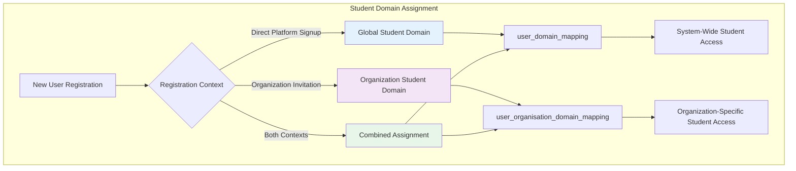
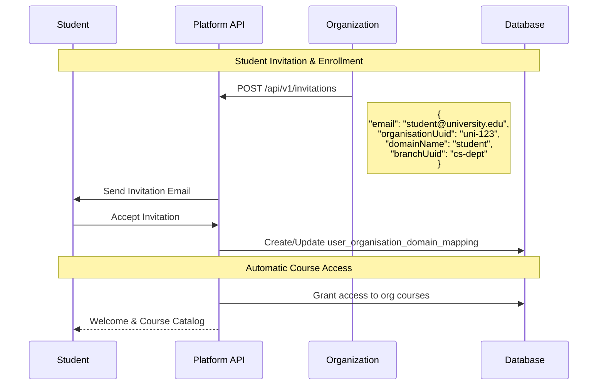
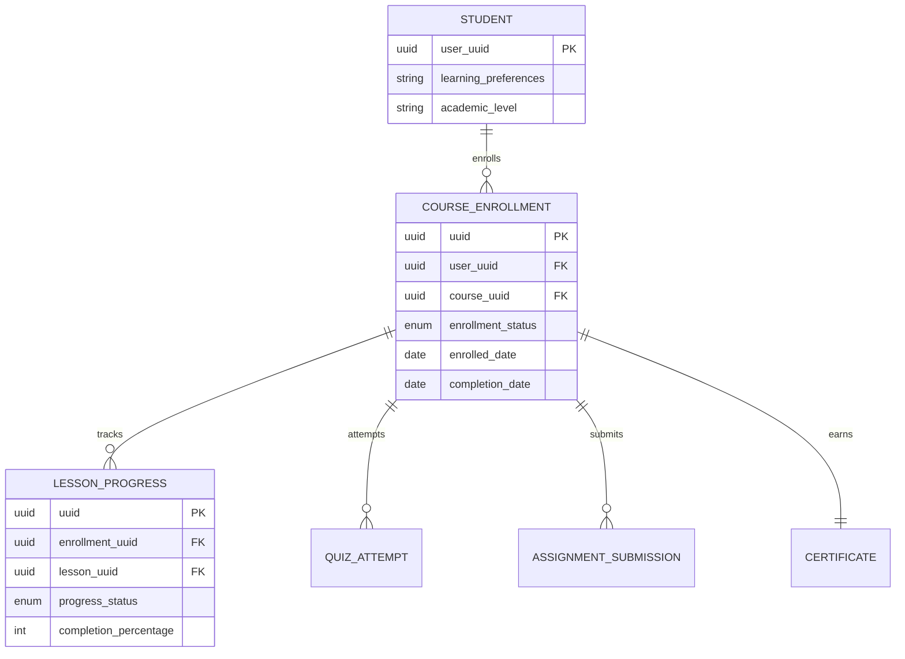
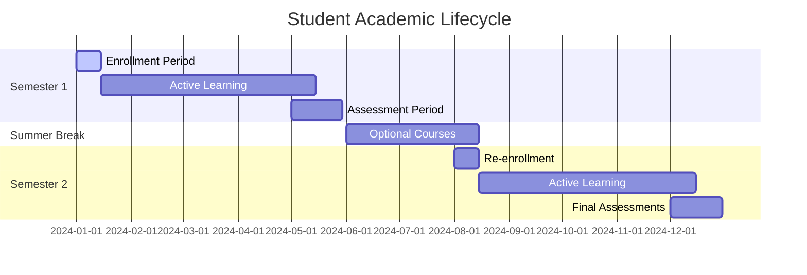
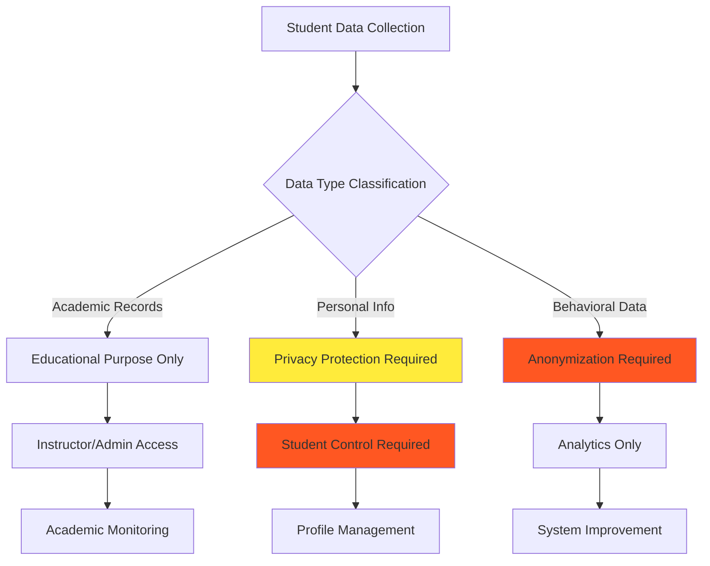

# Student Domain Guide

## Overview

The **Student** domain represents learners who engage with educational content, enroll in courses, and participate in training programs within the Elimika platform. Students can exist as both global users (independent learners) and organization-affiliated members.

## Student Domain Characteristics

### Core Capabilities
- **Course Enrollment**: Access and complete training courses
- **Progress Tracking**: Monitor learning progress and achievements  
- **Assessment Participation**: Take quizzes, submit assignments, receive grades
- **Certificate Earning**: Obtain completion certificates for courses and programs
- **Content Consumption**: View lessons, download materials, interact with content

### Domain Assignment Patterns



## Global vs Organization Student Domains

### Global Student Domain

**Assignment**: Direct mapping in `user_domain_mapping` table
**Scope**: Platform-wide access to public courses and content
**Use Cases**:
- Independent learners
- Self-enrolled users
- Open course participation

```sql
-- Example: Global student domain assignment
INSERT INTO user_domain_mapping (user_uuid, domain_uuid)
VALUES ('user-123', 'student-domain-uuid');
```

### Organization Student Domain

**Assignment**: Contextual mapping in `user_organisation_domain_mapping` table
**Scope**: Access to organization-specific courses and programs
**Additional Context**:
- Branch/department assignment
- Enrollment periods (start/end dates)
- Organization-specific policies

```sql
-- Example: Organization student domain assignment
INSERT INTO user_organisation_domain_mapping (
    user_uuid, organisation_uuid, domain_uuid, branch_uuid,
    start_date, active, deleted
) VALUES (
    'user-123', 'university-abc', 'student-domain-uuid', 'cs-department',
    '2024-01-15', true, false
);
```

## Student Lifecycle Management

### Enrollment Process



### Progress Tracking

Students accumulate learning data across multiple dimensions:



## API Reference for Student Management

### Student Profile Management

| Method | Endpoint | Purpose | Student-Specific Fields |
|--------|----------|---------|-------------------------|
| `GET` | `/api/v1/users/{uuid}` | Get student profile | `organisationAffiliations[]` with student roles |
| `PUT` | `/api/v1/users/{uuid}` | Update student info | Academic preferences, learning goals |
| `GET` | `/api/v1/students/{uuid}` | Get extended student data | Course history, achievements |

### Enrollment Management

| Method | Endpoint | Purpose | Use Case |
|--------|----------|---------|----------|
| `POST` | `/api/v1/students/{uuid}/enroll/{courseUuid}` | Enroll in course | Self-enrollment or admin assignment |
| `GET` | `/api/v1/students/{uuid}/enrollments` | List student enrollments | Progress dashboard |
| `GET` | `/api/v1/students/{uuid}/progress` | Get learning progress | Completion tracking |

### Organization Student Management

| Method | Endpoint | Purpose | Organization Context |
|--------|----------|---------|----------------------|
| `GET` | `/api/v1/organizations/{uuid}/students` | List org students | Roster management |
| `POST` | `/api/v1/organizations/{uuid}/students/invite` | Invite student | Batch enrollment |
| `GET` | `/api/v1/organizations/{uuid}/students/{studentUuid}/progress` | Track org student progress | Academic monitoring |

## Student Domain in Organization Context

### Branch-Level Student Management

Students can be assigned to specific organizational branches (departments, divisions):

```json
{
  "studentAffiliation": {
    "organisationUuid": "university-123",
    "organisationName": "State University",
    "domainInOrganisation": "student", 
    "branchUuid": "cs-dept-456",
    "branchName": "Computer Science Department",
    "startDate": "2024-01-15",
    "endDate": null,
    "active": true,
    "academicYear": "2024-2025",
    "studentId": "CS2024001"
  }
}
```

### Academic Periods and Temporal Management



## Validation Rules and Business Logic

### Student Domain Assignment Rules

1. **Self-Registration**: Users can self-assign as global students
2. **Organization Invitation**: Must be explicitly invited with student role
3. **Multiple Affiliations**: Can be student in multiple organizations simultaneously
4. **Temporal Constraints**: Organization student memberships respect academic periods

### Permission Validation

```java
// Example permission check for student content access
public boolean canAccessCourse(UUID studentUuid, UUID courseUuid) {
    // Check global student access
    List<String> globalDomains = getUserDomainsFromMappings(studentUuid);
    if (globalDomains.contains("student")) {
        return courseService.isPublicCourse(courseUuid);
    }
    
    // Check organization-specific access
    List<UserOrganisationAffiliationDTO> affiliations = 
        getUserOrganisationAffiliations(studentUuid);
    
    return affiliations.stream()
        .filter(aff -> "student".equals(aff.getDomainInOrganisation()))
        .filter(UserOrganisationAffiliationDTO::isActive)
        .anyMatch(aff -> courseService.isAvailableToOrganization(courseUuid, aff.getOrganisationUuid()));
}
```

## Student Data and Privacy Considerations

### Academic Records

Students generate extensive educational data:

- **Progress Records**: Lesson completion, time spent, attempts
- **Assessment Results**: Quiz scores, assignment grades, rubric evaluations  
- **Behavioral Data**: Login patterns, engagement metrics, help-seeking behavior
- **Achievement Data**: Certificates earned, badges, completion rates

### Data Protection



## Integration with Learning Management

### Course Enrollment Workflow

```bash
# Typical student enrollment process

# 1. Student requests course access
curl -X POST /api/v1/students/{studentUuid}/course-requests \
  -H "Content-Type: application/json" \
  -d '{"courseUuid": "intro-programming-101", "reason": "Required for CS degree"}'

# 2. Organization approves enrollment
curl -X POST /api/v1/organizations/{orgUuid}/enrollments/approve \
  -H "Content-Type: application/json" \
  -d '{"studentUuid": "student-123", "courseUuid": "intro-programming-101"}'

# 3. System creates enrollment record
curl -X GET /api/v1/students/{studentUuid}/enrollments
# Response includes new enrollment with access permissions
```

### Progress Reporting

Organizations can track student progress across multiple dimensions:

```json
{
  "studentProgressSummary": {
    "studentUuid": "student-123",
    "organizationUuid": "university-abc", 
    "branchName": "Computer Science",
    "academicPeriod": "Fall 2024",
    "totalEnrollments": 5,
    "completedCourses": 3,
    "inProgressCourses": 2,
    "averageGrade": 87.5,
    "certificatesEarned": 2,
    "lastActivity": "2024-12-01T14:30:00Z"
  }
}
```

This student domain implementation provides comprehensive support for both independent learners and organization-affiliated students, enabling flexible learning pathways while maintaining appropriate academic oversight and progress tracking.