# System Admin Management: Frontend Development Guide

## Overview

This document provides comprehensive guidance for frontend engineers building the System Admin Management interface in the Elimika platform. It covers the complete workflow for adding, managing, and monitoring system administrators with detailed API specifications, implementation patterns, and missing functionality alerts.

**Target User:** System Administrator (Global Admin)
**Primary Goal:** Secure management of platform-wide administrator accounts through invitation-based assignment and comprehensive user oversight.

---

## System Admin Domain Architecture

### Admin Hierarchy and Permissions

```mermaid
graph TB
    subgraph "Admin Domain Structure"
        SA[Super Admin<br/>🔧 Platform Owner]
        GA[Global Admin<br/>⚙️ System Operations]
        OA[Organization Admin<br/>🏢 Institution Management]

        SA --> GA
        GA --> OA
    end

    subgraph "Domain Assignment Methods"
        INV[Invitation Process<br/>📧 Email-based Assignment]
        DIRECT[Direct Assignment<br/>🔗 API-based Addition]
        BOOTSTRAP[Bootstrap Process<br/>⚡ Platform Initialization]
    end

    subgraph "Database Mapping"
        UDM[user_domain_mapping<br/>🗃️ Global Admin Assignment]
        UODM[user_organisation_domain_mapping<br/>🎯 Organization Admin Assignment]
    end

    SA -.-> BOOTSTRAP
    GA -.-> INV
    GA -.-> DIRECT
    OA -.-> UODM
    GA -.-> UDM

    style SA fill:#d32f2f
    style GA fill:#ff5722
    style OA fill:#ff9800
    style INV fill:#4caf50
```



### Admin Domain Types

| Domain Type | Scope | Assignment Method | Database Table | Use Case |
|-------------|-------|------------------|----------------|----------|
| **System Admin** | Platform-wide | `user_domain_mapping` | Global domain assignment | Complete platform control |
| **Organization Admin** | Institution-specific | `user_organisation_domain_mapping` | Contextual domain assignment | Organization management only |

---

## Frontend Implementation Architecture

### 1. Admin Management Dashboard Component Structure

```jsx
// Main container component hierarchy
AdminManagementDashboard/
├── AdminOverview/                 // KPI cards and metrics
│   ├── AdminStatsCard/           // Total admins, active sessions
│   ├── SystemHealthIndicator/    // Platform status overview
│   └── RecentActivityFeed/       // Admin action logs
├── AdminUserManagement/          // Core admin management
│   ├── AdminUserTable/          // Paginated admin list
│   ├── AdminInviteModal/        // Invite new admin flow
│   ├── AdminDetailsModal/       // View/edit admin details
│   └── AdminBulkActions/        // Batch operations
├── AdminAuditPanel/             // Security and compliance
│   ├── AdminActionLog/          // Detailed audit trail
│   ├── LoginSecurityOverview/   // Failed attempts, lockouts
│   └── PermissionMatrix/        // Role-permission mapping
└── SystemSettingsPanel/         // Platform configuration
    ├── AdminRoleConfiguration/   // Role definitions
    ├── SecurityPolicySettings/   // Password, session policies
    └── FeatureToggleManagement/  // Platform feature controls
```

### 2. Core API Integration Points

#### **Current Available Endpoints**

| Method | Endpoint | Purpose | Admin Level | Status |
|--------|----------|---------|-------------|---------|
| `GET` | `/api/v1/users` | List all platform users | Global Admin | ✅ Available |
| `GET` | `/api/v1/users/search` | Search users with filters | Global Admin | ✅ Available |
| `GET` | `/api/v1/users/{uuid}` | Get user details | Global Admin | ✅ Available |
| `PUT` | `/api/v1/users/{uuid}` | Update user profile | Global Admin | ✅ Available |
| `DELETE` | `/api/v1/users/{uuid}` | Delete user account | Global Admin | ✅ Available |
| `POST` | `/api/v1/organisations/{uuid}/invitations` | Invite to organization | Global Admin | ✅ Available |
| `POST` | `/api/v1/invitations/accept` | Accept invitation | User | ✅ Available |

#### **Missing Critical Endpoints** ⚠️

The following endpoints are **NOT IMPLEMENTED** and need backend development:

| Priority | Method | Missing Endpoint | Purpose | Impact |
|----------|--------|------------------|---------|---------|
| **HIGH** | `POST` | `/api/v1/admin/users/{uuid}/domains` | Add admin domain to user | **Core functionality blocked** |
| **HIGH** | `DELETE` | `/api/v1/admin/users/{uuid}/domains/{domain}` | Remove admin domain | **Admin removal impossible** |
| **HIGH** | `GET` | `/api/v1/admin/users/admins` | List all system admins | **Admin dashboard empty** |
| **HIGH** | `GET` | `/api/v1/admin/audit-log` | Get admin action logs | **Security compliance missing** |
| **MEDIUM** | `GET` | `/api/v1/admin/dashboard/statistics` | Admin dashboard metrics | **Dashboard KPIs unavailable** |
| **MEDIUM** | `POST` | `/api/v1/admin/users/invite-admin` | Direct admin invitation | **Streamlined admin creation blocked** |
| **LOW** | `GET` | `/api/v1/admin/system-health` | System health metrics | **Monitoring dashboard limited** |

---

## Feature Implementation Guide

### Feature 1.0: System Admin Invitation Flow

#### 1.1 Admin Invitation Process

**Current Implementation Status:** ⚠️ **Partially Available**

**Available:** Basic user invitation system via `OrganisationController`
**Missing:** Direct admin domain assignment endpoint


#### 1.2 Frontend Component Implementation

```jsx
import React, { useState, useEffect } from 'react';
import { useAuth } from '../hooks/useAuth';
import { adminApi } from '../services/api';

const AdminInviteModal = ({ isOpen, onClose, onSuccess }) => {
  const [formData, setFormData] = useState({
    email: '',
    name: '',
    adminLevel: 'system', // system | organization
    notes: ''
  });
  const [loading, setLoading] = useState(false);
  const [error, setError] = useState(null);

  const handleSubmit = async (e) => {
    e.preventDefault();
    setLoading(true);
    setError(null);

    try {
      // ⚠️ MISSING API ENDPOINT - Using workaround
      // Intended: await adminApi.inviteAdmin(formData);

      // CURRENT WORKAROUND: Use organization invitation
      const response = await adminApi.inviteToOrganization({
        recipientEmail: formData.email,
        recipientName: formData.name,
        domainName: 'admin', // Will need manual domain assignment
        notes: formData.notes
      });

      // ⚠️ MISSING: Automatic admin domain assignment
      // Manual step required after invitation acceptance

      onSuccess(response.data);
      onClose();
    } catch (err) {
      setError('Failed to send admin invitation. Please try again.');
    } finally {
      setLoading(false);
    }
  };

  return (
    <Modal isOpen={isOpen} onClose={onClose} title="Invite New System Admin">
      <form onSubmit={handleSubmit}>
        <div className="form-group">
          <label>Email Address</label>
          <input
            type="email"
            value={formData.email}
            onChange={(e) => setFormData({...formData, email: e.target.value})}
            required
            placeholder="admin@company.com"
          />
        </div>

        <div className="form-group">
          <label>Full Name</label>
          <input
            type="text"
            value={formData.name}
            onChange={(e) => setFormData({...formData, name: e.target.value})}
            required
            placeholder="John Administrator"
          />
        </div>

        <div className="form-group">
          <label>Admin Level</label>
          <select
            value={formData.adminLevel}
            onChange={(e) => setFormData({...formData, adminLevel: e.target.value})}
          >
            <option value="system">System Administrator</option>
            <option value="organization">Organization Administrator</option>
          </select>
          <small className="help-text">
            System admins have platform-wide access. Organization admins are limited to specific institutions.
          </small>
        </div>

        <div className="form-group">
          <label>Welcome Message (Optional)</label>
          <textarea
            value={formData.notes}
            onChange={(e) => setFormData({...formData, notes: e.target.value})}
            placeholder="Welcome to the Elimika admin team..."
            maxLength={500}
          />
        </div>

        {error && <div className="error-message">{error}</div>}

        <div className="modal-actions">
          <button type="button" onClick={onClose} className="btn-secondary">
            Cancel
          </button>
          <button type="submit" disabled={loading} className="btn-primary">
            {loading ? 'Sending...' : 'Send Invitation'}
          </button>
        </div>
      </form>

      {/* ⚠️ Missing Functionality Warning */}
      <div className="implementation-warning">
        <h4>⚠️ Implementation Status</h4>
        <ul>
          <li>❌ Direct admin invitation endpoint missing</li>
          <li>❌ Automatic admin domain assignment unavailable</li>
          <li>✅ Basic invitation system working</li>
          <li>✅ Email delivery functional</li>
        </ul>
        <p><strong>Current Limitation:</strong> Admin role must be manually assigned after invitation acceptance.</p>
      </div>
    </Modal>
  );
};
```

### Feature 2.0: Admin User Management Interface

#### 2.1 Admin User Table Component

**Implementation Status:** ✅ **Mostly Available** (uses existing user endpoints)

```jsx
const AdminUserTable = () => {
  const [admins, setAdmins] = useState([]);
  const [loading, setLoading] = useState(true);
  const [filters, setFilters] = useState({
    domain: 'admin', // Filter for admin domain users
    status: 'active'
  });

  useEffect(() => {
    loadAdmins();
  }, [filters]);

  const loadAdmins = async () => {
    try {
      setLoading(true);

      // ⚠️ MISSING: Dedicated admin list endpoint
      // Using workaround with search filters
      const response = await userApi.searchUsers({
        ...filters,
        domain: 'admin' // Filter for admin domain only
      });

      setAdmins(response.data.items);
    } catch (error) {
      console.error('Failed to load admin users:', error);
    } finally {
      setLoading(false);
    }
  };

  const handleRemoveAdmin = async (userUuid) => {
    if (!confirm('Remove admin privileges from this user?')) return;

    try {
      // ⚠️ MISSING API ENDPOINT
      // await adminApi.removeAdminDomain(userUuid, 'admin');

      // CURRENT WORKAROUND: Would need manual database update
      alert('⚠️ Admin removal endpoint not implemented. Contact backend team.');

    } catch (error) {
      alert('Failed to remove admin privileges.');
    }
  };

  return (
    <div className="admin-table-container">
      <div className="table-header">
        <h2>System Administrators</h2>
        <div className="admin-stats">
          <span>Total Admins: {admins.length}</span>
          <span>Active Sessions: {admins.filter(a => a.lastLogin > Date.now() - 86400000).length}</span>
        </div>
      </div>

      {/* ⚠️ Missing Functionality Alert */}
      <div className="functionality-alert">
        <strong>⚠️ Missing Backend Support:</strong>
        <ul>
          <li>Admin-specific user listing endpoint</li>
          <li>Admin domain assignment/removal</li>
          <li>Admin activity tracking</li>
        </ul>
      </div>

      <table className="admin-table">
        <thead>
          <tr>
            <th>Name</th>
            <th>Email</th>
            <th>Admin Level</th>
            <th>Last Login</th>
            <th>Status</th>
            <th>Actions</th>
          </tr>
        </thead>
        <tbody>
          {admins.map(admin => (
            <tr key={admin.uuid}>
              <td>
                <div className="user-info">
                  
                  <span>{admin.firstName} {admin.lastName}</span>
                </div>
              </td>
              <td>{admin.email}</td>
              <td>
                <span className={`admin-level ${admin.adminLevel || 'system'}`}>
                  {admin.domains.includes('admin') ? 'System Admin' : 'Organization Admin'}
                </span>
              </td>
              <td>{formatDate(admin.lastLogin)}</td>
              <td>
                <span className={`status ${admin.status || 'active'}`}>
                  {admin.status || 'Active'}
                </span>
              </td>
              <td>
                <button onClick={() => viewAdminDetails(admin)} className="btn-sm">
                  View
                </button>
                <button onClick={() => handleRemoveAdmin(admin.uuid)} className="btn-sm btn-danger">
                  Remove Admin
                </button>
              </td>
            </tr>
          ))}
        </tbody>
      </table>
    </div>
  );
};
```

### Feature 3.0: Admin Dashboard Overview

#### 3.1 System Health Dashboard

**Implementation Status:** ❌ **Missing Backend Support**

```jsx
const AdminDashboardOverview = () => {
  const [dashboardData, setDashboardData] = useState(null);
  const [loading, setLoading] = useState(true);

  useEffect(() => {
    loadDashboardData();
  }, []);

  const loadDashboardData = async () => {
    try {
      // ⚠️ MISSING API ENDPOINTS
      // const [stats, health, activity] = await Promise.all([
      //   adminApi.getDashboardStatistics(), ❌
      //   adminApi.getSystemHealth(), ❌
      //   adminApi.getRecentActivity() ❌
      // ]);

      // MOCK DATA - Replace with API calls when available
      setDashboardData({
        userMetrics: {
          totalUsers: 0, // Would come from API
          activeUsers24h: 0,
          newRegistrations7d: 0,
          suspendedAccounts: 0
        },
        systemHealth: {
          status: 'UNKNOWN', // Would come from API
          uptime: 'N/A',
          responseTime: 'N/A',
          errorRate: 'N/A'
        },
        adminActivity: [] // Would come from API
      });

    } catch (error) {
      console.error('Dashboard data loading failed:', error);
    } finally {
      setLoading(false);
    }
  };

  return (
    <div className="admin-dashboard-overview">
      {/* ⚠️ Critical Missing Functionality Alert */}
      <div className="critical-alert">
        <h3>⚠️ Dashboard Backend Not Implemented</h3>
        <p>The following critical endpoints are missing:</p>
        <ul>
          <li><code>GET /api/v1/admin/dashboard/statistics</code></li>
          <li><code>GET /api/v1/admin/system-health</code></li>
          <li><code>GET /api/v1/admin/audit-log</code></li>
        </ul>
        <p><strong>Impact:</strong> Admin dashboard will show placeholder data until backend implementation.</p>
      </div>

      <div className="dashboard-grid">
        <div className="kpi-section">
          <KPICard
            title="Total Users"
            value={dashboardData?.userMetrics?.totalUsers || 'N/A'}
            icon="users"
            status="missing-data"
          />
          <KPICard
            title="System Health"
            value={dashboardData?.systemHealth?.status || 'UNKNOWN'}
            icon="health"
            status="missing-data"
          />
          <KPICard
            title="Active Admins"
            value="N/A"
            icon="admin"
            status="missing-data"
          />
        </div>

        <div className="activity-section">
          <h3>Recent Admin Activity</h3>
          <div className="missing-feature-notice">
            <p>⚠️ Admin activity log endpoint not implemented</p>
            <p>Expected endpoint: <code>GET /api/v1/admin/audit-log</code></p>
          </div>
        </div>
      </div>
    </div>
  );
};
```

---

## API Service Layer Implementation

### Admin API Service

```javascript
// services/adminApi.js
import { apiClient } from './apiClient';

export const adminApi = {
  // ✅ AVAILABLE ENDPOINTS (using existing user management)
  getAllUsers: (params = {}) => {
    return apiClient.get('/api/v1/users', { params });
  },

  searchUsers: (searchParams, pageable = {}) => {
    return apiClient.get('/api/v1/users/search', {
      params: { ...searchParams, ...pageable }
    });
  },

  getUserDetails: (uuid) => {
    return apiClient.get(`/api/v1/users/${uuid}`);
  },

  updateUser: (uuid, userData) => {
    return apiClient.put(`/api/v1/users/${uuid}`, userData);
  },

  deleteUser: (uuid) => {
    return apiClient.delete(`/api/v1/users/${uuid}`);
  },

  inviteToOrganization: (organizationUuid, invitationData) => {
    return apiClient.post(`/api/v1/organisations/${organizationUuid}/invitations`, invitationData);
  },

  // ❌ MISSING ENDPOINTS - Need backend implementation
  inviteAdmin: (adminInviteData) => {
    // ❌ NOT IMPLEMENTED
    throw new Error('Admin invitation endpoint not implemented. Expected: POST /api/v1/admin/users/invite-admin');
  },

  addAdminDomain: (userUuid, domainData) => {
    // ❌ NOT IMPLEMENTED
    throw new Error('Admin domain assignment endpoint not implemented. Expected: POST /api/v1/admin/users/{uuid}/domains');
  },

  removeAdminDomain: (userUuid, domain) => {
    // ❌ NOT IMPLEMENTED
    throw new Error('Admin domain removal endpoint not implemented. Expected: DELETE /api/v1/admin/users/{uuid}/domains/{domain}');
  },

  getAdminUsers: (filters = {}) => {
    // ❌ NOT IMPLEMENTED
    // WORKAROUND: Use search with admin domain filter
    return this.searchUsers({ ...filters, domain: 'admin' });
  },

  getDashboardStatistics: () => {
    // ❌ NOT IMPLEMENTED
    throw new Error('Admin dashboard statistics endpoint not implemented. Expected: GET /api/v1/admin/dashboard/statistics');
  },

  getSystemHealth: () => {
    // ❌ NOT IMPLEMENTED
    throw new Error('System health endpoint not implemented. Expected: GET /api/v1/admin/system-health');
  },

  getAuditLog: (params = {}) => {
    // ❌ NOT IMPLEMENTED
    throw new Error('Admin audit log endpoint not implemented. Expected: GET /api/v1/admin/audit-log');
  }
};
```

---

## Security Implementation

### Role-Based Access Control

```jsx
// hooks/useAdminAccess.js
import { useAuth } from './useAuth';
import { useMemo } from 'react';

export const useAdminAccess = () => {
  const { user, isAuthenticated } = useAuth();

  const adminAccess = useMemo(() => {
    if (!isAuthenticated || !user) {
      return {
        isAdmin: false,
        isSystemAdmin: false,
        isOrganizationAdmin: false,
        canManageUsers: false,
        canViewAuditLogs: false,
        canManageSystem: false
      };
    }

    const userDomains = user.domains || [];
    const isSystemAdmin = userDomains.includes('admin');
    const isOrganizationAdmin = userDomains.includes('organisation_user');

    return {
      isAdmin: isSystemAdmin || isOrganizationAdmin,
      isSystemAdmin,
      isOrganizationAdmin,
      canManageUsers: isSystemAdmin,
      canViewAuditLogs: isSystemAdmin,
      canManageSystem: isSystemAdmin
    };
  }, [user, isAuthenticated]);

  return adminAccess;
};

// components/ProtectedAdminRoute.jsx
import { useAdminAccess } from '../hooks/useAdminAccess';
import { Navigate } from 'react-router-dom';

const ProtectedAdminRoute = ({ children, requiredLevel = 'admin' }) => {
  const { isAdmin, isSystemAdmin } = useAdminAccess();

  if (requiredLevel === 'system' && !isSystemAdmin) {
    return <Navigate to="/unauthorized" replace />;
  }

  if (requiredLevel === 'admin' && !isAdmin) {
    return <Navigate to="/unauthorized" replace />;
  }

  return children;
};
```

---

## Critical Implementation Gaps

### High Priority Missing Features

#### 1. **Admin Domain Management Endpoints** ⚠️ **CRITICAL**

```javascript
// REQUIRED BACKEND IMPLEMENTATION
/**
 * Add admin domain to existing user
 * POST /api/v1/admin/users/{userUuid}/domains
 *
 * Request Body:
 * {
 *   "domainName": "admin",
 *   "assignmentType": "global",
 *   "reason": "Promoted to system administrator",
 *   "effectiveDate": "2024-12-01"
 * }
 */

/**
 * Remove admin domain from user
 * DELETE /api/v1/admin/users/{userUuid}/domains/{domainName}
 *
 * Query Parameters:
 * - reason: "Role change" | "Security concern" | "User request"
 * - effectiveDate: ISO date string
 */
```

#### 2. **Admin Dashboard API** ⚠️ **HIGH**

```javascript
// REQUIRED BACKEND IMPLEMENTATION
/**
 * Admin dashboard statistics
 * GET /api/v1/admin/dashboard/statistics
 *
 * Response:
 * {
 *   "userMetrics": {
 *     "totalUsers": 15847,
 *     "activeUsers24h": 3421,
 *     "newRegistrations7d": 234,
 *     "suspendedAccounts": 12
 *   },
 *   "adminMetrics": {
 *     "totalAdmins": 8,
 *     "activeAdminSessions": 3,
 *     "adminActionsToday": 47
 *   },
 *   "systemHealth": {
 *     "status": "HEALTHY",
 *     "uptime": "99.97%",
 *     "responseTime": "142ms",
 *     "errorRate": "0.02%"
 *   }
 * }
 */
```

#### 3. **Audit Log System** ⚠️ **HIGH**

```javascript
// REQUIRED BACKEND IMPLEMENTATION
/**
 * Admin audit log
 * GET /api/v1/admin/audit-log
 *
 * Query Parameters:
 * - page, size: Pagination
 * - adminUuid: Filter by admin user
 * - action: Filter by action type
 * - startDate, endDate: Date range filter
 * - targetResource: Filter by affected resource
 *
 * Response:
 * {
 *   "items": [{
 *     "id": "audit-123",
 *     "adminUserUuid": "admin-456",
 *     "adminEmail": "admin@elimika.com",
 *     "action": "ASSIGN_ADMIN_DOMAIN",
 *     "targetResource": "user:user-789",
 *     "details": {
 *       "domainAssigned": "admin",
 *       "reason": "New team member"
 *     },
 *     "timestamp": "2024-12-01T15:30:00Z",
 *     "ipAddress": "192.168.1.100"
 *   }]
 * }
 */
```

---

## Implementation Roadmap

### Phase 1: Core Admin Management (Week 1-2)
- ✅ **Available:** Basic user listing and search
- ❌ **Missing:** Admin domain assignment endpoints
- ❌ **Missing:** Admin-specific user filtering
- **Frontend Status:** Can build UI, limited functionality

### Phase 2: Admin Dashboard (Week 3-4)
- ❌ **Missing:** Dashboard statistics API
- ❌ **Missing:** System health monitoring
- ❌ **Missing:** Real-time metrics
- **Frontend Status:** Mock data only

### Phase 3: Security and Audit (Week 5-6)
- ❌ **Missing:** Audit log endpoints
- ❌ **Missing:** Admin session tracking
- ❌ **Missing:** Security event logging
- **Frontend Status:** Cannot implement

### Phase 4: Advanced Features (Week 7-8)
- ❌ **Missing:** Bulk admin operations
- ❌ **Missing:** Admin role templates
- ❌ **Missing:** System configuration management
- **Frontend Status:** Blocked until APIs available

---

## Workaround Solutions

### Current Development Approach

1. **Admin User Listing:** Use `GET /api/v1/users/search` with domain filters
2. **Admin Invitations:** Use existing organization invitation system
3. **Admin Assignment:** Manual database updates required (temporary)
4. **Dashboard Data:** Mock data until API implementation
5. **Audit Logs:** Display placeholder UI

### Testing Strategy

```javascript
// Mock data for development
const mockAdminData = {
  admins: [
    {
      uuid: "admin-001",
      firstName: "John",
      lastName: "Administrator",
      email: "john@elimika.com",
      domains: ["admin"],
      status: "active",
      lastLogin: "2024-12-01T10:30:00Z"
    }
  ],
  dashboardStats: {
    userMetrics: {
      totalUsers: 15847,
      activeUsers24h: 3421,
      newRegistrations7d: 234
    },
    systemHealth: {
      status: "HEALTHY",
      uptime: "99.97%"
    }
  }
};

// Use mock data until APIs are available
export const useMockAdminData = () => {
  const [data, setData] = useState(mockAdminData);
  return { data, loading: false, error: null };
};
```

This comprehensive guide provides the frontend team with a complete implementation roadmap while clearly identifying missing backend functionality that needs to be developed before full feature completion.