# User Domains Management Guide

## System Architecture Overview

The Elimika platform implements a flexible dual-tier user domain system that manages user roles and permissions across both global system access and organization-specific contexts. This architecture supports complex multi-tenancy scenarios while maintaining clear role-based access control.

### Core Domain Types

The system supports four primary user domains:

- **Student**: Learners who enroll in courses and training programs
- **Instructor**: Educators who create and deliver content  
- **Admin**: System administrators with platform-wide privileges
- **Organisation User**: Users affiliated with specific organizations

```mermaid
graph TB
    subgraph "Global Domain System"
        GD[Global User Domains<br/>🌐 System-Wide Roles]
        UDM[User Domain Mapping<br/>🔗 Direct User Assignment]
        UD[User Domain<br/>📋 Domain Definitions]
    end

    subgraph "Organization-Specific System" 
        OD[Organization Domains<br/>🏢 Context-Aware Roles]
        UODM[User Organisation Domain Mapping<br/>🎯 Multi-Dimensional Assignment]
        ORG[Organisation<br/>🏛️ Institution Context]
        BRANCH[Training Branch<br/>🌿 Department/Division]
    end

    subgraph "User Profile Integration"
        USER[User Profile<br/>👤 Combined View]
        AFFIL[Organisation Affiliations<br/>📊 Detailed Membership Info]
    end

    GD --> UDM
    UDM --> UD
    OD --> UODM
    UODM --> ORG
    UODM --> BRANCH
    UODM --> UD
    USER --> GD
    USER --> OD
    USER --> AFFIL

    style GD fill:#e1f5fe
    style OD fill:#f3e5f5
    style USER fill:#e8f5e9
    style AFFIL fill:#fffde7
```



## Domain Architecture: Global vs Organization-Specific

### 1. Global User Domains 

**Purpose**: System-wide role assignment independent of organizational context.

**Entities**:
- `UserDomain`: Master domain definitions (student, instructor, admin, organisation_user)
- `UserDomainMapping`: Direct user-to-domain assignments

**Use Cases**:
- Platform administrators (`admin`)
- Independent instructors not tied to specific organizations
- Users with system-wide privileges


### 2. Organization-Specific Domain Mappings

**Purpose**: Contextual role assignment within specific organizations with temporal and hierarchical management.

**Key Features**:
- **Multi-dimensional mapping**: User + Organization + Domain + Branch
- **Temporal tracking**: Start date, end date, active status
- **Soft deletion**: Audit trail preservation
- **Branch granularity**: Department/division level assignments


## Domain Resolution and User Profile Integration

### Combined Domain Resolution

The system aggregates domains from both global and organizational contexts to provide a unified user profile:

```java
// Method: getUserDomainsFromMappings() in UserServiceImpl
private List<String> getUserDomainsFromMappings(UUID userUuid) {
    Set<String> allDomains = new HashSet<>();
    
    // 1. Get global/standalone domains
    List<UserDomainMapping> standaloneMappings = userDomainMappingRepository.findByUserUuid(userUuid);
    // Add to allDomains set...
    
    // 2. Get domains from active organization memberships  
    List<UserOrganisationDomainMapping> orgMappings = 
        userOrganisationDomainMappingRepository.findActiveByUser(userUuid);
    // Add to allDomains set...
    
    return new ArrayList<>(allDomains); // Deduplicated list
}
```

### Organization Affiliation Details

Beyond simple domain lists, the system provides rich organizational context through `UserOrganisationAffiliationDTO`:

```json
{
  "organisationUuid": "org-123-456",
  "organisationName": "University ABC", 
  "domainInOrganisation": "instructor",
  "branchUuid": "branch-789",
  "branchName": "Computer Science Department",
  "startDate": "2024-01-15",
  "endDate": null,
  "active": true,
  "affiliatedDate": "2024-01-15T10:30:00Z"
}
```

## API Integration Points

### User Profile Endpoints

| Method | Endpoint | Purpose | Returns |
|--------|----------|---------|---------|
| `GET` | `/api/v1/users/{uuid}` | Get user with all domains and affiliations | `UserDTO` with combined domains and organization affiliations |
| `GET` | `/api/v1/users` | Get all users (paginated) | `PagedDTO<UserDTO>` |
| `PUT` | `/api/v1/users/{uuid}` | Update user profile | Updated `UserDTO` |
| `GET` | `/api/v1/users/search` | Search users with filters | `PagedDTO<UserDTO>` matching criteria |

### Organization Management Endpoints

| Method | Endpoint | Purpose | Use Case |
|--------|----------|---------|----------|
| `GET` | `/api/v1/organisations/{uuid}/users` | Get organization members | List all affiliated users (paginated) |
| `GET` | `/api/v1/organisations/{uuid}/users/domain/{domainName}` | Filter by role | Get users with specific role in organization |
| `POST` | `/api/v1/organisations/{uuid}/invitations` | Create organization invitation | Invite user to organization with role |
| `GET` | `/api/v1/organisations/{uuid}/invitations` | Get organization invitations | List all invitations for organization |

### User Invitation Management

| Method | Endpoint | Purpose | Context |
|--------|----------|---------|---------|
| `GET` | `/api/v1/users/{uuid}/invitations/pending` | Get pending invitations for user | User sees all pending invites |
| `GET` | `/api/v1/users/{uuid}/invitations/sent` | Get invitations sent by user | Track invitations created by user |
| `POST` | `/api/v1/users/{uuid}/invitations/accept` | Accept invitation by token | User accepts organization/branch invite |
| `POST` | `/api/v1/users/{uuid}/invitations/decline` | Decline invitation by token | User declines organization/branch invite |

## Repository Query Capabilities

### Advanced Querying Features

The `UserOrganisationDomainMappingRepository` provides comprehensive query methods:

```java
// Active relationship queries
List<UserOrganisationDomainMapping> findActiveByUser(UUID userUuid);
List<UserOrganisationDomainMapping> findActiveByOrganisation(UUID orgUuid);
Optional<UserOrganisationDomainMapping> findActiveByUserAndOrganisation(UUID userUuid, UUID orgUuid);

// Role-based filtering  
List<UserOrganisationDomainMapping> findActiveByOrganisationAndDomain(UUID orgUuid, UUID domainUuid);
List<UserOrganisationDomainMapping> findActiveByBranch(UUID branchUuid);

// Temporal queries
List<UserOrganisationDomainMapping> findMappingsEndingBetween(LocalDate start, LocalDate end);
List<UserOrganisationDomainMapping> findByStartDateAfterAndActiveTrueAndDeletedFalse(LocalDate date);

// Analytics
long countDistinctActiveUsersByOrganisation(UUID orgUuid);
long countDistinctActiveUsersByOrganisationAndDomain(UUID orgUuid, UUID domainUuid);
```

## Business Rules and Validation

### Domain Assignment Rules

1. **Admin and Organisation User**: Always assigned as global domains
2. **Student and Instructor**: Can be both global and organization-specific
3. **Temporal Validity**: Organization memberships respect start/end date constraints
4. **Active Status**: Only active mappings contribute to user permissions
5. **Soft Deletion**: Deactivated memberships preserved for audit trails

### Permission Resolution


## Migration and Data Management

### Membership Lifecycle Management


This architecture provides a robust foundation for managing user roles across both system-wide and organization-specific contexts, enabling complex multi-tenant scenarios while maintaining clear separation of concerns and audit capabilities.