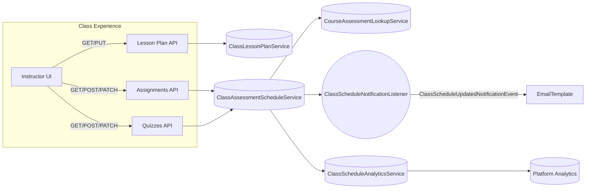

# Class & Assessment Scheduling: Frontend Integration Guide

This guide explains how frontend teams should integrate with the **class lesson plan** and **class-level assessment scheduling** APIs. It focuses on instructor and student experiences across web dashboards, highlighting required endpoints, payloads, UI states, and notification triggers.

## Audience & Goals

- **Instructors** manage lesson ordering, assessment release windows, deadlines, and overrides for their classes.
- **Students** consume lesson plans and assessment deadlines that reflect class-specific overrides.
- **Product/UX** teams ensure the UI mirrors business rules (permission checks, validation feedback, notifications).

## Architecture Overview



## Key Concepts

| Concept | Description | Notes for UI |
|---|---|---|
| `ClassLessonPlan` | Defines lesson ordering, optional planned start/end times, and instructor notes per class. | Primary view instructors use to structure their cohort. |
| `ClassAssignmentSchedule` | Associates a class/lesson with an assignment (course template or class clone) and sets visibility/due windows. | Deadlines drive instructor notifications and student calendars. |
| `ClassQuizSchedule` | Same as assignments but with quiz-specific overrides (time limit, attempts, passing score). | UI should highlight overrides vs inherited defaults. |
| `release_strategy` | `INHERITED`, `CUSTOM`, or `CLONE`. Signals how class values relate to course templates. | Display badges or tooltips explaining overrides. |

## API Endpoints

Base path: `/api/v1/classes/{classUuid}`

| Endpoint | Method | Purpose |
|---|---|---|
| `/lesson-plan` | `GET` | Retrieve ordered lesson plan entries for a class. |
| `/lesson-plan` | `PUT` | Replace the entire lesson plan (ordered array). |
| `/assignments` | `GET` | List class assignment schedules. |
| `/assignments` | `POST` | Create a schedule entry (inherit defaults or clone template). |
| `/assignments/{scheduleUuid}` | `PATCH` | Update deadlines, release strategy, or overrides. |
| `/assignments/{scheduleUuid}` | `DELETE` | Remove class-specific schedule (students lose access). |
| `/quizzes` | `GET` | List class quiz schedules. |
| `/quizzes` | `POST` | Create class quiz schedule. |
| `/quizzes/{scheduleUuid}` | `PATCH` | Update quiz overrides or deadlines. |
| `/quizzes/{scheduleUuid}` | `DELETE` | Remove quiz from class plan. |

### Lesson Plan Payload

```jsonc
PUT /api/v1/classes/{classUuid}/lesson-plan
[
  {
    "uuid": "optional-when-updating-existing",
    "lesson_uuid": "lesson-uuid",
    "scheduled_start": "2025-02-10T14:00:00",
    "scheduled_end": "2025-02-10T15:30:00",
    "scheduled_instance_uuid": null,
    "instructor_uuid": "instructor-uuid",
    "notes": "Focus on group project kick-off"
  }
]
```

**UI Guidance**
- Use draggable lists for reordering.
- Preserve `uuid` for existing entries; omit for new entries to create.
- Validate `scheduled_start < scheduled_end` client-side.
- Highlight conflicts returned from timetabling APIs (if integrated).

### Assignment Schedule Payload

```jsonc
POST /api/v1/classes/{classUuid}/assignments
{
  "assignment_uuid": "course-assignment-uuid",
  "lesson_uuid": "lesson-uuid",          // optional if template already set
  "class_lesson_plan_uuid": "optional",
  "visible_at": "2025-02-12T06:00:00Z",
  "due_at": "2025-02-15T21:00:00Z",
  "grading_due_at": "2025-02-18T21:00:00Z",
  "timezone": "Africa/Nairobi",
  "release_strategy": "CUSTOM",
  "max_attempts": 1,
  "instructor_uuid": "instructor-uuid",
  "notes": "Remind students about rubric section B."
}
```

**UI Validation**
- `due_at` must be after `visible_at`.
- `grading_due_at` optional; show warnings if before `due_at`.
- `release_strategy` drives UI toggles:
  - `INHERITED`: fields read-only, show course defaults.
  - `CUSTOM`: allow editing deadlines & overrides.
  - `CLONE`: separate screen to edit the class clone (future roadmap).
- Use pickers with timezone display; conversions handled server-side (persisted in UTC).

### Quiz Schedule Payload

```jsonc
PATCH /api/v1/classes/{classUuid}/quizzes/{scheduleUuid}
{
  "visible_at": "2025-02-20T06:00:00Z",
  "due_at": "2025-02-20T20:00:00Z",
  "timezone": "UTC",
  "release_strategy": "CUSTOM",
  "time_limit_override": 45,
  "attempt_limit_override": 2,
  "passing_score_override": 75.5,
  "notes": "Extended time per accessibility plan."
}
```

**UI Considerations**
- Time limit and attempt overrides should be constrained by course template maximums (validate on save based on API error response).
- Display difference between template vs class override using chips or accordion sections.
- Show historical updates (if available) using the schedule change notifications.

## Notifications & Event Flow

- `ClassScheduleNotificationListener` sends `CLASS_SCHEDULE_UPDATED` emails to instructors for every create/update/delete.
- Notification template variables:
  - `assessmentTitle`, `assessmentType`, `changeTypeLabel`, `visibleAt`, `dueAt`, `releaseStrategy`, `notes`.
- Frontend should surface recent changes to avoid email reliance:
  - Optionally fetch last change timestamp via analytics snapshot.
  - Display banners like “Assignment deadline moved to 20 Feb, 21:00”.

## Analytics

- `ClassScheduleAnalyticsService` tracks:
  - Total scheduled assignments/quizzes.
  - Upcoming deadlines in next 7 days.
  - Overdue counts (for instructor dashboards).
  - Last schedule change timestamp (for refresh prompts).
- Frontend can poll a dedicated analytics endpoint (to be exposed) or rely on scheduled data fetch.

## Permission Model

- Only instructors assigned to the class (or organisation admins) can mutate schedules.
- Students have read-only access via dedicated endpoints (to be exposed later, e.g., `/api/v1/students/classes/{classUuid}/schedule`).
- Ensure UI disables edit controls when user lacks `INSTRUCTOR` or `ORG_ADMIN` role.

## Error Handling Patterns

| HTTP Status | Scenario | UI Response |
|---|---|---|
| `400` | Validation failure (deadline order, missing lesson) | Show inline form errors from response `message`. |
| `403` | Attempt to edit class not owned by instructor | Redirect to read-only view with “insufficient permissions”. |
| `404` | Lesson plan or assessment not found | Refresh class data; show toast “Item removed by another instructor”. |
| `409` | (Future) Scheduling conflict with timetabling | Display conflict modal with conflicting time slots. |

## Recommended UI Workflow

1. **Lesson Plan Overview**
   - Load `/lesson-plan` into reorderable list.
   - Provide “Add Lesson” modal with search over course lessons.

2. **Assessment Scheduler Drawer**
   - Trigger from lesson plan row (“Manage Assessments”).
   - Show tabs for assignments/quizzes with existing schedules.
   - Include “Import course templates” action (future bulk API).

3. **Deadline Calendar**
   - Visual calendar heatmap highlighting `visible_at` and `due_at`.
   - Supports drag-to-adjust (PATCH endpoint on drop).

4. **Audit Log Panel**
   - Use notification event payloads to display “Updated by [user] on [time]”.
   - Helps instructors track collaborative edits.

## Student Experience Considerations

- Students must always see class-specific deadlines:
  - Upcoming modules should rely on class schedules rather than course templates.
  - Display timezone for each deadline (converted to user’s local time with class timezone reference).
- Integrate with notification preferences to opt-in/out of due reminders (existing assignment reminder events still fire).
- Ensure gradebook view reflects class clones vs course templates (identify by `scope` in assignment/quiz DTOs).

## Frontend Checklist

- [ ] Update instructor dashboard navigation with “Lesson Plan & Deadlines”.
- [ ] Build lesson plan reorder & inline notes UI.
- [ ] Implement assessment scheduler with create/update/delete flows.
- [ ] Show release strategy badges and tooltip explanations.
- [ ] Surface email notifications in UI (badge for recent changes).
- [ ] Sync analytics counts for at-a-glance metrics.
- [ ] Add student view updates to show class overrides.

## Appendix

- **DTOs:** `ClassLessonPlanDTO`, `ClassAssignmentScheduleDTO`, `ClassQuizScheduleDTO`.
- **Events:** `ClassAssignmentScheduleChangedEventDTO`, `ClassQuizScheduleChangedEventDTO`.
- **Notification Type:** `CLASS_SCHEDULE_UPDATED`.
- **Enums:** `AssignmentScope`, `QuizScope`, `ClassAssessmentReleaseStrategy`.

For backend architecture specifics, see `docs/architecture/class-assessment-scheduling.md`.
