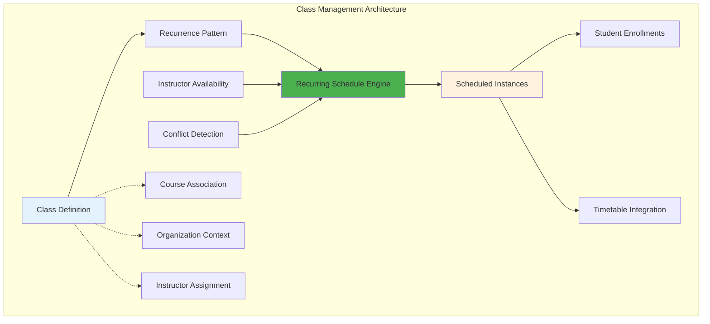
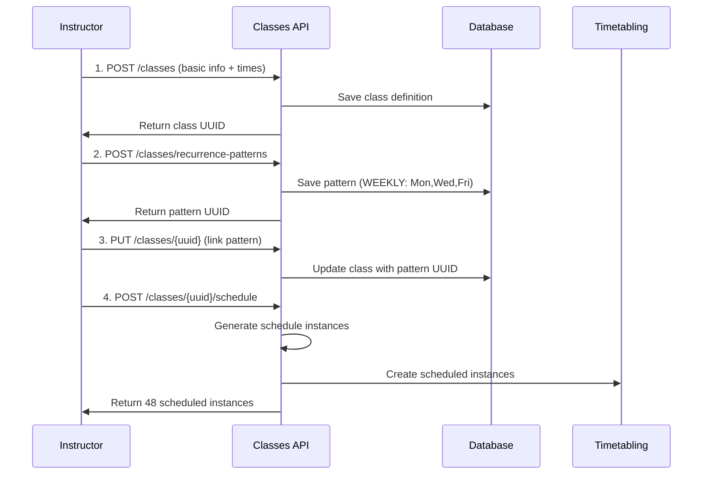
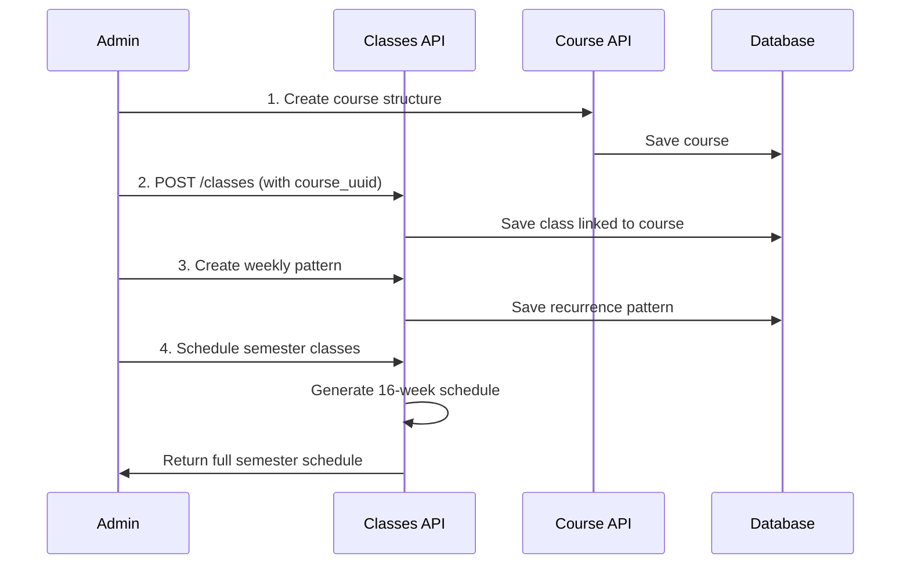
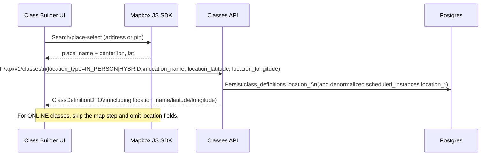

# Class Definition Management: Frontend Integration Guide

## 1. Overview

This guide provides frontend engineers with the necessary information to integrate with the **Class Definition Management** APIs. It covers creating class templates, managing recurrence patterns, and scheduling class instances.

**Key Objective:** Build a UI that allows instructors and administrators to define a class once and schedule it to run multiple times, like in Google Calendar.

---

## 2. Data Flow

The following diagram illustrates the data flow for class definition and scheduling:



---

## 3. API Call Sequences

### Workflow 1: Standalone Class with Fixed Schedule



### Workflow 2: Course-Based Class Series



---

## 4. Core Concepts for Frontend Developers

### Class Definition vs. Scheduled Instance

-   **`ClassDefinition`**: This is the **template** for a class. It defines *what* the class is about (e.g., "Introduction to Java"), its duration (e.g., 90 minutes), the instructor, and the maximum number of students. It does **not** have a specific date.
-   **`RecurrencePattern`**: This is the **rule** for scheduling. It defines *how often* a class should occur (e.g., every Monday and Wednesday at 10:00 AM).
-   **`ScheduledInstance`**: This is the **actual calendar event**. It's a concrete occurrence of a class on a specific date and time (e.g., "Introduction to Java on 2024-09-09 from 10:00 to 11:30").

**Typical Workflow:**

1.  Create a `ClassDefinition`.
2.  Create a `RecurrencePattern`.
3.  Associate the pattern with the definition.
4.  Trigger the scheduling process to generate the `ScheduledInstance` objects.

> **Important:** When linking a class definition to a course (`course_uuid`), the specified instructor and/or organisation must already have an approved training application for that course. Attempting to create or update a class definition without the necessary approvals— or after an approval has been revoked— will fail with a clear validation error. Every training application now includes a segmented rate card (private/public × individual/group) with a shared currency (defaulting to KES), so coordinators can align scheduled class fees with the approved combination instead of free-text prices.

---

## 5. Frontend Integration Quick Start

This section provides a task-oriented guide to implementing the frontend UI.

### Task 1: Create the "Define a New Class" Form

This form should capture the details for a `ClassDefinition`.

-   **API Endpoint:** `POST /api/v1/classes`
-   **Method:** `POST`
-   **Controller Method:** `createClassDefinition`

**Example Request Body:**

```json
{
  "title": "Advanced React Patterns",
  "description": "A deep dive into modern React design patterns.",
  "default_instructor_uuid": "a1b2c3d4-e5f6-7890-1234-567890abcdef",
  "course_uuid": "c1d2e3f4-g5h6-7890-1234-567890abcdef",
  "default_start_time": "2025-01-15T14:00:00Z",
  "default_end_time": "2025-01-15T15:30:00Z",
  "location_type": "IN_PERSON",
  "location_name": "Nairobi HQ – Room 101",
  "location_latitude": -1.292066,
  "location_longitude": 36.821945,
  "max_participants": 30,
  "allow_waitlist": true,
  "is_active": true
}
```

**Location & Mapbox expectations:**

- When `location_type` is `ONLINE`, `location_name` and coordinates are optional and usually omitted.
- When `location_type` is `IN_PERSON` or `HYBRID`, the frontend **must** send:
  - `location_name` – a human-readable label (e.g., `"Nairobi HQ – Room 101"`).
  - `location_latitude` – latitude between `-90` and `90`.
  - `location_longitude` – longitude between `-180` and `180`.
- The backend will reject IN_PERSON/HYBRID definitions missing any of these fields, or with coordinates outside the valid ranges.

### 5.1 Mapbox Location Flow for Classes

Use the same Mapbox map picker you use elsewhere in the app to populate the class location fields.



**Handling the Response:**

The API will return the newly created `ClassDefinitionDTO`. Your UI should store the `uuid` from the response, as it's needed for all subsequent operations.

**Example Success Response:**

```json
{
  "success": true,
  "message": "Class definition created successfully",
  "data": {
    "uuid": "cd123456-7890-abcd-ef01-234567890abc",
    "title": "Advanced React Patterns",
    "default_start_time": "2025-01-15T14:00:00Z",
    "default_end_time": "2025-01-15T15:30:00Z",
    "duration_minutes": 90,
    "duration_formatted": "1h 30m",
    "has_recurrence": false,
    "is_standalone": false,
    "capacity_info": "Max 30 participants (waitlist enabled)"
  }
}
```

---

### Task 2: Build the "Set Recurrence" UI

This UI allows users to define how often the class should repeat.

-   **API Endpoint:** `POST /api/v1/classes/recurrence-patterns`
-   **Method:** `POST`
-   **Controller Method:** `createClassRecurrencePattern`

**Example: Weekly on Monday, Wednesday, Friday**

```json
{
  "recurrence_type": "WEEKLY",
  "days_of_week": "MONDAY,WEDNESDAY,FRIDAY",
  "interval_value": 1,
  "end_date": "2025-12-31"
}
```

**Example: Monthly on the 15th**

```json
{
  "recurrence_type": "MONTHLY",
  "day_of_month": 15,
  "interval_value": 1,
  "occurrence_count": 12
}
```

**After creating the pattern, associate it with the class definition:**

-   **API Endpoint:** `PUT /api/v1/classes/{uuid}`
-   **Method:** `PUT`

---

## 6. Rate Card UX Updates

### 6.0 Data Flow Diagram

```mermaid
graph TD
    subgraph Instructor Console
        A[Rate Card Wizard] -->|submit rate card| B(Courses API\nPOST /training-applications)
        C[Class Builder] -->|select visibility & format| D(Classes API\nPOST /classes)
    end

    subgraph Core Services
        B --> E[(Course Training Applications)]
        D --> F[(Class Definitions)]
        E -->|approved rate card lookup| D
        G[Order Service] --> H[(Platform Fee Rules)]
    end

    subgraph Student Checkout
        I[Cart UI] -->|fetch fee breakdown| J(Commerce API\nGET /cart /order)
        J -->|PlatformFeeBreakdown| I
    end

    D -->|class pricing| I
    B -->|status notifications| Instructor Console
```

Instructors now define a **segmented rate card** (session format × delivery modality) during the course training application flow, and class creation must surface those approved amounts. Update the existing UI as follows.

### 6.1 Capture Rate Cards in the Training Application Wizard

1. **Currency selector** – dropdown seeded with the platform currencies (default to the tenant currency). This feeds the single `rate_card.currency` field.
2. **Four numeric inputs** – group them in a 2×2 grid so instructors understand they must supply every combination:

| Format \\ Modality | Online (per hour, per learner) | In Person (per hour, per learner) |
|--------------------|--------------------------------|-----------------------------------|
| **Private / 1:1**  | `private_online_rate`          | `private_inperson_rate`           |
| **Group**          | `group_online_rate`            | `group_inperson_rate`             |

3. **Validation rules**:
    - All cells are required and must be non‑negative decimals with four fractional digits.
    - Enforce `value >= course.minimum_training_fee`; display an inline helper like “KES 2,500.00 is the minimum for this course”.
    - When the instructor enters mixed values, keep the form valid—pricing can differ per cell.
4. **Preview summary** – before submitting, render a small table or chip list summarizing the four figures so instructors know what will drive class pricing later.
5. **Payload** – `POST /api/v1/courses/{course_uuid}/training-applications` expects:

```json
{
  "applicant_type": "instructor",
  "applicant_uuid": "f6cda07a-5b44-4ccc-8f7a-0a7c1bd6e2e4",
  "rate_card": {
    "currency": "KES",
    "private_online_rate": 3500.0000,
    "private_inperson_rate": 3600.0000,
    "group_online_rate": 2800.0000,
    "group_inperson_rate": 3000.0000
  },
  "application_notes": "Weekday evening slots available."
}
```

### 6.2 Surface Rate Cards During Class Creation

When instructors define a class for an approved course (`course_uuid` present):

1. **Format + Modality selectors**
    - Add required controls for `session_format` (Individual/Group) and `location_type` (Online/In-person/Hybrid).
    - Use contextual copy to explain that pricing is locked to the approved rate card based on these choices.
2. **Training fee display**
    - Auto-populate `training_fee` by looking up the approved rate for the selected format + modality combination.
    - Render the field as read-only with helper text: “Sourced from your approved rate card”.
    - If no rate exists (e.g., approval revoked), block submission and surface the backend error message.
3. **Scenario preview**
    - Show a mini recap card: “Group Online sessions cost KES 2,800 per learner”. This helps instructors confirm they picked the right toggle.
4. **Error handling**
    - Display validation errors returned from `POST /api/v1/classes` (e.g., instructor lacks an approved rate card) near the form header.

### 6.3 Order Summary & Receipts

Student-facing receipts (cart review, checkout confirmation, PDF download) must list:

- **Tuition line items** – each class/product with its price.
- **Platform fee/top-up charges** – use `platform_fee` from the API to show the amount, currency, and rule label (“Platform service fee – Rule #PF-123”).
- **Net total** – subtotal + platform fee + payment-provider surcharges, so learners see exactly how the final figure is composed.

Re-use the `PlatformFeeBreakdown` schema in UI models so future deductions (discounts/waivers) can be enumerated without additional backend changes.
-   **Controller Method:** `updateClassDefinition`

**Request Body:**

```json
{
  "recurrence_pattern_uuid": "rp123456-7890-abcd-ef01-234567890abc"
}
```

---

### Task 3: Implement the "Generate Schedule" Action

This is typically a button that, when clicked, generates the actual class instances on the calendar.

#### Step 3.3: Create the Schedule

Once the user confirms, you can create the actual schedule.

-   **API Endpoint:** `POST /api/v1/classes/{uuid}/schedule`
-   **Method:** `POST`
-   **Controller Method:** `scheduleRecurringClassFromDefinition`
-   **Query Parameters:** `startDate` and `endDate`.
-   **Conflict handling:** The backend now enforces instructor availability and overlap checks during scheduling, so no separate conflict endpoint is required.

**Example Request:**

```http
POST /api/v1/classes/cd123456-7890-abcd-ef01-234567890abc/schedule?startDate=2024-09-01&endDate=2024-12-31
```

**The response will contain the list of `ScheduledInstanceDTO`s that were successfully created.**

---

## 6. Managing Existing Classes & Assessments

### Listing and Filtering

Provide UIs to view class definitions based on different criteria.

-   **For a specific course:** `GET /api/v1/classes/course/{courseUuid}` -> `getClassDefinitionsForCourse`
-   **For a specific instructor:** `GET /api/v1/classes/instructor/{instructorUuid}` -> `getClassDefinitionsForInstructor`
-   **For an organization:** `GET /api/v1/classes/organisation/{organisationUuid}` -> `getClassDefinitionsForOrganisation`

You can use the `activeOnly=true` query parameter to filter for active classes.

### Updating and Deactivating

-   **Update:** `PUT /api/v1/classes/{uuid}` -> `updateClassDefinition`
-   **Deactivate:** `DELETE /api/v1/classes/{uuid}` -> `deactivateClassDefinition`

> **Next Steps:** Instructors often need to control lesson ordering and assessment deadlines after the class definition exists. Pair this guide with **[Class & Assessment Scheduling: Frontend Integration Guide](./ClassAssessmentsFrontendGuide.md)** to implement the lesson plan UI and class-specific assignment/quiz scheduling workflows.

---

## 7. Advanced UI Considerations

### Handling Scheduling Conflicts

When the `conflicts` endpoint returns conflicts, your UI should:

1.  **Clearly list the conflicting dates and times.**
2.  **Explain the reason for each conflict** (e.g., "Instructor is unavailable," "Another class is already scheduled").
3.  **Provide options to the user:**
    -   "Schedule anyway and ignore conflicts."
    -   "Skip the conflicting instances and schedule the rest."
    -   "Cancel and adjust the schedule."

### Real-time Updates

For a more dynamic experience, consider using WebSockets to:

-   Notify the user when a schedule generation is complete.
-   Update the calendar in real-time if another admin modifies the schedule.

### Optimistic UI Updates

When a user creates or updates a class definition, you can update the UI immediately, before the API call completes. This makes the application feel faster and more responsive.

---

This guide provides the core API interactions needed to build a robust frontend for class definition and scheduling management. By following these guidelines, you can create an intuitive and powerful interface for your users.
