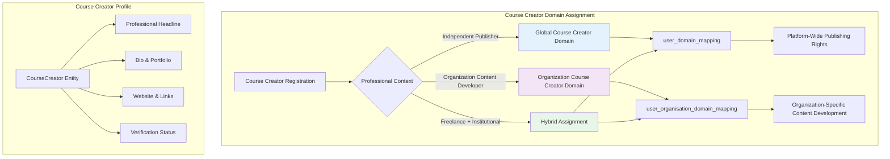
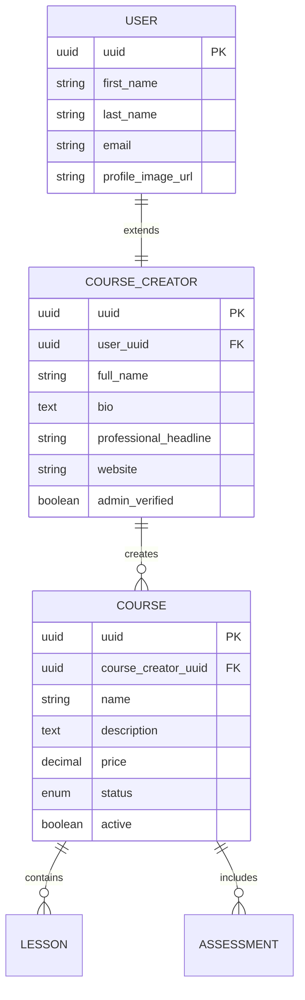
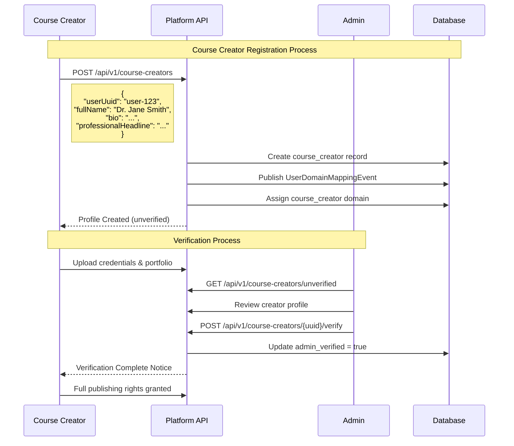
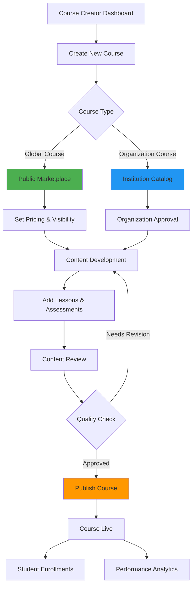
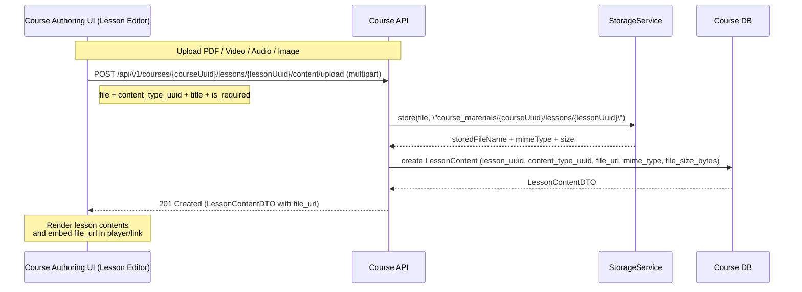
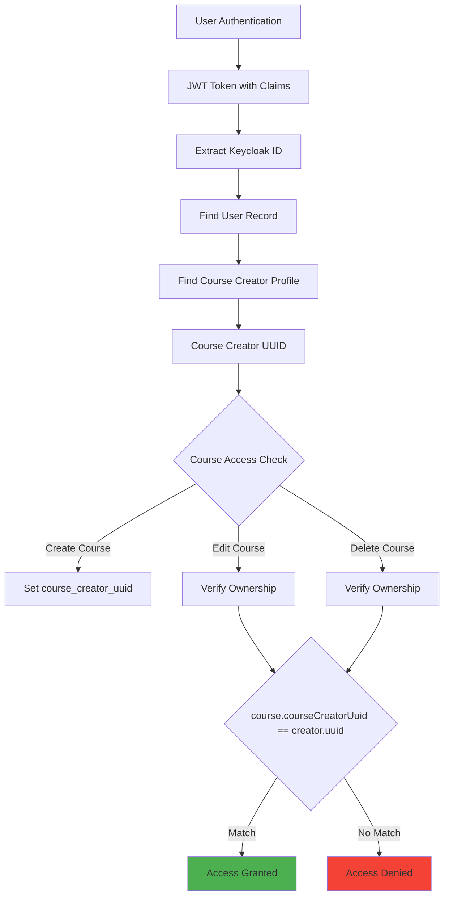
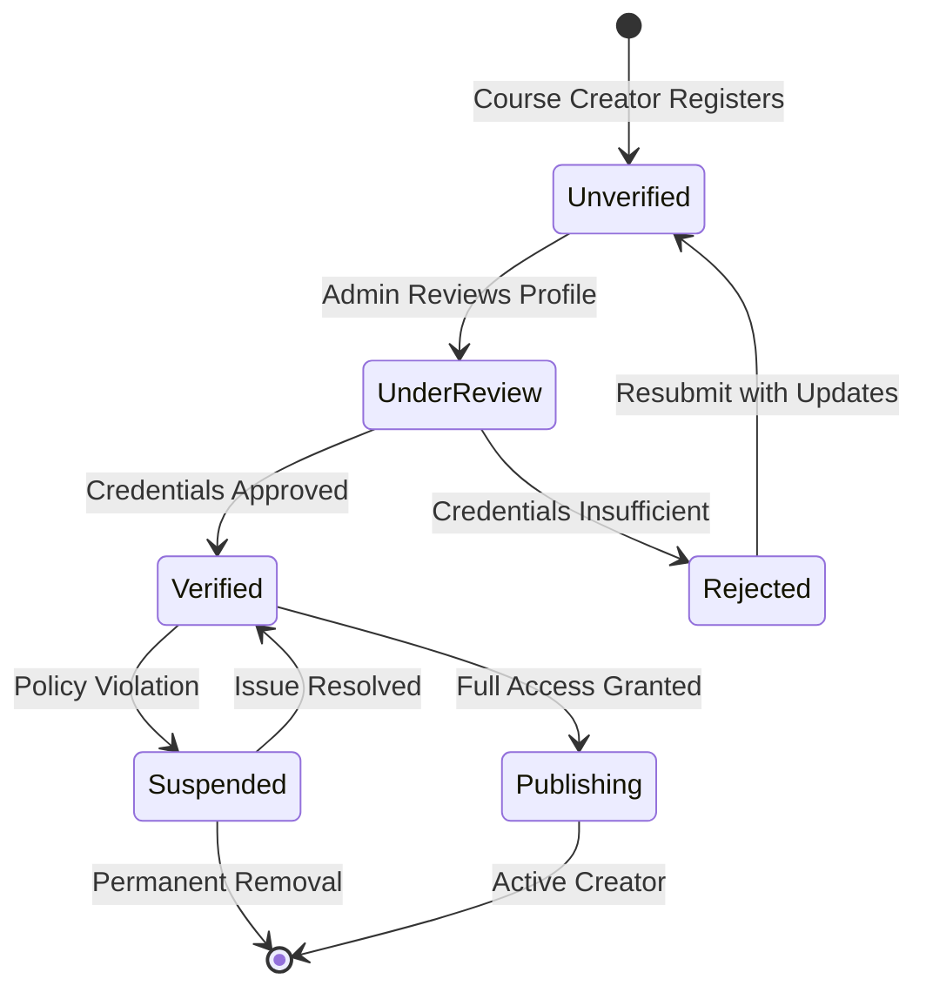
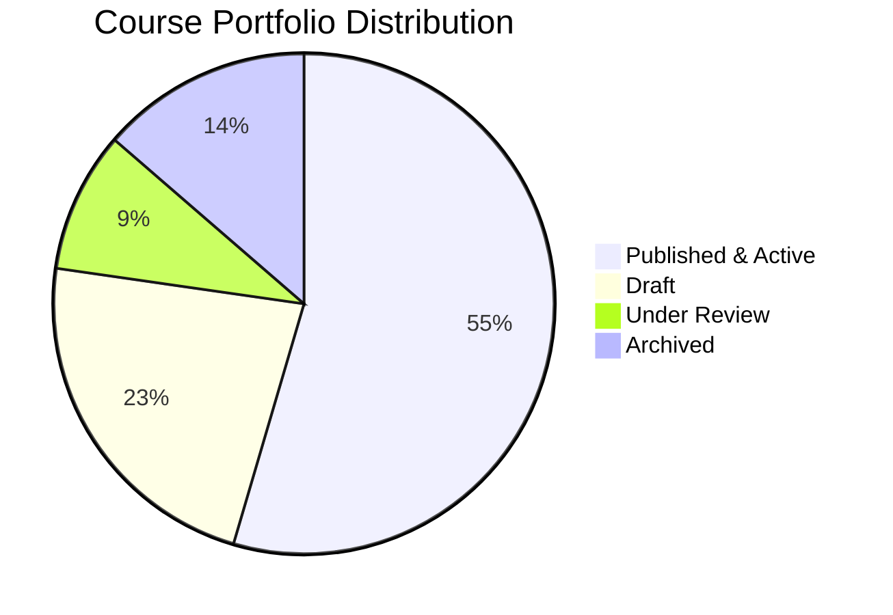
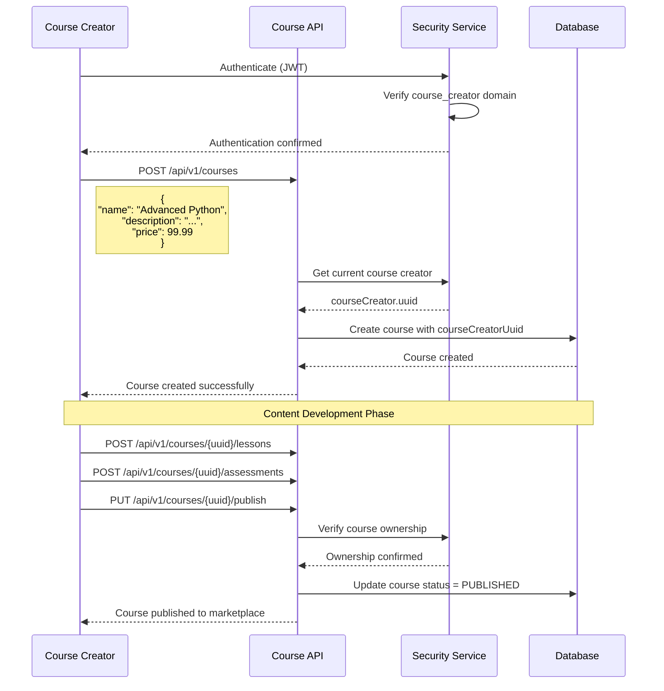

# Course Creator Domain Guide

## Overview

The **Course Creator** domain represents content authors who design, build, and publish educational courses within the Elimika platform. Course creators focus on content authorship and intellectual property, distinct from instructors who deliver instruction. Course creators can operate as independent content publishers (global domain) or as content developers affiliated with educational organizations.

## Course Creator Domain Characteristics

### Core Capabilities
- **Content Authorship**: Design and structure courses, lessons, and learning materials
- **Intellectual Property Management**: Own and manage course content rights
- **Course Publishing**: Control course visibility, pricing, and distribution
- **Content Monetization**: Earn revenue from course sales and enrollments
- **Quality Control**: Update and maintain course content over time

### Enrollment Compliance
- Every course must explicitly declare the acceptable learner band via `age_lower_limit` and/or `age_upper_limit`. These limits feed the shared `AgeVerificationService`, which looks up the student's date of birth and throws an `AgeRestrictionException` if the request falls outside the configured range.
- Enrollment and checkout UIs must collect DOB before submission and bubble up the backend error message (“Student age 12 is below the minimum age 16 required for course …”) so learners and guardians know why the request failed.
- When age limits change, update the course description and marketing copy so downstream storefronts, timetabling, and guardian dashboards show consistent expectations.

### Domain Assignment Patterns



## Global vs Organization Course Creator Domains

### Global Course Creator Domain

**Assignment**: Direct mapping in `user_domain_mapping` table
**Scope**: Platform-wide content creation and publishing authority
**Use Cases**:
- Independent content creators
- Subject matter experts
- Educational content entrepreneurs
- Freelance curriculum designers

Assignment is done by adding an entry to the `user_domain_mapping` table linking the user's UUID with the course creator domain's UUID.

**Capabilities**:
- Create and publish courses to platform marketplace
- Set course pricing and licensing terms
- Retain full intellectual property rights
- Build creator reputation and portfolio
- Earn revenue from course enrollments

### Organization Course Creator Domain

**Assignment**: Contextual mapping in `user_organisation_domain_mapping` table
**Scope**: Institution-specific content development responsibilities
**Additional Context**:
- Department/division assignment
- Content development contracts
- Organizational IP agreements
- Institution-specific curriculum standards

Assignment is done by adding a detailed entry to the `user_organisation_domain_mapping` table that links the user to the organization, the course creator domain, and optionally a specific branch, along with start dates and status.

## Course Creator Profile System

### Course Creator Entity Relationships



### Professional Profile Management

```json
{
  "courseCreatorProfile": {
    "uuid": "creator-123",
    "userUuid": "user-456",
    "fullName": "Dr. Jane Smith",
    "professionalHeadline": "Expert in Machine Learning & AI Education",
    "bio": "PhD in Computer Science with 10 years of experience creating online courses. Passionate about making complex topics accessible to learners worldwide.",
    "website": "https://janesmithlearning.com",
    "adminVerified": true,

    "publishedCourses": 15,
    "totalEnrollments": 12500,
    "averageRating": 4.8,
    "activeStudents": 3200
  }
}
```

## Course Creator Lifecycle Management

### Registration and Verification Workflow



### Course Publishing Workflow



### Lesson Media Upload Workflow

Course creators attach rich lesson materials (PDFs, videos, audio, images) directly during content authoring. All uploads flow through Elimika’s StorageService so contracts stay consistent across domains.



#### API: Upload Lesson Media

- **Endpoint:** `POST /api/v1/courses/{courseUuid}/lessons/{lessonUuid}/content/upload`
- **Content-Type:** `multipart/form-data`
- **Purpose:** Upload a media file (PDF, image, audio, video) and create a corresponding `LessonContent` entry.

**Request fields:**

- `file` – required, binary file (validated against supported types and size limits).
- `content_type_uuid` – required, one of the configured `ContentType` entries (e.g. “Video”, “PDF Document”, “Audio”).
- `title` – required, display title shown to learners.
- `description` – optional, longer description for the material.
- `is_required` – optional, marks whether this content must be completed for lesson completion.

**Behaviour:**

- Stores the file under `storage.folders.courseMaterials/{courseUuid}/lessons/{lessonUuid}` via `StorageService.store(file, folder)`.
- Resolves a public/semi‑public `file_url` using `storage.baseUrl` + stored file name.
- Persists a new `LessonContent` row and returns the full `LessonContentDTO`, including:
  - `lesson_uuid`
  - `content_type_uuid`
  - `file_url`
  - `file_size_bytes`
  - `mime_type`

**Frontend usage:**

- Course creation forms should call this endpoint when creators drop/upload PDFs, videos, audio, or images for a lesson.
- After a successful response, merge the returned `LessonContentDTO` into the lesson content list so the UI stays in sync with backend ordering and metadata.

#### Using the Endpoint from Tiptap (Rich Text Editor)

Tiptap image uploads should reuse the same API instead of a separate, ad‑hoc upload path:

1. When the editor needs to upload an inline image:
   - Call `POST /api/v1/courses/{courseUuid}/lessons/{lessonUuid}/content/upload` with:
     - `file` = the image selected in the editor,
     - `content_type_uuid` pointing to an image‐oriented `ContentType`,
     - `title` = a human‑friendly label (often the filename).
2. Read `file_url` from the `LessonContentDTO` in the response.
3. Insert an `` node into the lesson HTML that Tiptap manages.

This keeps all binary lesson assets (including editor images) behind Elimika’s storage and content‑type rules, while the HTML generated by Tiptap remains portable and cache‑friendly.

## Training Delivery Requirements & Pricing Controls

Course creators now define operational expectations alongside minimum financial terms for any instructor delivering their curriculum.

### Configuring Delivery Requirements

- `POST /api/v1/courses/{courseUuid}/training-requirements` records each required material, piece of equipment, or facility.
- Fields captured per requirement:
  - `requirement_type`: `material`, `equipment`, `facility`, or `other`.
  - `name`, optional `description`, and optional `quantity` + `unit` metadata.
  - `provided_by`: responsibility assignment (`course_creator`, `instructor`, `organisation`, or `student`).
  - `is_mandatory`: flag resources that must be confirmed before scheduling training.
- Responses from `GET /api/v1/courses/{courseUuid}` include a read-only `training_requirements` array summarising the configured items.

### Minimum Training Fee

- `CourseDTO.minimum_training_fee` defines the price floor for any instructor-led delivery.
- If omitted at creation time the platform defaults the value to the course list price.
- Courses can be filtered via `min_training_fee` / `max_training_fee` query parameters to surface offerings that match budget constraints.
- Class definitions linked to the course must provide a `training_fee` that meets or exceeds the configured minimum; otherwise the service raises an `IllegalArgumentException`.

### Instructor Revenue Share

- `CourseDTO` now owns `creator_share_percentage`, `instructor_share_percentage`, and `revenue_share_notes` so that every instructor inherits the same split.
- Revenue percentages are required when creating or updating a course, must be between 0 and 100, and together must equal 100%.
- The course service enforces those constraints during create/update; violations raise `IllegalArgumentException` with clear messaging.
- Class definitions only specify the session `training_fee` and must stay at or above the course minimum—no additional revenue split data is stored per class.

### Training Application Approvals

- Use `GET /api/v1/courses/{courseUuid}/training-applications?status=pending` to review incoming instructor and organisation requests.
- Approve, reject, or revoke access with `POST /api/v1/courses/{courseUuid}/training-applications/{applicationUuid}?action=approve|reject|revoke`. Optional notes are stored alongside the decision.
- Search across applications with `GET /api/v1/courses/training-applications/search` and rich query operators (e.g. `status=approved`, `applicantType=instructor`, `createdDate_between=2025-01-01T00:00:00,2025-12-31T23:59:59`).
- Revoking moves the application to a `revoked` state; instructors or organisations must resubmit before they can regain teaching rights.
- Class definitions cannot be created or updated for a course unless the referenced instructor and/or organisation has an approved application, giving course creators full control over who can access their curriculum.

## API Reference for Course Creator Management

### Course Creator Profile Management

| Method | Endpoint | Purpose | Course Creator-Specific Fields |
|--------|----------|---------|-------------------------------|
| `POST` | `/api/v1/course-creators` | Create new course creator | `fullName`, `bio`, `professionalHeadline`, `website` |
| `GET` | `/api/v1/course-creators/{uuid}` | Get course creator profile | Complete creator profile with stats |
| `PUT` | `/api/v1/course-creators/{uuid}` | Update course creator info | Bio, headline, website updates |
| `DELETE` | `/api/v1/course-creators/{uuid}` | Delete course creator | Remove creator and cascade data |
| `GET` | `/api/v1/course-creators` | Get all course creators (paginated) | `PagedDTO<CourseCreatorDTO>` |

### Course Creator Search and Discovery

| Method | Endpoint | Purpose | Use Case |
|--------|----------|---------|----------|
| `GET` | `/api/v1/course-creators/search` | Search course creators with filters | Advanced search with operators |
| `GET` | `/api/v1/course-creators/verified` | Get verified course creators | Trusted creator list |
| `GET` | `/api/v1/course-creators/unverified` | Get unverified course creators | Admin review queue |

**Search Operators Supported**:
- `fullName_like=value` - Contains search (case-insensitive)
- `fullName_startswith=value` - Prefix search
- `fullName_endswith=value` - Suffix search
- `adminVerified=true/false` - Filter by verification status
- `createdDate_gte=2024-01-01` - Date range filtering
- `professionalHeadline_like=content` - Search by expertise

### Course Creator Verification Management

| Method | Endpoint | Purpose | Admin Context |
|--------|----------|---------|---------------|
| `POST` | `/api/v1/course-creators/{uuid}/verify` | Verify course creator | Admin approval with optional reason |
| `POST` | `/api/v1/course-creators/{uuid}/unverify` | Revoke verification | Admin action with reason |
| `GET` | `/api/v1/course-creators/{uuid}/verification-status` | Check verification status | Returns boolean verification state |
| `GET` | `/api/v1/course-creators/count?verified=true` | Count creators by status | Statistics for dashboard |

## Course Ownership and Security

### Course Ownership Model



### Authorization Service Integration

The `CourseSecurityService` validates course ownership:

```java
// JWT (keycloakId) → User → CourseCreator → Course
public boolean isCourseOwner(UUID courseUuid) {
    // Extract keycloakId from JWT
    // Find User by keycloakId
    // Find CourseCreator by User UUID
    // Get Course and verify course.courseCreatorUuid == courseCreator.uuid
}
```

**Domain Security Service Methods**:
- `isCourseCreator()` - Check if user has course_creator domain
- `hasAnyDomain(UserDomain.course_creator, UserDomain.admin)` - Multi-domain check
- `getCurrentUser()` - Get authenticated user context

## Verification Process and Quality Assurance

### Admin Verification Workflow



### Verification Criteria

Course creators are verified based on:

1. **Professional Credentials**: Educational background, certifications
2. **Content Portfolio**: Sample courses, teaching materials
3. **Subject Matter Expertise**: Demonstrated knowledge in teaching domain
4. **Quality Standards**: Adherence to platform content guidelines
5. **Legal Compliance**: Copyright, licensing, and terms acceptance

## Organization-Specific Course Creator Features

### Institutional Content Development

```json
{
  "organizationCourseCreator": {
    "courseCreatorUuid": "creator-789",
    "organizationAffiliation": {
      "organisationUuid": "university-abc",
      "organisationName": "State University",
      "domainInOrganisation": "course_creator",
      "branchUuid": "curriculum-dev",
      "branchName": "Curriculum Development Office",
      "contractType": "Full-time Content Developer",
      "startDate": "2023-01-15",
      "active": true,
      "ipAgreement": "University owns institutional course IP"
    },

    "institutionalResponsibilities": {
      "contentQuota": "4 courses per semester",
      "qualityReviewRequired": true,
      "collaborationExpected": true,
      "brandingGuidelines": "Must follow university visual identity",
      "approvalWorkflow": "Department Head → Dean → Publishing"
    }
  }
}
```

### Multi-Organization Content Development

Course creators can develop content for multiple organizations. This is achieved by creating multiple `user_organisation_domain_mapping` entries for the same user with different organizations, each with its own content development terms.

## Course Creator Analytics and Performance

### Creator Dashboard Metrics



### Performance Analytics

```json
{
  "courseCreatorAnalytics": {
    "creatorUuid": "creator-123",
    "period": "2024",

    "courseMetrics": {
      "totalCoursesCreated": 22,
      "publishedCourses": 18,
      "activeCourses": 15,
      "averageCourseRating": 4.7,
      "totalEnrollments": 15420
    },

    "revenueMetrics": {
      "totalRevenue": 127500.00,
      "averageRevenuePerCourse": 7083.33,
      "topPerformingCourse": {
        "courseUuid": "course-456",
        "courseName": "Advanced Machine Learning",
        "enrollments": 2150,
        "revenue": 43000.00
      }
    },

    "engagementMetrics": {
      "averageCompletionRate": 78.5,
      "studentSatisfaction": 4.6,
      "certificatesIssued": 9850,
      "activeDiscussions": 342
    }
  }
}
```

## Integration with Course Management

### Course Creation Flow



## Course Creator vs Instructor Distinction

### Key Differences

| Aspect | Course Creator | Instructor |
|--------|---------------|------------|
| **Primary Role** | Content authorship & IP ownership | Content delivery & teaching |
| **Focus** | Course structure, curriculum design | Student engagement, instruction |
| **Ownership** | Owns course intellectual property | Delivers others' courses or own |
| **Revenue Model** | Per-enrollment or licensing fees | Salary, hourly, or per-class |
| **Responsibilities** | Content updates, quality maintenance | Grading, feedback, office hours |
| **Relationship to Content** | Creator and rights holder | Facilitator and educator |

### Dual Role Support

Users can have both `course_creator` and `instructor` domains:

```json
{
  "dualRoleUser": {
    "userUuid": "user-999",
    "domains": ["course_creator", "instructor"],

    "asCreator": {
      "createsContent": true,
      "ownsCourseIP": true,
      "earnsRoyalties": true
    },

    "asInstructor": {
      "teachesCourses": true,
      "gradeStudents": true,
      "provideFeedback": true
    }
  }
}
```

## Validation Rules and Business Logic

### Course Creator Domain Assignment Rules

1. **Self-Registration**: Users can register as course creators (subject to verification)
2. **Organization Invitation**: Institutions can invite users as content developers
3. **Multiple Affiliations**: Can create content for multiple organizations
4. **Verification Requirement**: Admin verification recommended for marketplace publishing
5. **IP Agreements**: Clear ownership terms for organization-affiliated creators

### Course Ownership Validation

The system validates course ownership through the `CourseSecurityService`:

1. Extract JWT token from request
2. Get Keycloak ID from token claims
3. Find User record by Keycloak ID
4. Find CourseCreator record by User UUID
5. Verify course's `courseCreatorUuid` matches the CourseCreator's UUID
6. Grant or deny access based on ownership match

## Data Model Reference

### Course Creator Entity

```sql
CREATE TABLE course_creators (
    uuid UUID PRIMARY KEY,
    user_uuid UUID NOT NULL REFERENCES users(uuid),
    full_name VARCHAR(255),
    bio TEXT,
    professional_headline VARCHAR(255),
    website VARCHAR(255),
    admin_verified BOOLEAN DEFAULT FALSE,
    created_at TIMESTAMP,
    updated_at TIMESTAMP
);
```

### Course Creator Domain Mapping

```sql
-- Global course creator assignment
INSERT INTO user_domain_mapping (user_uuid, user_domain_uuid)
VALUES ('user-123', (SELECT uuid FROM user_domains WHERE domain_name = 'course_creator'));

-- Organization course creator assignment
INSERT INTO user_organisation_domain_mapping (
    user_uuid,
    organisation_uuid,
    user_domain_uuid,
    branch_uuid,
    start_date,
    active
)
VALUES (
    'user-123',
    'org-456',
    (SELECT uuid FROM user_domains WHERE domain_name = 'course_creator'),
    'branch-789',
    '2024-01-15',
    true
);
```

## Best Practices for UI Integration

### Course Creator Dashboard Components

1. **Profile Management**
   - Full name, bio, headline, website editing
   - Verification status display
   - Portfolio showcase

2. **Course Management**
   - Create/edit/delete courses
   - Ownership-based access control
   - Publishing workflow

3. **Analytics Dashboard**
   - Revenue tracking
   - Enrollment statistics
   - Student feedback metrics

4. **Verification Tracking**
   - Verification status indicator
   - Admin review progress
   - Resubmission workflow

### Authentication & Authorization Patterns

```javascript
// Example: Check if user is course creator
const isCourseCreator = user.domains?.includes('course_creator');

// Example: Check course ownership before edit
const canEditCourse = async (courseUuid) => {
  const response = await api.get(`/api/v1/courses/${courseUuid}`);
  return response.data.courseCreatorUuid === currentUser.courseCreatorUuid;
};

// Example: Verify before publishing
const publishCourse = async (courseUuid) => {
  if (!isCourseCreator) {
    throw new Error('Only course creators can publish courses');
  }
  // Proceed with publish
};
```

### UI State Management

```javascript
// Course Creator Profile State
{
  courseCreator: {
    uuid: 'creator-123',
    fullName: 'Dr. Jane Smith',
    professionalHeadline: 'ML & AI Expert',
    adminVerified: true,
    bio: '...',
    website: 'https://...'
  },

  ownedCourses: [
    { uuid: 'course-1', name: 'Advanced Python', status: 'published' },
    { uuid: 'course-2', name: 'ML Basics', status: 'draft' }
  ],

  analytics: {
    totalEnrollments: 5200,
    averageRating: 4.8,
    monthlyRevenue: 12500
  }
}
```

This course creator domain implementation provides comprehensive support for content authorship, intellectual property management, and course monetization, enabling both independent creators and institutional content developers to build and publish high-quality educational content while maintaining appropriate ownership rights and quality standards.
