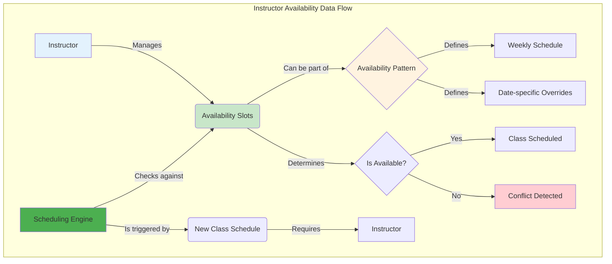
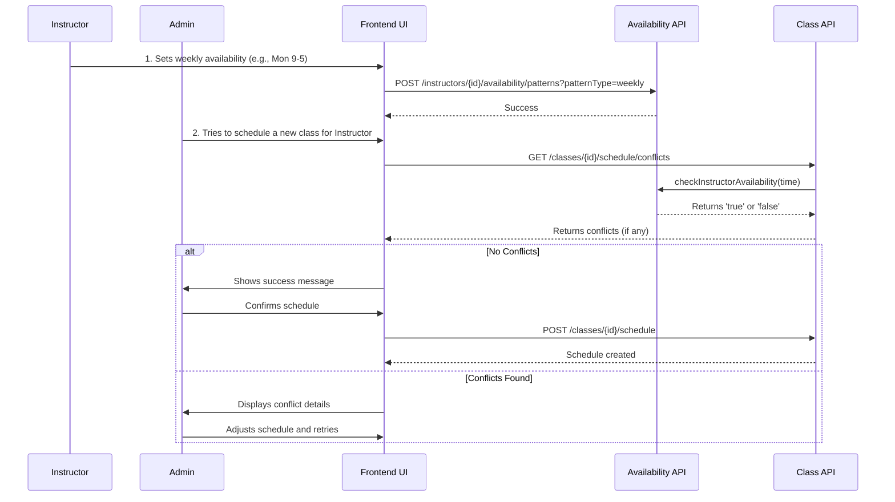
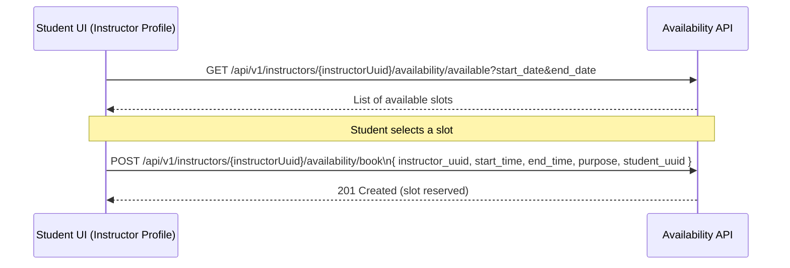

# Instructor Availability: Frontend Integration Guide

## 1. Overview

This guide provides frontend engineers with a comprehensive walkthrough for integrating with the **Instructor Availability Management** APIs. It focuses on building a calendar-based UI for managing instructor schedules.

**API Endpoint Root:** `/api/v1/instructors/{instructorUuid}/availability`
**OpenAPI Tag:** `Instructor Availability Management`

**Note:** All availability endpoints are now nested under the instructor resource for better RESTful design and consistency with other modules.

---

## 2. Data Flow

The following diagram illustrates the data flow for instructor availability:



---

## 3. API Call Sequences

The following diagram illustrates the sequence of API calls for setting and checking instructor availability:



---

## 4. Core Task: Building the Availability Calendar

Use the merged calendar feed to render a single view that combines availability slots, blocked time, and scheduled class instances.

-   **API Endpoint:** `GET /api/v1/instructors/{instructorUuid}/availability/calendar`
-   **Query Parameters:** `start_date`, `end_date` (inclusive, `YYYY-MM-DD`)
-   **Response:** Array of `InstructorCalendarEntryDTO` entries with `entry_type` set to `AVAILABILITY`, `BLOCKED`, or `SCHEDULED_INSTANCE`.
-   **Tip:** Render availability entries in green, blocked entries using their `color_code` (if present), and scheduled instances with the status badge (`SCHEDULED`/`ONGOING`/`COMPLETED`).

---

## 5. Managing Availability Patterns

Instructors can define their availability via recurring patterns and blocked time. Use the pattern setter for bulk changes and the block endpoint for one-offs or bookings.

### Setting Weekly Availability

This is the most common scenario. The user selects time slots that repeat every week.

-   **API Endpoint:** `POST /api/v1/instructors/{instructorUuid}/availability/patterns?patternType=weekly`
-   **Method:** `POST`
-   **Controller Method:** `setAvailabilityPatterns`

**Example Request Body:**

This request sets the instructor to be available every Monday from 9 AM to 5 PM and every Wednesday from 10 AM to 1 PM.

```json
[
  {
    "day_of_week": 1, // Monday
    "start_time": "09:00:00",
    "end_time": "17:00:00",
    "is_available": true
  },
  {
    "day_of_week": 3, // Wednesday
    "start_time": "10:00:00",
    "end_time": "13:00:00",
    "is_available": true
  }
]
```

### Blocking Specific Times

Users may need to block time for appointments or other commitments. You can optionally provide a color code to visually categorize different types of blocked times.

-   **API Endpoint:** `POST /api/v1/instructors/{instructorUuid}/availability/block`
-   **Method:** `POST`
-   **Controller Method:** `blockTime`
-   **Query Parameters:**
    -   `start`: The start time in `YYYY-MM-DDTHH:mm:ss` format.
    -   `end`: The end time in `YYYY-MM-DDTHH:mm:ss` format.
    -   `color_code` (optional): Hex color code for UI visualization (e.g., `#FF6B6B`).

**Example Request (without color):**

```http
POST /api/v1/instructors/{instructorUuid}/availability/block?start=2024-09-12T11:00:00&end=2024-09-12T12:30:00
```

**Example Request (with color code):**

```http
POST /api/v1/instructors/{instructorUuid}/availability/block?start=2024-09-12T11:00:00&end=2024-09-12T12:30:00&color_code=%23FF6B6B
```

**Common Color Codes:**

-   **Vacation**: `#FF6B6B` (Red)
-   **Meeting**: `#FFD93D` (Yellow)
-   **Sick Leave**: `#FFA07A` (Orange)
-   **Personal**: `#95E1D3` (Teal)
-   **Professional Development**: `#A8E6CF` (Mint Green)

This will create a new `AvailabilitySlot` with `is_available` set to `false` and the specified `color_code`.

---

### 6.0 Unified Instructor Calendar

Use the merged calendar feed to render a single view that combines availability slots, blocked time, and scheduled class instances.

-   **API Endpoint:** `GET /api/v1/instructors/{instructorUuid}/availability/calendar`
-   **Query Parameters:** `start_date`, `end_date` (inclusive, `YYYY-MM-DD`)
-   **Response:** Array of `InstructorCalendarEntryDTO` entries with `entry_type` set to `AVAILABILITY`, `BLOCKED`, or `SCHEDULED_INSTANCE`.
-   **Tip:** Render availability entries in green, blocked entries using their `color_code` (if present), and scheduled instances with the status badge (`SCHEDULED`/`ONGOING`/`COMPLETED`).

---

## 6. Checking Availability

This is a crucial integration point for other modules, like **Class Definition Management**. Before scheduling a class, you must check if the instructor is available.

-   **API Endpoint:** `GET /api/v1/instructors/{instructorUuid}/availability/check`
-   **Method:** `GET`
-   **Controller Method:** `checkAvailability`
-   **Query Parameters:**
    -   `start`: The start time in `YYYY-MM-DDTHH:mm:ss` format.
    -   `end`: The end time in `YYYY-MM-DDTHH:mm:ss` format.

**Example Request:**

```http
GET /api/v1/instructors/a1b2c3d4-e5f6-7890-1234-567890abcdef/availability/check?start=2024-09-10T10:00:00&end=2024-09-10T11:30:00
```

**Example Response (Instructor is Available):**

```json
{
  "success": true,
  "message": "Instructor is available",
  "data": true
}
```

**Example Response (Instructor is Not Available):**

```json
{
  "success": true,
  "message": "Instructor is not available",
  "data": false
}
```

### UI Implementation

-   When an administrator is assigning an instructor to a class, use this endpoint to validate the selection in real-time.
-   Disable the "Save" or "Assign" button if the instructor is not available.
-   Provide a clear error message explaining the conflict.

---

## 7. Student Bookings for Private Sessions

Students can book one-on-one sessions with instructors using the same availability data that powers class scheduling. The key difference is that bookings reserve the instructor's time without immediately creating a public class or enrollment; other modules can follow up to create paid sessions.



### Booking Endpoint

-   **API Endpoint:** `POST /api/v1/instructors/{instructorUuid}/availability/book`
-   **Method:** `POST`
-   **Body:** `InstructorSlotBookingRequestDTO`

**Request body fields:**

-   `instructor_uuid` (UUID, required) – must match the path variable.
-   `start_time` (ISO date-time, required) – booking start.
-   `end_time` (ISO date-time, required) – booking end.
-   `purpose` (string, optional, max 500 chars) – short description (e.g., "Private coaching on data structures").
-   `student_uuid` (UUID, optional) – can be supplied or inferred from the authenticated user.

**Behaviour:**

-   Validates that the instructor is available for the full `[start_time, end_time]` window (using the same logic as `/availability/check`).
-   If not available, returns `400` with a clear message.
-   If available, creates a blocked availability entry for that period so:
    -   The slot no longer appears in `/available` results.
    -   Future scheduling/booking honours the reservation.

### Frontend Integration Tips

-   On instructor profile or detail pages:
    -   Show a "Book Private Session" CTA that opens a calendar of available slots using `/available`.
    -   After the user picks a slot, post it to `/availability/book`.
    -   Show a confirmation state with the selected time and purpose.
-   On the instructor dashboard:
    -   Render blocked slots created by bookings with a distinct color (e.g., teal) using the existing availability data so instructors can see upcoming private commitments.
-   Coordinate with Timetabling/Commerce flows:
    -   After a successful booking, optionally redirect students into a payment or session details screen where the private session is converted into a scheduled class + enrollment.

---

## 7. Data Structures for Frontend

### `AvailabilitySlotDTO`

This is the primary data structure you'll work with. It represents a single block of time in an instructor's schedule. Key fields include:
-   `instructor_uuid`: The ID of the instructor.
-   `availability_type`: The type of slot (e.g., `WEEKLY`, `SPECIFIC_DATE`).
-   `day_of_week` or `specific_date`: Defines when the slot occurs.
-   `start_time` and `end_time`: The time range for the slot.
-   `is_available`: A boolean indicating if the instructor is available or blocked during this time.
-   `color_code`: Optional hex color code for blocked times (e.g., `#FF6B6B` for vacation).

### `WeeklyAvailabilitySlotDTO`

This is a simpler data structure used when creating recurring weekly availability patterns. It includes the `day_of_week`, `start_time`, and `end_time`.

---

This updated guide provides a more focused, task-oriented approach for frontend developers integrating with the Instructor Availability APIs.
