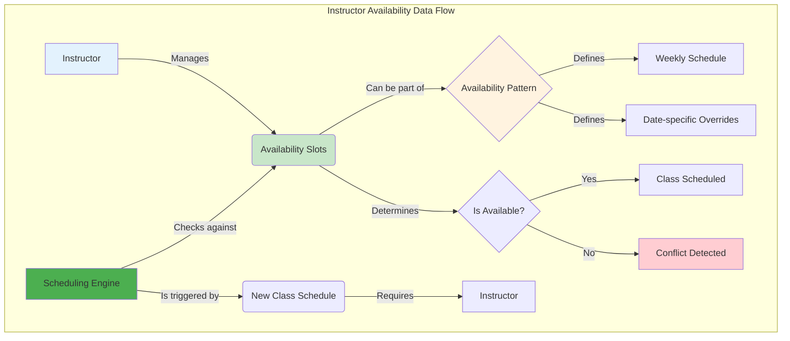
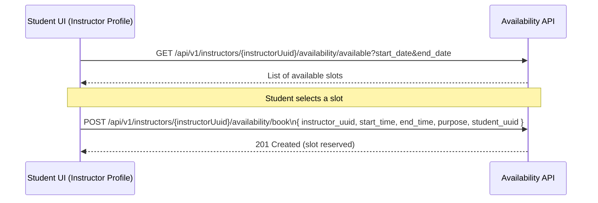

# Instructor Availability: Frontend Integration Guide

## 1. Overview

This guide provides frontend engineers with a comprehensive walkthrough for integrating with the **Instructor Availability Management** APIs. It focuses on building a calendar-based UI for managing instructor schedules.

**API Endpoint Root:** `/api/v1/instructors/{instructorUuid}/availability`
**OpenAPI Tag:** `Instructor Availability Management`

**Note:** All availability endpoints are now nested under the instructor resource for better RESTful design and consistency with other modules.
**Important:** Endpoints for setting recurrence patterns or blocking slots have been removed; the frontend consumes the calendar and availability check endpoints only.

---

## 2. Data Flow

The following diagram illustrates the data flow for instructor availability:



---

## 3. Core Task: Building the Availability Calendar

Use the merged calendar feed to render a single view that combines availability slots, blocked time, and scheduled class instances.

-   **API Endpoint:** `GET /api/v1/instructors/{instructorUuid}/availability/calendar`
-   **Query Parameters:** `start_date`, `end_date` (inclusive, `YYYY-MM-DD`)
-   **Response:** Array of `InstructorCalendarEntryDTO` entries with `entry_type` set to `AVAILABILITY`, `BLOCKED`, or `SCHEDULED_INSTANCE`.
-   **Tip:** Render availability entries in green, blocked entries using their `color_code` (if present), and scheduled instances with the status badge (`SCHEDULED`/`ONGOING`/`COMPLETED`).

---

## 4. Checking Availability

This is a crucial integration point for other modules, like **Class Definition Management**. Before scheduling a class, you must check if the instructor is available.

-   **API Endpoint:** `GET /api/v1/instructors/{instructorUuid}/availability/check`
-   **Method:** `GET`
-   **Controller Method:** `checkAvailability`
-   **Query Parameters:**
    -   `start`: The start time in `YYYY-MM-DDTHH:mm:ss` format.
    -   `end`: The end time in `YYYY-MM-DDTHH:mm:ss` format.

**Example Request:**

```http
GET /api/v1/instructors/a1b2c3d4-e5f6-7890-1234-567890abcdef/availability/check?start=2024-09-10T10:00:00&end=2024-09-10T11:30:00
```

**Example Response (Instructor is Available):**

```json
{
  "success": true,
  "message": "Instructor is available",
  "data": true
}
```

**Example Response (Instructor is Not Available):**

```json
{
  "success": true,
  "message": "Instructor is not available",
  "data": false
}
```

### UI Implementation

-   When an administrator is assigning an instructor to a class, use this endpoint to validate the selection in real-time.
-   Disable the "Save" or "Assign" button if the instructor is not available.
-   Provide a clear error message explaining the conflict.

---

## 7. Student Bookings for Private Sessions

Students can book one-on-one sessions with instructors using the same availability data that powers class scheduling. The key difference is that bookings reserve the instructor's time without immediately creating a public class or enrollment; other modules can follow up to create paid sessions.



### Booking Endpoint

## 5. Data Structures for Frontend

### `AvailabilitySlotDTO`

This is the primary data structure you'll work with. It represents a single block of time in an instructor's schedule. Key fields include:
-   `instructor_uuid`: The ID of the instructor.
-   `availability_type`: The type of slot (e.g., `WEEKLY`, `SPECIFIC_DATE`).
-   `day_of_week` or `specific_date`: Defines when the slot occurs.
-   `start_time` and `end_time`: The time range for the slot.
-   `is_available`: A boolean indicating if the instructor is available or blocked during this time.
-   `color_code`: Optional hex color code for blocked times (e.g., `#FF6B6B` for vacation).

---

This updated guide provides a more focused, task-oriented approach for frontend developers integrating with the Instructor Availability APIs.
