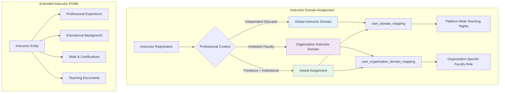
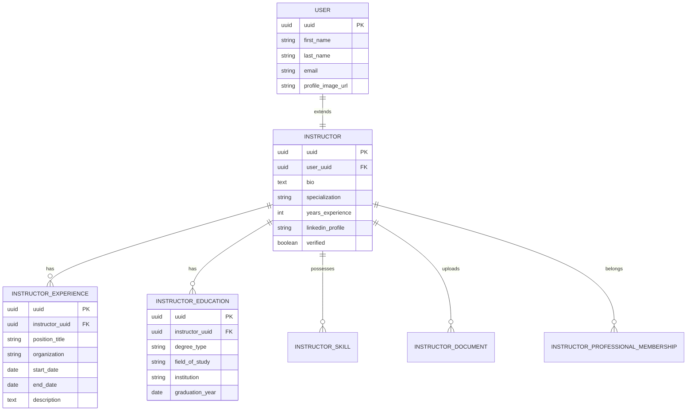
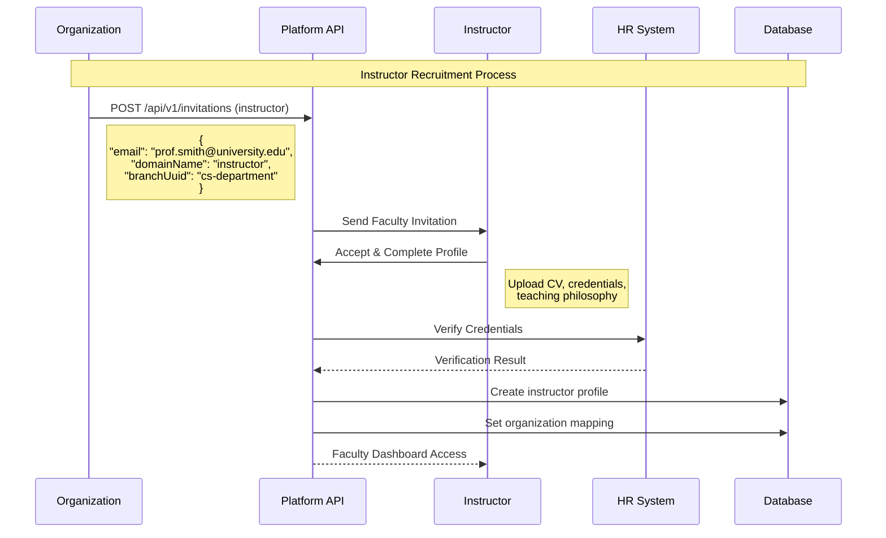
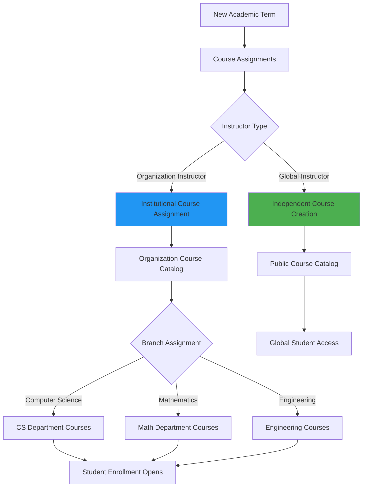
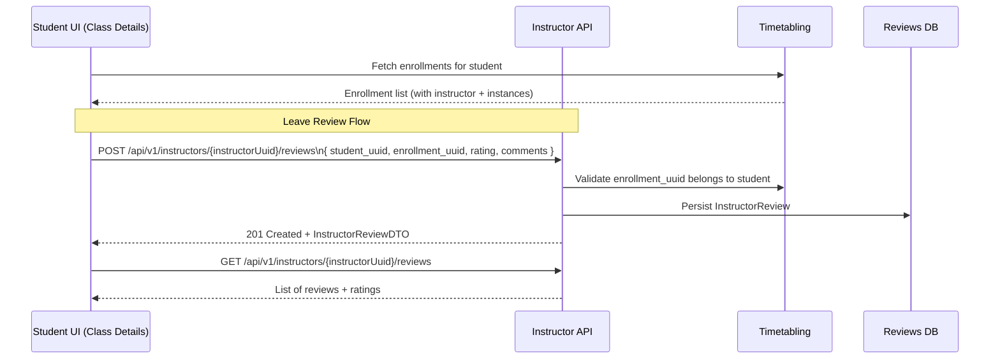
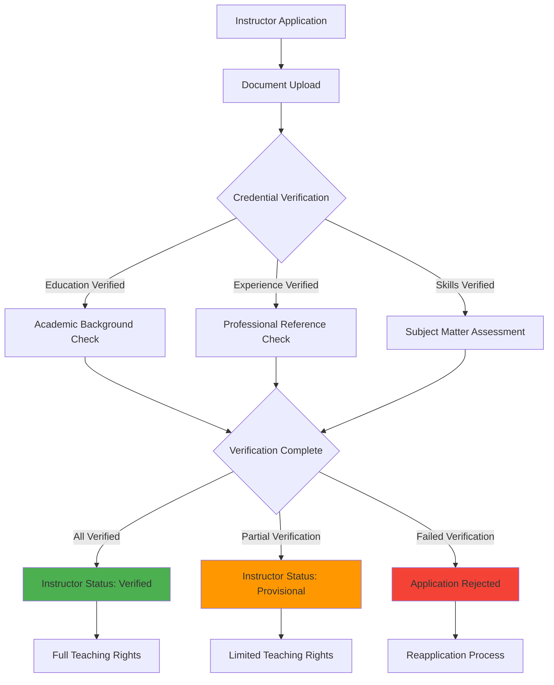

# Instructor Domain Guide

## Overview

The **Instructor** domain represents educators who create, deliver, and manage educational content within the Elimika platform. Instructors can operate as independent content creators (global domain) or as faculty members affiliated with specific educational organizations.

## Instructor Domain Characteristics

### Core Capabilities
- **Content Creation**: Design courses, lessons, assessments, and rubrics
- **Student Management**: Monitor progress, provide feedback, grade assignments
- **Assessment Design**: Create quizzes, assignments, and evaluation criteria
- **Performance Analytics**: Track student engagement and learning outcomes
- **Certification Authority**: Award certificates upon course completion

### Enrollment Compliance
- Instructors configure age expectations per course/class (via course age limits or class metadata). These values feed the global age gate enforced at enrollment time, so collaborators must keep the limits accurate.
- When coordinating manual enrollments, confirm the student profile has a date of birth; otherwise the backend raises `AgeRestrictionException` and the enrollment never posts to the timetable.
- Communicate limit changes to organization admins and storefront teams so paywall, invitations, and guardian dashboards stay in sync, avoiding surprise denials at checkout.

### Domain Assignment Patterns



## Global vs Organization Instructor Domains

### Global Instructor Domain

**Assignment**: Direct mapping in `user_domain_mapping` table
**Scope**: Platform-wide content creation and teaching authority
**Use Cases**:
- Independent course creators
- Freelance educators
- Subject matter experts
- Community contributors

Assignment is done by adding an entry to the `user_domain_mapping` table linking the user's UUID with the instructor domain's UUID.

**Capabilities**:
- Create public courses accessible to all students
- Publish to platform course catalog
- Earn revenue from course enrollments
- Build instructor reputation and ratings

### Organization Instructor Domain

**Assignment**: Contextual mapping in `user_organisation_domain_mapping` table
**Scope**: Institution-specific teaching and administrative responsibilities
**Additional Context**:
- Department/faculty assignment
- Academic rank and tenure status
- Semester/term associations
- Institution-specific policies and curricula

Assignment is done by adding a detailed entry to the `user_organisation_domain_mapping` table that links the user to the organization, the instructor domain, and optionally a specific branch, along with start dates and status.

## Extended Instructor Profile System

### Instructor Entity Relationships



### Professional Qualifications Management

```json
{
  "instructorProfile": {
    "userUuid": "instructor-456",
    "specialization": "Machine Learning & Data Science",
    "yearsExperience": 8,
    "verified": true,
    "bio": "PhD in Computer Science with expertise in ML algorithms...",
    
    "education": [
      {
        "degreeType": "PhD",
        "fieldOfStudy": "Computer Science", 
        "institution": "MIT",
        "graduationYear": "2018"
      }
    ],
    
    "experience": [
      {
        "positionTitle": "Senior Data Scientist",
        "organization": "Google",
        "startDate": "2020-01-01",
        "endDate": null,
        "description": "Leading ML research initiatives..."
      }
    ],
    
    "skills": ["Python", "TensorFlow", "Deep Learning", "Statistics"],
    
    "professionalMemberships": [
      {
        "organizationName": "ACM",
        "membershipType": "Professional Member",
        "startDate": "2019-01-01"
      }
    ]
  }
}
```

## Instructor Lifecycle Management

### Recruitment and Onboarding



### Teaching Assignment Workflow



## API Reference for Instructor Management

### Instructor Profile Management

| Method | Endpoint | Purpose | Instructor-Specific Fields |
|--------|----------|---------|---------------------------|
| `GET` | `/api/v1/instructors/{uuid}` | Get complete instructor profile | `bio`, `specialization`, `yearsExperience` |
| `PUT` | `/api/v1/instructors/{uuid}` | Update instructor info | Teaching philosophy, expertise areas |
| `POST` | `/api/v1/instructors` | Create new instructor | Complete instructor profile |
| `GET` | `/api/v1/instructors` | Get all instructors (paginated) | `PagedDTO<InstructorDTO>` |
| `GET` | `/api/v1/instructors/search` | Search instructors with filters | Advanced search capabilities |

### Instructor Professional Information Management

| Method | Endpoint | Purpose | Use Case |
|--------|----------|---------|----------|
| `POST` | `/api/v1/instructors/{uuid}/experience` | Add work experience | Professional history tracking |
| `GET` | `/api/v1/instructors/{uuid}/experience` | Get instructor experience | Career progression view |
| `POST` | `/api/v1/instructors/{uuid}/education` | Add education record | Academic qualifications |
| `GET` | `/api/v1/instructors/{uuid}/education` | Get instructor education | Degree and certification info |
| `POST` | `/api/v1/instructors/{uuid}/skills` | Add instructor skills | Technical competencies |
| `GET` | `/api/v1/instructors/{uuid}/skills` | Get instructor skills | Expertise areas |

### Instructor Document and Credential Management

| Method | Endpoint | Purpose | Instructor Context |
|--------|----------|---------|-------------------|
| `POST` | `/api/v1/instructors/{uuid}/documents` | Add instructor documents | Upload credentials, certificates |
| `GET` | `/api/v1/instructors/{uuid}/documents` | Get instructor documents | View uploaded documents |
| `POST` | `/api/v1/instructors/{uuid}/documents/upload` | Upload instructor document PDF | Store verified PDFs via StorageService |
| `POST` | `/api/v1/instructors/{uuid}/memberships` | Add professional memberships | Industry affiliations |
| `GET` | `/api/v1/instructors/{uuid}/memberships` | Get professional memberships | Professional body memberships |

### Student Reviews and Ratings

Students can leave structured reviews for instructors once they have attended a class. Reviews are tied to specific enrollments so that feedback remains grounded in real teaching interactions rather than free‑floating comments.



#### API: Submit an Instructor Review

- **Endpoint:** `POST /api/v1/instructors/{instructorUuid}/reviews`
- **Body:** `InstructorReviewDTO` JSON
- **Key fields:**
  - `student_uuid` – the student leaving the review.
  - `enrollment_uuid` – enrollment that links the student to a specific scheduled class instance.
  - `rating` – overall rating from `1` to `5`.
  - Optional fields: `headline`, `comments`, `clarity_rating`, `engagement_rating`, `punctuality_rating`, `is_anonymous`.

**Rules enforced by the backend:**

- The `enrollment_uuid` must exist and belong to `student_uuid`; otherwise the request fails.
- A student can submit at most one review per `(instructor_uuid, enrollment_uuid)` pair. Subsequent attempts will return an error.

**Frontend integration tips:**

- Show a “Rate Instructor” entry point on:
  - Class detail pages once the class is completed, or
  - A “My Classes” / “Past Sessions” tab after attendance is marked.
- Pre‑select the `instructorUuid` and `enrollmentUuid` from the student’s enrollments to avoid manual lookup.
- Use a 5‑star UI for `rating` and optional sliders or star widgets for the dimension ratings.
- Respect `is_anonymous` when displaying reviews on public instructor profile pages (hide student name/avatar when true).

#### API: Fetch Instructor Reviews

- **Endpoint:** `GET /api/v1/instructors/{instructorUuid}/reviews`
- **Purpose:** Populate instructor profile pages and analytics dashboards with:
  - Individual reviews and comments.
  - Aggregate star ratings (frontend can compute the average or call the summary endpoint below).

For quick analytics without client-side aggregation, use:

- **Endpoint:** `GET /api/v1/instructors/{instructorUuid}/reviews/summary`
- **Response:** `InstructorRatingSummaryDTO` with:
  - `average_rating` – average of all non-null `rating` values, or `null` when there are no reviews.
  - `review_count` – total number of reviews for the instructor.

Recommended UI patterns:

- On the instructor profile, add:
  - An average rating badge (e.g. `4.7 ★` from `review_count` reviews, using `/reviews/summary`).
  - A breakdown chart by rating (5★, 4★, etc.).
  - A review list showing `headline`, `comments`, and anonymized student metadata.
- For org admins, add filters such as:
  - Date range,
  - Minimum rating,
  - Specific classes/programs.

## Organization-Specific Instructor Features

### Academic Department Integration

```json
{
  "organizationInstructor": {
    "instructorUuid": "prof-smith-789",
    "organizationAffiliation": {
      "organisationUuid": "state-university",
      "organisationName": "State University",
      "domainInOrganisation": "instructor",
      "branchUuid": "cs-department",
      "branchName": "Computer Science Department",
      "academicRank": "Associate Professor",
      "tenure": true,
      "startDate": "2020-08-01",
      "active": true
    },
    
    "institutionalResponsibilities": {
      "courseLoad": 6,
      "maxStudentsPerCourse": 150,
      "researchExpectations": true,
      "committeeAssignments": ["Graduate Admissions", "Curriculum Committee"],
      "officeHours": "Tuesdays 2-4 PM, Thursdays 10-12 PM"
    }
  }
}
```

### Multi-Branch Teaching Assignments

Instructors can teach across multiple departments within an organization. This is achieved by creating multiple `user_organisation_domain_mapping` entries for the same user and organization, each with a different `branch_uuid`.

## Performance Analytics and Reporting

### Teaching Effectiveness Metrics

```mermaid
dashboard
    title Instructor Performance Dashboard
    
    chart-pie "Student Satisfaction"
        "Excellent (85%)" : 85
        "Good (12%)" : 12
        "Fair (3%)" : 3
        
    chart-bar "Course Completion Rates"
        "Fall 2024" : 94
        "Spring 2024" : 91
        "Fall 2023" : 88
        
    chart-line "Student Engagement Trends"
        "Week 1" : 95
        "Week 5" : 87
        "Week 10" : 92
        "Week 15" : 89
```

### Assessment Quality Metrics

```json
{
  "instructorAssessmentAnalytics": {
    "instructorUuid": "prof-smith-789",
    "period": "Fall 2024",
    "coursesTeaching": 3,
    "totalStudents": 287,
    
    "assessmentMetrics": {
      "averageGradeDistribution": {
        "A": 23,
        "B": 45, 
        "C": 27,
        "D": 4,
        "F": 1
      },
      "assignmentCompletionRate": 94.2,
      "averageSubmissionTime": "2.3 days before deadline",
      "rubricUsageConsistency": 98.5
    },
    
    "studentFeedback": {
      "overallSatisfaction": 4.6,
      "contentClarity": 4.8,
      "responseTime": 4.4,
      "helpfulness": 4.7
    }
  }
}
```

## Instructor Validation and Quality Assurance

### Professional Verification Process



### Course Training Applications

Instructors must request access to each course they intend to deliver. Submit an application using `POST /api/v1/courses/{courseUuid}/training-applications` with your instructor UUID and supporting notes. Course creators review applications via `POST /api/v1/courses/{courseUuid}/training-applications/{applicationUuid}?action=approve|reject|revoke`. Only **approved** instructors can be assigned to class definitions tied to that course; attempts to schedule classes without an approved application are rejected automatically. If access is revoked, submit a new application to regain approval. You can check the status of your submissions via `GET /api/v1/courses/training-applications/search?applicantUuid={yourUuid}&applicantType=instructor`.

### Instructor Search and Analytics

The system provides advanced search capabilities for instructor management. A series of API endpoints allows searching for instructors based on various criteria:
-   **By Experience**: Find instructors with a minimum number of years of experience using the `/api/v1/instructors/search` endpoint.
-   **By Skills**: Search for instructors possessing specific skills at a certain proficiency level via the `/api/v1/instructors/skills/search` endpoint.
-   **By Education**: Filter instructors by their qualifications, such as having a PhD, using the `/api/v1/instructors/education/search` endpoint.
-   **By Current Position**: Find instructors who are currently active in a position via the `/api/v1/instructors/experience/search` endpoint.

This instructor domain implementation provides comprehensive support for both independent educators and institutional faculty, enabling effective content creation, student management, and professional development while maintaining appropriate quality standards and accountability measures.
