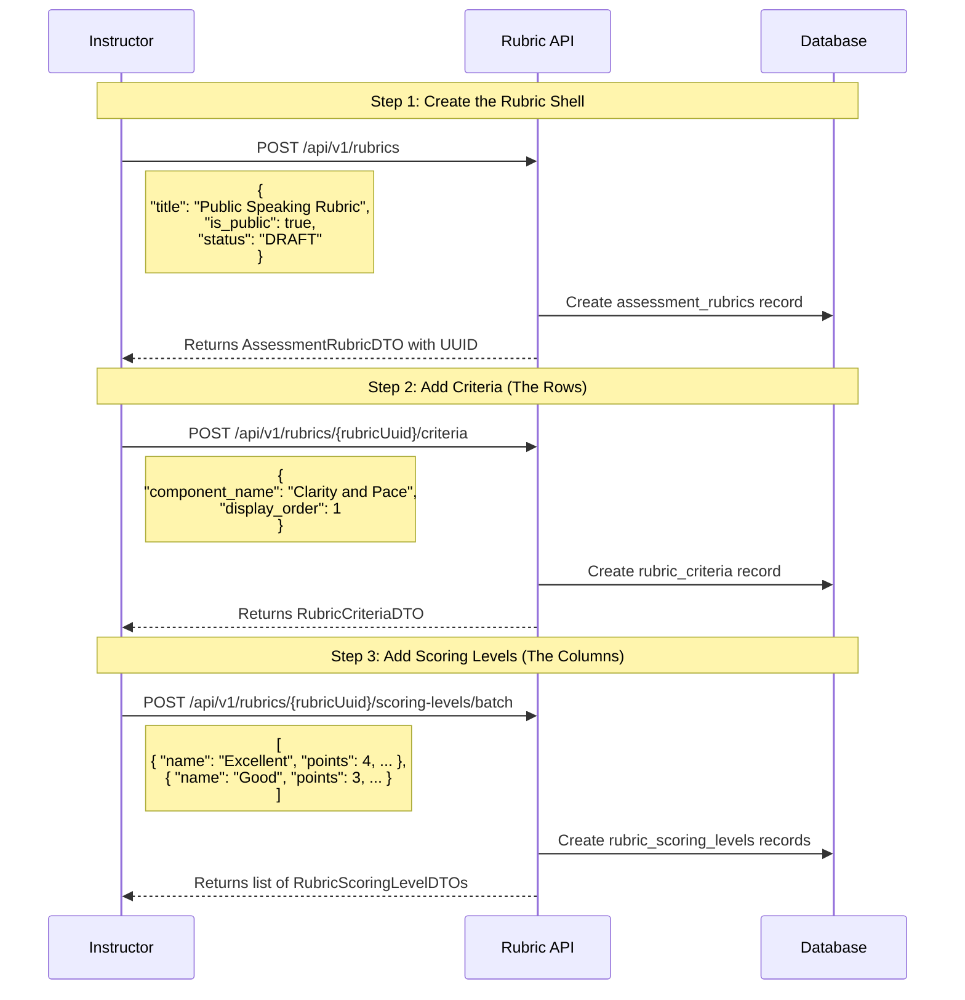

# Rubric Management API Usage Chart

## System Architecture Overview

The rubric system is designed for flexibility, allowing instructors to create detailed, custom assessment tools. The core components are:

- **Assessment Rubric**: The main container for a rubric, holding its title, description, and overall settings.
- **Rubric Criteria**: The rows of the matrix, defining *what* is being assessed (e.g., "Technical Skill," "Clarity").
- **Rubric Scoring Levels**: The columns of the matrix, defining the performance levels and their points (e.g., "Excellent," "Good," "Fair").
- **Rubric Scoring**: The individual cells of the matrix, containing descriptions for a specific criterion at a specific scoring level.

```mermaid
graph TB
    subgraph "Core Rubric Components"
        AR[Assessment Rubric<br/>📋 Main Container]
        RC[Rubric Criteria<br/>📊 Matrix Rows]
        RSL[Rubric Scoring Levels<br/>📈 Matrix Columns]
        RS[Rubric Scoring<br/>🎯 Matrix Cells]
    end

    subgraph "Course Association"
        CRA[Course Rubric Association<br/>🔗 Link to Courses]
        C[Courses<br/>📚 One or More Courses]
    end

    AR --> RC
    AR --> RSL
    RC --> RS
    RSL --> RS
    AR --> CRA
    CRA --> C

    style AR fill:#e1f5fe
    style RC fill:#f3e5f5
    style RSL fill:#e8f5e9
    style RS fill:#fffde7
    style CRA fill:#fff3e0
```



## API Workflow: From Creation to a Complete Matrix

The process is now fully dynamic. The matrix is built automatically as you define its constituent parts.

### Phase 1: Define the Rubric Structure



### Phase 2: Automatic Matrix Generation and Population

The matrix is created automatically once the rubric has at least one criterion and one scoring level.

```mermaid
sequenceDiagram
    participant I as Instructor
    participant API as Rubric API
    participant MatrixService as Matrix Service
    participant DB as Database

    Note over I,DB: Step 4: Auto-Generation of the Matrix
    I->>API: POST /api/v1/rubrics/{rubricUuid}/criteria
    Note right of I: Adding a criterion to a rubric<br/>that already has scoring levels.
    API->>MatrixService: createRubricCriteriaWithMatrixCheck()
    MatrixService->>DB: Check for existing scoring levels (they exist!)
    MatrixService->>DB: Create empty rubric_scoring cells for all<br/>(Criteria × Scoring Level) combinations.
    MatrixService-->>API: Returns CriteriaCreationResponse
    API-->>I: { "matrixGenerated": true, "matrix": { ... } }

    Note over I,DB: Step 5: Populate Cell Descriptions
    I->>API: PUT /api/v1/rubrics/{rubricUuid}/matrix/cells
    Note right of I: {<br/>"criteriaUuid": "...",<br/>"scoringLevelUuid": "...",<br/>"description": "Speaker is clear and confident."<br/>}
    API->>DB: Update description in rubric_scoring record
    API-->>I: Returns updated RubricMatrixDTO

    Note over I,DB: Step 6: Validate Completeness
    I->>API: GET /api/v1/rubrics/{rubricUuid}/validate-matrix
    API->>MatrixService: Check if all cells are filled
    MatrixService-->>API: Validation results
    API-->>I: MatrixValidationResult
```



## Endpoint Reference Chart

### 🏗️ Rubric Building Endpoints

| Method | Endpoint | Purpose | Key Fields |
|---|---|---|---|
| `POST` | `/api/v1/rubrics` | Create a new rubric shell. | `title`, `description`, `rubric_type` |
| `POST` | `/api/v1/rubrics/{uuid}/criteria` | Add a criterion (a row) to the rubric. | `component_name`, `display_order` |
| `POST` | `/api/v1/rubrics/{uuid}/scoring-levels` | Add a single scoring level (a column). | `name`, `points`, `level_order` |
| `POST` | `/api/v1/rubrics/{uuid}/scoring-levels/batch` | Add multiple scoring levels at once. | `List<RubricScoringLevelDTO>` |
| `PUT` | `/api/v1/rubrics/{uuid}/matrix/cells` | Update the description of a single matrix cell. | `criteriaUuid`, `scoringLevelUuid`, `description` |

### 🔍 Discovery & Retrieval Endpoints

| Method | Endpoint | Purpose | Use Case |
|---|---|---|---|
| `GET` | `/api/v1/rubrics/{uuid}` | Get a specific rubric's details. | View a rubric's configuration. |
| `GET` | `/api/v1/rubrics/{uuid}/matrix` | Get the complete, assembled matrix view. | Display the full rubric for evaluation. |
| `GET` | `/api/v1/rubrics/discovery/public` | Browse all public, reusable rubrics. | Find a rubric to use in a course. |
| `GET` | `/api/v1/rubrics/discovery/search` | Search for rubrics by keyword or type. | Find a specific type of rubric. |

### ✅ Validation & Management Endpoints

| Method | Endpoint | Purpose | Returns |
|---|---|---|---|
| `GET` | `/api/v1/rubrics/{uuid}/validate-matrix` | Check if the matrix is complete and valid. | `MatrixValidationResult` |
| `PUT` | `/api/v1/rubrics/{uuid}` | Update a rubric's general information. | Modified `AssessmentRubricDTO` |
| `POST` | `/api/v1/rubrics/{uuid}/matrix/recalculate` | Recalculate max scores after changes. | Updated `RubricMatrixDTO` |

## Editing the Matrix: A Dynamic Process

Once a rubric matrix is created, it is not static. You can edit every part of it, from the names of your criteria to the points assigned to a scoring level.

### Editing Criteria (Rows)

To change the name, description, or display order of a criterion, you use the following endpoint:

-   **Endpoint:** `PUT /api/v1/rubrics/{rubricUuid}/criteria/{criteriaUuid}`
-   **Action:** Provide the full `RubricCriteriaDTO` with the updated fields.

**Example:** Renaming a criterion from "Clarity and Pace" to "Vocal Clarity and Pacing".

```bash
curl -X PUT /api/v1/rubrics/{rubricUuid}/criteria/{criteriaUuid} \
  -H "Content-Type: application/json" \
  -d '{
    "componentName": "Vocal Clarity and Pacing",
    "description": "The speaker's voice is clear and the pacing is effective.",
    "displayOrder": 1
  }'
```

### Editing Scoring Levels (Columns)

Similarly, you can adjust the properties of a scoring level, such as its name, point value, or color code.

-   **Endpoint:** `PUT /api/v1/rubrics/{rubricUuid}/scoring-levels/{levelUuid}`
-   **Action:** Provide the full `RubricScoringLevelDTO` with the updated fields.

**Example:** Changing the "Excellent" level to be worth 5 points instead of 4.

```bash
curl -X PUT /api/v1/rubrics/{rubricUuid}/scoring-levels/{levelUuid} \
  -H "Content-Type: application/json" \
  -d '{
    "name": "Excellent",
    "points": 5.00,
    "levelOrder": 1,
    "isPassing": true,
    "description": "Performance that goes above and beyond all requirements."
  }'
```

### Editing Cell Descriptions (Intersections)

As mentioned previously, you can update the description for any cell at the intersection of a criterion and a scoring level.

-   **Endpoint:** `PUT /api/v1/rubrics/{rubricUuid}/matrix/cells`
-   **Action:** Provide the `criteriaUuid`, `scoringLevelUuid`, and the new `description`.

**Example:** Updating a cell description.

```bash
curl -X PUT /api/v1/rubrics/{rubricUuid}/matrix/cells \
  -H "Content-Type: application/json" \
  -d '{
    "criteriaUuid": "uuid-for-vocal-clarity",
    "scoringLevelUuid": "uuid-for-excellent-level",
    "description": "Speaker is exceptionally clear and uses pacing to enhance the message."
  }'
```

## New Rubric Creation Workflow (Example)

This example shows the new, streamlined process for creating a complete rubric from scratch.

```bash
# Step 1: Create the rubric foundation
curl -X POST /api/v1/rubrics \
  -H "Content-Type: application/json" \
  -d '{
    "title": "Essay Writing Assessment",
    "rubricType": "WRITING",
    "isPublic": true,
    "status": "DRAFT"
  }'
# Response provides the new {rubricUuid}

# Step 2: Add evaluation criteria (the rows)
curl -X POST /api/v1/rubrics/{rubricUuid}/criteria \
  -H "Content-Type: application/json" \
  -d '{ "componentName": "Thesis Statement", "displayOrder": 1 }'

curl -X POST /api/v1/rubrics/{rubricUuid}/criteria \
  -H "Content-Type: application/json" \
  -d '{ "componentName": "Evidence and Support", "displayOrder": 2 }'

# Step 3: Add scoring levels in a single batch (the columns)
curl -X POST /api/v1/rubrics/{rubricUuid}/scoring-levels/batch \
  -H "Content-Type: application/json" \
  -d '[
    { "name": "Exemplary", "points": 4, "levelOrder": 1, "isPassing": true },
    { "name": "Proficient", "points": 3, "levelOrder": 2, "isPassing": true },
    { "name": "Developing", "points": 2, "levelOrder": 3, "isPassing": true },
    { "name": "Needs Improvement", "points": 1, "levelOrder": 4, "isPassing": false }
  ]'
# At this point, the matrix is AUTO-GENERATED with empty cells.

# Step 4: Fill in the matrix cell descriptions
# Example: Describe what "Exemplary" looks like for the "Thesis Statement"
curl -X PUT /api/v1/rubrics/{rubricUuid}/matrix/cells \
  -H "Content-Type: application/json" \
  -d '{
    "criteriaUuid": "{thesis-statement-uuid}",
    "scoringLevelUuid": "{exemplary-level-uuid}",
    "description": "Thesis is exceptionally clear, arguable, and insightful."
  }'
# Repeat for all other cells...

# Step 5: Validate the matrix
curl -X GET /api/v1/rubrics/{rubricUuid}/validate-matrix

# Step 6: Publish the rubric for use
curl -X PUT /api/v1/rubrics/{rubricUuid} \
  -H "Content-Type: application/json" \
  -d '{ "status": "PUBLISHED", "active": true }'
```

## Example of a User-Defined Matrix Structure

The new system gives you full control to define the matrix structure. The following is just one example of what you can build.

```
Essay Writing Rubric - 4 Levels
                    Scoring Levels (Columns) - Defined by User
        ┌───────────┬──────────┬──────────┬─────────────┐
        │ Exemplary │Proficient│Developing│ Needs Impr. │
        │  (4 pts)  │  (3 pts) │  (2 pts) │   (1 pt)    │
        │  ✅ Pass  │  ✅ Pass │  ✅ Pass │   ❌ Fail   │
   ┌────┼───────────┼──────────┼──────────┼─────────────┤
C  │Ths.│Clear,     │Clear and │Thesis is │Thesis is    │
r  │St. │arguable,  │arguable  │present,  │unclear or   │
i  │    │insightful │thesis.   │may be    │not arguable.│
t  │    │           │          │vague.    │             │
   ├────┼───────────┼──────────┼──────────┼─────────────┤
e  │Evd.│Strong,    │Relevant  │Some      │Evidence is  │
r  │Spt.│well-chosen│evidence  │evidence, │weak or      │
i  │    │evidence.  │used.     │but lacks │irrelevant.  │
a  │    │           │          │analysis. │             │
   └────┴───────────┴──────────┴──────────┴─────────────┘

Total Possible Score: 8 points (2 criteria × 4 max points)
Minimum Passing Score: 4 points (2 criteria × 2 min passing points)
```
