# User and Organization Domains Guide

## System Architecture Overview

The Elimika platform implements a flexible dual-tier user domain system that manages user roles and permissions across both global system access and organization-specific contexts. This architecture supports complex multi-tenancy scenarios while maintaining clear role-based access control.

### Core Domain Types

The system supports four primary user domains:

- **Student**: Learners who enroll in courses and training programs

> **Enrollment compliance:** Student domains must capture a verified date of birth before enrollments. The AgeVerificationService enforces course/class age limits and returns `AgeRestrictionException` when a learner falls outside the configured band, so tenant onboarding flows should surface DOB requirements up front.
- **Instructor**: Educators who create and deliver content
- **Admin**: System administrators with platform-wide privileges
- **Organisation User**: Users affiliated with specific organizations

```mermaid
graph TB
    subgraph "Global Domain System"
        GD[Global User Domains<br/>🌐 System-Wide Roles]
        UDM[User Domain Mapping<br/>🔗 Direct User Assignment]
        UD[User Domain<br/>📋 Domain Definitions]
    end

    subgraph "Organization-Specific System"
        OD[Organization Domains<br/>🏢 Context-Aware Roles]
        UODM[User Organisation Domain Mapping<br/>🎯 Multi-Dimensional Assignment]
        ORG[Organisation<br/>🏛️ Institution Context]
        BRANCH[Training Branch<br/>🌿 Department/Division]
    end

    subgraph "User Profile Integration"
        USER[User Profile<br/>👤 Combined View]
        AFFIL[Organisation Affiliations<br/>📊 Detailed Membership Info]
    end

    GD --> UDM
    UDM --> UD
    OD --> UODM
    UODM --> ORG
    UODM --> BRANCH
    UODM --> UD
    USER --> GD
    USER --> OD
    USER --> AFFIL

    style GD fill:#e1f5fe
    style OD fill:#f3e5f5
    style USER fill:#e8f5e9
    style AFFIL fill:#fffde7
```



## Domain Architecture: Global vs Organization-Specific

### 1. Global User Domains

**Purpose**: System-wide role assignment independent of organizational context.

**Entities**:
- `UserDomain`: Master domain definitions (student, instructor, admin, organisation_user)
- `UserDomainMapping`: Direct user-to-domain assignments

**Use Cases**:
- Platform administrators (`admin`)
- Independent instructors not tied to specific organizations
- Users with system-wide privileges


### 2. Organization-Specific User Domains

Organization-specific domains enable contextual role-based access control within educational institutions. Unlike global domains that apply platform-wide, organization domains provide granular control over user permissions, responsibilities, and access rights within specific institutional contexts.

#### Organization Domain Architecture

Organization domains use a sophisticated mapping system that considers multiple contextual factors:


#### Organization Domain Entity Structure

##### Core Entity: UserOrganisationDomainMapping


##### Organization Affiliation DTO

The system provides rich contextual information through the `UserOrganisationAffiliationDTO`:

```json
{
  "organizationAffiliation": {
    "organisationUuid": "university-abc-123",
    "organisationName": "ABC State University",
    "domainInOrganisation": "instructor",
    "branchUuid": "cs-department-456", 
    "branchName": "Computer Science Department",
    "startDate": "2024-01-15",
    "endDate": null,
    "active": true,
    "affiliatedDate": "2024-01-15T09:00:00Z"
  }
}
```

#### Organization Domain Lifecycle Management

##### User Invitation and Enrollment


##### Branch Transfer Within Organization


#### Branch-Level Organization Management

##### Hierarchical Structure

Organizations can have multiple training branches (departments/divisions) with specific management:


##### Branch-Specific User Management

Administrators can manage users at the branch level using a set of dedicated API endpoints. These endpoints allow for listing all users within a branch, filtering those users by their domain (e.g., listing only instructors), and assigning a new user to a specific branch with a designated role. The API endpoints for these actions are detailed in the "API Integration Points" section.

#### Organization Domain Repository Capabilities

##### Advanced Query Methods

The `UserOrganisationDomainMappingRepository` provides a comprehensive set of query methods to retrieve data based on various criteria. These methods support:
-   **Active Relationship Queries**: Finding active mappings by user, by organization, or by a combination of both.
-   **Role-based Filtering**: Searching for active mappings within an organization for a specific domain (e.g., all students in University X).
-   **Branch-specific Queries**: Finding all active mappings for a specific training branch or counting the number of active users in that branch.
-   **Temporal Queries**: Finding mappings that are scheduled to end within a specific date range.
-   **Bulk Operations**: Retrieving mappings for a list of users within a single organization.

##### Analytics and Reporting Queries

For analytics and reporting purposes, the repository provides methods to:
-   Count the number of distinct active users in an organization, optionally filtered by domain.
-   Analyze cross-organization affiliations by finding all organizations a single user belongs to, or all users belonging to a single organization.

#### Multi-Organization Scenarios

##### Users with Multiple Organization Affiliations

```json
{
  "userProfile": {
    "userUuid": "multi-org-user-123",
    "firstName": "Dr. Sarah",
    "lastName": "Johnson",
    "email": "sarah.johnson@email.com",
    
    "organisationAffiliations": [
      {
        "organisationUuid": "state-university",
        "organisationName": "State University",
        "domainInOrganisation": "instructor",
        "branchName": "Computer Science Department",
        "startDate": "2020-08-01",
        "active": true,
        "primaryAffiliation": true
      },
      {
        "organisationUuid": "tech-consulting-firm", 
        "organisationName": "Tech Consulting Solutions",
        "domainInOrganisation": "instructor",
        "branchName": "Training Division",
        "startDate": "2023-01-15",
        "active": true,
        "primaryAffiliation": false
      },
      {
        "organisationUuid": "community-college",
        "organisationName": "Metro Community College", 
        "domainInOrganisation": "instructor",
        "branchName": "Continuing Education",
        "startDate": "2022-06-01",
        "endDate": "2023-12-31",
        "active": false,
        "primaryAffiliation": false
      }
    ]
  }
}
```

##### Cross-Organization Collaboration


#### Organization Domain Analytics

##### Membership Analytics Dashboard

```json
{
  "organizationAnalytics": {
    "organizationUuid": "state-university-123",
    "organizationName": "State University",
    "reportingPeriod": "Fall 2024",
    
    "membershipMetrics": {
      "totalActiveUsers": 12847,
      "usersByDomain": {
        "student": 11234,
        "instructor": 892,
        "organisation_user": 721
      },
      "usersByBranch": {
        "Computer Science": 2341,
        "Engineering": 3567,  
        "Liberal Arts": 2890,
        "Graduate School": 1456
      }
    },
    
    "temporalMetrics": {
      "newAffiliationsThisMonth": 234,
      "expiredAffiliationsThisMonth": 67,
      "transfersBetweenBranches": 12,
      "averageAffiliationDuration": "3.2 years"
    },
    
    "branchPerformance": [
      {
        "branchName": "Computer Science",
        "activeUsers": 2341,
        "courseCompletionRate": 94.2,
        "studentSatisfaction": 4.6,
        "facultyUtilization": 87.3
      }
    ]
  }
}
```

## Domain Resolution and User Profile Integration

### Combined Domain Resolution

The system aggregates domains from both global and organizational contexts to provide a unified user profile. The backend logic, typically within a `UserService`, fetches all global domain mappings for a user and combines them with all of their active organization-specific domain mappings. This produces a complete, deduplicated list of all roles the user holds across the entire platform, which is then used for permission checking.

### Organization Affiliation Details

Beyond simple domain lists, the system provides rich organizational context through the `UserOrganisationAffiliationDTO` as detailed in the section above.

## API Integration Points

### User Profile Endpoints

| Method | Endpoint | Purpose | Returns |
|--------|----------|---------|---------|
| `GET` | `/api/v1/users/{uuid}` | Get user with all domains and affiliations | `UserDTO` with combined domains and organization affiliations |
| `GET` | `/api/v1/users` | Get all users (paginated) | `PagedDTO<UserDTO>` |
| `PUT` | `/api/v1/users/{uuid}` | Update user profile | Updated `UserDTO` |
| `GET` | `/api/v1/users/search` | Search users with filters | `PagedDTO<UserDTO>` matching criteria |

### Organization Management Endpoints

| Method | Endpoint | Purpose | Use Case |
|--------|----------|---------|----------|
| `GET` | `/api/v1/organisations/{uuid}/users` | Get organization members | List all affiliated users (paginated) |
| `GET` | `/api/v1/organisations/{uuid}/users/domain/{domainName}` | Filter by role | Get users with specific role in organization |
| `POST` | `/api/v1/organisations/{uuid}/invitations` | Create organization invitation | Invite user to organization with role |
| `GET` | `/api/v1/organisations/{uuid}/invitations` | Get organization invitations | List all invitations for organization |

### Branch Management Endpoints

| Method | Endpoint | Purpose | Branch Context |
|--------|----------|---------|----------------|
| `GET` | `/api/v1/organisations/{uuid}/training-branches` | List organization branches | Department structure (paginated) |
| `POST` | `/api/v1/organisations/{uuid}/training-branches` | Create new branch | Department creation |
| `GET` | `/api/v1/organisations/{uuid}/training-branches/{branchUuid}/users` | List branch users | Department roster |
| `POST` | `/api/v1/organisations/{uuid}/training-branches/{branchUuid}/users/{userUuid}` | Assign user to branch | Departmental assignment |
| `DELETE` | `/api/v1/organisations/{uuid}/training-branches/{branchUuid}/users/{userUuid}` | Remove user from branch | Departmental removal |

## Business Rules and Validation

### Domain Assignment Rules

1. **Admin and Organisation User**: Can be assigned as global domains.
2. **Student and Instructor**: Can be both global and organization-specific.
3. **Temporal Validity**: Organization memberships respect start/end date constraints.
4. **Active Status**: Only active mappings contribute to user permissions.
5. **Soft Deletion**: Deactivated memberships preserved for audit trails.

### Permission Resolution


### Temporal Management Rules for Organizations


## Membership Lifecycle Management


This architecture provides a robust foundation for managing user roles across both system-wide and organization-specific contexts, enabling complex multi-tenant scenarios while maintaining clear separation of concerns and audit capabilities.
